# BÁO CÁO KỸ THUẬT HỆ THỐNG

## Traffic-Law RAG — Trợ lý Pháp lý Giao thông Việt Nam (v6.3)

**Phiên bản:** 6.3 · **Ngày:** 05/05/2026
**Tác giả:** Phong Mac · **Đồ án Tốt nghiệp**
**Repo:** `traffic_rag/` · **Stack:** Python 3.11 · LangGraph · Qdrant · Gemini · FastAPI · Next.js 14 · Docker

> Báo cáo này là tài liệu kỹ thuật **duy nhất, đầy đủ** cho toàn bộ hệ thống. Mỗi thành phần (ingestion, chunking, embedding, indexing, retrieval, generation, orchestration, deployment) đều được trình bày theo cấu trúc **Research → Quyết định → Kiến trúc chi tiết**: trước tiên đưa ra kết quả so sánh định lượng từ các ablation `research/` (RQ1-RQ9), sau đó giải thích tại sao hệ thống chọn phương án đang triển khai, cuối cùng mô tả đầy đủ mã nguồn / công thức / cấu hình thực tế.

---

## Mục lục

1. [Tổng quan hệ thống](#1-tổng-quan-hệ-thống)
2. [Data Ingestion — Chuẩn hoá văn bản pháp luật](#2-data-ingestion)
3. [Chunking — Cắt đoạn phân cấp theo Điều/Khoản/Điểm](#3-chunking--rq2)
4. [Embedding — Biểu diễn vector đa ngôn ngữ](#4-embedding--rq3)
5. [Indexing — Vector database lựa chọn và cấu hình](#5-indexing--rq4)
6. [Hybrid Retrieval — Dense + Sparse + Sibling + Cross-ref](#6-hybrid-retrieval--rq9)
7. [Generation — Prompt engineering và ràng buộc citation](#7-generation--rq5)
8. [Agentic Workflow — LangGraph định tuyến đa intent](#8-agentic-workflow)
9. [Deployment — API, UI, Docker và HITL](#9-deployment)
10. [Phương pháp đánh giá — Công thức chi tiết](#10-phương-pháp-đánh-giá--công-thức-chi-tiết)
11. [Đánh giá tổng thể — Baseline + Cost + RQ10 reranker + RQ7-lite RAGAS](#11-đánh-giá-tổng-thể--rq1--rq8)
12. [Hạn chế và hướng phát triển](#12-hạn-chế--hướng-phát-triển)
13. [Phụ lục](#13-phụ-lục)

---

## 1. Tổng quan hệ thống

### 1.1 Mục tiêu và phạm vi

Hệ thống **Traffic-RAG** là trợ lý AI trả lời câu hỏi về pháp luật giao thông đường bộ Việt Nam theo quy định mới 2024–2025. Mục tiêu cụ thể:

- **Trả lời đúng theo văn bản gốc** — mỗi câu trả lời trích dẫn chính xác tới cấp **điểm/khoản/điều** của Nghị định, Thông tư, Luật.
- **Chống ảo giác (hallucination)** — từ chối khi ngữ cảnh không đủ thay vì bịa số tiền/số điểm.
- **Xử lý đa ý (multi-intent)** — một câu hỏi có thể chứa 3–4 câu con (mức phạt + trừ điểm GPLX + tước bằng + xử lý phương tiện).
- **Giải quyết cross-reference** — khi Điều A dẫn tới Điều B, hệ thống tự kéo cả B vào ngữ cảnh.
- **Định tuyến đa intent** — tách biệt Q&A pháp luật / chit-chat / tra cứu web / out-of-scope.

**Corpus:** 6 văn bản (tổng **~800 trang** chuẩn hoá), **2 705 chunks** sau phân đoạn phân cấp:

| doc_id             | Tên                                           | Vai trò                            |
| ------------------ | --------------------------------------------- | ---------------------------------- |
| `168/2024/NĐ-CP`   | Nghị định 168/2024 xử phạt vi phạm hành chính | Mức phạt + trừ điểm GPLX (cốt lõi) |
| `36/2024/QH15`     | Luật TT-ATGT đường bộ                         | Luật gốc                           |
| `35/2024/QH15`     | Luật Đường bộ                                 | Luật gốc                           |
| `151/2024/NĐ-CP`   | NĐ hướng dẫn Luật 36/2024                     | Bổ trợ                             |
| `47/2024/TT-BGTVT` | TT kỹ thuật, chu kỳ đăng kiểm                 | Kỹ thuật                           |
| `79/2024/TT-BCA`   | TT thủ tục đăng ký xe                         | Thủ tục                            |

### 1.2 Sơ đồ kiến trúc tổng thể (v6.0)

**Offline pipeline** — chạy một lần, tái chạy khi bổ sung văn bản mới:

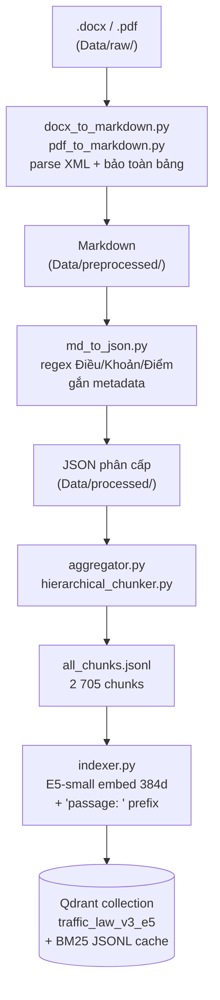

**Online pipeline** — mỗi request đi qua đồ thị state-machine do LangGraph điều phối:

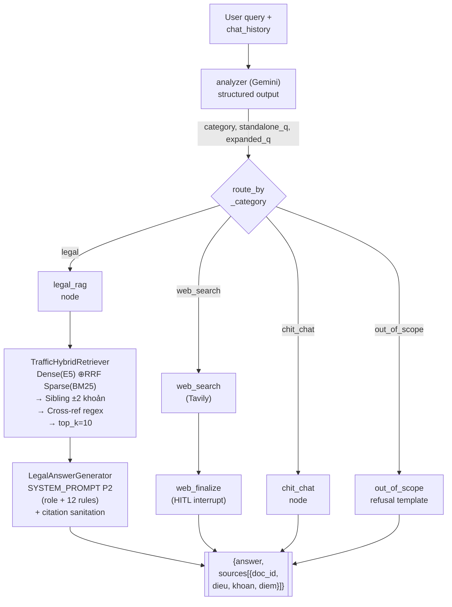

> **Ghi chú:** node `web_finalize` có `interrupt_before` — đồ thị tạm dừng, UI hiển thị snippet cho người dùng duyệt; khi resume mới tổng hợp câu trả lời.

### 1.3 Tech stack

| Layer         | Thư viện / dịch vụ                                       | Lý do chọn                             |
| ------------- | -------------------------------------------------------- | -------------------------------------- |
| Language      | Python 3.11                                              | hỗ trợ type hint, pattern matching     |
| Orchestration | `langgraph` 0.2.x                                        | state machine, HITL `interrupt_before` |
| LLM wrapper   | `langchain-google-genai`                                 | Gemini flash tốc độ cao, chi phí thấp  |
| LLM gen       | **Gemini 3.1 Flash Lite Preview**                        | 1M context, $0.075/1M in, $0.30/1M out |
| Embedding     | **`intfloat/multilingual-e5-small`** (384d, max_seq=512) | RQ3 winner (MRR 0.22)                  |
| Vector DB     | **Qdrant 1.7** (Docker)                                  | hybrid, metadata filter, payload index |
| Sparse        | `rank_bm25` (BM25Okapi)                                  | pure Python, dễ đồng bộ với Qdrant     |
| Web search    | `tavily-python`                                          | free tier, trả snippet dài             |
| Backend       | `FastAPI` + `uvicorn`                                    | async, WebSocket streaming             |
| Frontend      | `Streamlit`                                              | prototype nhanh,`st.chat_message`      |
| Trace/Eval    | LangSmith (project `Traffic-RAG-Evaluation`)             | RQ8 phân tích chi phí                  |
| Container     | Docker Compose                                           | isolation Qdrant + API + UI            |

### 1.4 Tổng hợp kết quả research (teaser)

Các ablation `research/` (chi tiết ở §3–§7 và §11) đã xác lập mọi lựa chọn thiết kế trong hệ thống:

| RQ  | Câu hỏi                                          | Kết luận                                                         | Quyết định                        |
| --- | ------------------------------------------------ | ---------------------------------------------------------------- | --------------------------------- |
| RQ1 | Gemini-only / Vanilla RAG / Agentic RAG khác gì? | Agentic Cit-R = 0.56 vs Gemini 0.20                              | **Dùng Agentic RAG (LangGraph)**  |
| RQ2 | Hierarchical vs Fixed-512?                       | Hierarchical MRR 0.16 vs 0.07                                    | **Hierarchical chunker**          |
| RQ3 | sbert / mpnet / e5-small?                        | e5-small MRR 0.22, nhanh nhất, max_seq=512                       | **e5-small** (migrate từ sbert)   |
| RQ4 | Qdrant / Chroma / FAISS?                         | Cùng chất lượng; FAISS 200× nhanh nhưng không có metadata filter | **Qdrant** (giữ filter + payload) |
| RQ5 | Prompt không role / role / role+rules?           | Rules nâng Cit-R 0.36 → 0.48 và refusal 0% → 72%                 | **P2 full rules**                 |
| RQ8 | Đâu là cost center?                              | `legal_rag` node 39k token, $0.010/query                         | Optimize RAG trước web_search     |
| RQ9 | Rewrite query có lợi không?                      | Rewrite LÀM HẠI: MRR −35%, latency +45%                          | **TẮT rewrite** ở turn đầu        |

---

## 2. Data Ingestion

### 2.1 Tổng quan pipeline thực tế

Ingestion là pipeline 2 giai đoạn, chạy offline, idempotent. **Toàn bộ scripts nằm trong [source/ingestion/](../source/ingestion/)** và đều dùng `pdfplumber` để extract — không có kênh `.docx` riêng (các file `.docx` ở `Data/raw/phuluc/` chưa có pipeline xử lý, xem 2.5).

```
                     CLEANING (3 scripts riêng)               CHUNKING

Data/raw/
├── luat/      *.pdf  --[clean_luat_pdfs.py]-->  Data/cleaned/luat/      *.md  --+
├── nghidinh/  *.pdf  --[clean_nghidinh_pdfs.py]-->  Data/cleaned/nghidinh/ *.md +
├── thongtu/   *.pdf  --[clean_thongtu_pdfs.py]-->  Data/cleaned/thongtu/  *.md  +
├── phuluc/    *.docx (CHƯA xử lý — xem 2.5)                                     |
└── quychuan/  *.pdf  (CHƯA xử lý — xem 2.5)                                     |
                                                                                 v
                                                                  [semantic_chunker.py]
                                                                                 |
                                                                                 v
                                                          Data/all_chunks.jsonl (§3)
```

**Bảng số file qua từng tầng (đếm thực tế ngày 2026-05-02):**

| Tầng | Đường dẫn | Số file | Ghi chú |
|---|---|---:|---|
| Raw — Luật | `Data/raw/luat/` | 3 PDF | luat23 (2008, repealed) + luat35 + luat36 |
| Raw — Nghị định | `Data/raw/nghidinh/` | 6 PDF | nd10, nd100, nd123, nd135, nd168, nd336 |
| Raw — Thông tư | `Data/raw/thongtu/` | 17 PDF | 4 nhóm: banglai/dangkyxe/khithai/tuantra |
| Raw — Phụ lục | `Data/raw/phuluc/` | 49 docx | tt12/tt13/tt35/tt48 — **chưa pipeline** |
| Raw — Quy chuẩn | `Data/raw/quychuan/` | 3 PDF | QCVN41 + QCVN_04_2021 + TCVN_5756 — **chưa pipeline** |
| **Tổng raw** | | **78 file** | |
| Cleaned — Luật | `Data/cleaned/luat/` | 2 md | luat23 bị blacklist (xem 2.3) |
| Cleaned — Nghị định | `Data/cleaned/nghidinh/` | 6 md | nd100 + nd123 → md **rỗng** sau filter mảng đường bộ |
| Cleaned — Thông tư | `Data/cleaned/thongtu/` | 17 md | đầy đủ |
| **Tổng cleaned** | | **25 md** | |
| Effective vào chunker | (md có nội dung) | **23** | trừ 2 file md rỗng (nd100, nd123) |

→ **Pipeline rớt từ 78 raw xuống 23 effective**: 53 file phụ lục+quy chuẩn (chưa có script clean) + 1 file Luật 2008 (blacklist) + nội dung mảng đường bộ NĐ100/2019 + NĐ123/2021 đã bị NĐ168/2024 bãi bỏ (clean ra md rỗng → chunker `if not full_text.strip(): continue` bỏ qua).

### 2.2 Cleaning script — kiến trúc chung 3 file

3 script ([clean_luat_pdfs.py](../source/ingestion/clean_luat_pdfs.py), [clean_nghidinh_pdfs.py](../source/ingestion/clean_nghidinh_pdfs.py), [clean_thongtu_pdfs.py](../source/ingestion/clean_thongtu_pdfs.py)) chia sẻ kiến trúc 5 bước:

```
+-------------+    +--------------+    +--------------+    +--------------+    +--------------+
|  Bước 1     |--->|  Bước 2      |--->|  Bước 3      |--->|  Bước 4      |--->|  Bước 5      |
|  Mở PDF     |    |  Extract     |    |  Clean text  |    |  Format      |    |  Ghi md      |
|  pdfplumber |    |  text+table  |    |  regex/NFC   |    |  Markdown    |    |  + warning   |
|  per page   |    |  bbox excl.  |    |  merge dòng  |    |  hierarchy   |    |  optional    |
+-------------+    +--------------+    +--------------+    +--------------+    +--------------+
```

#### Bước 1 — Mở PDF với pdfplumber

`pdfplumber.open(pdf_path)` cho từng trang một (`for page in pdf.pages`) — đủ chính xác cho text-based PDF của Cổng thông tin pháp luật. Không OCR (corpus toàn PDF số, không scan).

#### Bước 2 — Extract text + table với bbox-based exclusion

Vấn đề: nếu lấy `page.extract_text()` rồi `page.extract_tables()` riêng, **text trong bảng bị duplicate** — câu mức phạt xuất hiện 2 lần (một lần dạng text, một lần dạng row của table). Giải pháp ([clean_luat_pdfs.py:255-273](../source/ingestion/clean_luat_pdfs.py#L255-L273)):

```python
def get_table_bboxes(page):
    return [tbl.bbox for tbl in page.find_tables()]   # [(x0, top, x1, bottom), ...]

def is_inside_table(obj, bboxes, tolerance=2.0):
    x0, top = obj["x0"], obj["top"]
    return any(tx0-tol <= x0 <= tx1+tol and ttop-tol <= top <= tbottom+tol
               for (tx0, ttop, tx1, tbottom) in bboxes)
```

Sau đó text được lọc qua `is_inside_table` trước khi append. Bảng được render riêng thành Markdown table (xem `table_to_markdown` ở [clean_luat_pdfs.py:210-249](../source/ingestion/clean_luat_pdfs.py#L210-L249)) với 2 đặc điểm:
- **Flatten merged cells** — ô gộp chiều dọc được nhân bản xuống mọi hàng để encoder thấy đầy đủ ngữ cảnh.
- **Escape pipe** — `|` trong nội dung được escape `\|` để không phá cú pháp Markdown.

#### Bước 3 — Clean text

Gọi `clean_text(raw, strategy)` ([clean_luat_pdfs.py:128-204](../source/ingestion/clean_luat_pdfs.py#L128-L204)):

1. **Unicode NFC normalization** — `unicodedata.normalize("NFC", raw)` gộp diacritic về dạng compose chuẩn (vd. "ề" Unicode decomposed thành 1 codepoint compose). Bắt buộc vì các regex sau dùng dạng compose.
2. **Lọc nhiễu page-level** — 3 regex:
   - `RE_HEADER_NOISE` = `r"^\d{1,2}/\d{1,2}/\d{2,4},.*about:blank$"` (header browser-print "26/4/2026, ... about:blank").
   - `RE_FOOTER_NOISE` = `r"about:blank\s+\d+/\d+|Thư viện pháp luật|Mã tra cứu"` (footer chú thích nguồn).
   - `RE_PAGE_NUM` = `r"^(Trang\s+)?\d+(\s*/\s*\d+)?$"` (số trang đơn lẻ).
3. **Lọc biểu mẫu** — chấm chấm dài (`\.{5,}`) thay bằng `[Cần điền thông tin]`; ô checkbox được thay bằng `[Lựa chọn]`.
4. **Bôi đậm ngày tháng** — `r"(ngày\s+\d+\s+tháng\s+\d+\s+năm\s+\d{4})"` → `**\1**`. Mục đích: ngày hiệu lực không bị retriever bỏ qua.
5. **LaTeX cho công thức kỹ thuật** — `\b(CO2?|HC|NOx|PM2\.5)\b` → `$$\1$$` (dùng cho TT khí thải).

#### Bước 4 — Format Markdown hierarchy

Quan trọng nhất cho `semantic_chunker.py` ở §3.3 nhận diện cấu trúc:

| Pattern thô | Markdown đích | Tại sao |
|---|---|---|
| `Chương I QUY ĐỊNH CHUNG` | `# Chương I QUY ĐỊNH CHUNG` | Mức cao nhất — không cần chunk riêng nhưng làm landmark |
| `Điều 6. Xử phạt…` | `## Điều 6. Xử phạt…` | Đúng `RE_DIEU` ở chunker → bóc tách đúng |
| `1. Phạt tiền từ…` | giữ nguyên | `RE_KHOAN` ở chunker bắt được dạng số.+space+chữ hoa |
| `a) Vượt đèn đỏ…` | giữ nguyên | `RE_DIEM` bắt được chữ thường + `)` |

#### Bước 5 — Nối dòng bị gãy (line merging)

Vấn đề kinh điển khi extract PDF: 1 câu dài bị cắt cứng theo physical line. Giải pháp 2 điều kiện AND ([clean_luat_pdfs.py:178-196](../source/ingestion/clean_luat_pdfs.py#L178-L196)):

```python
prev_ends_mid_sentence = RE_MERGE_ELIGIBLE_END.search(prev[-1:])
                         # prev kết thúc bằng [a-z, dấu phẩy, ;, hoặc chữ thường có dấu]
curr_is_heading        = RE_IS_HEADING.match(line)
                         # curr không bắt đầu bằng "Điều X" / "Khoản X" / "1." / "a)"
curr_starts_lowercase  = line[0].islower() or line[0] in vietnamese_lowercase

if prev_ends_mid_sentence and curr_starts_lowercase and not curr_is_heading:
    merge dòng
else:
    giữ riêng
```

Logic này **không nhập "Điều 6" vào câu trước** (curr_is_heading match) cũng **không nhập câu mới bắt đầu bằng chữ hoa** (curr_starts_lowercase = False) — đây là 2 lỗi phổ biến của các script merge ngây thơ.

### 2.3 Per-file strategy — vì sao có nhiều quyết định "đặc biệt"

Mỗi script clean có dict `FILE_STRATEGIES` ([clean_luat_pdfs.py:87-102](../source/ingestion/clean_luat_pdfs.py#L87-L102)) định nghĩa hành vi riêng từng file. Dùng để xử lý các trường hợp **không thể tự động hoá**:

| Trường hợp | Strategy | Ví dụ |
|---|---|---|
| File giữ toàn bộ | `{"keep_all": True}` | luat35, luat36 — văn bản có hiệu lực, không cần lọc |
| File hết hiệu lực nhưng vẫn cần | `{"keep_all": True, "prepend_warning": "..."}` | luat23_db_2008_inactive — chèn cảnh báo "đã hết hiệu lực từ 01/01/2025" lên đầu file md |
| File có mảng đường sắt/thuỷ cần loại | filter regex chương | nd100, nd123 — chỉ giữ chương đường bộ; sau khi NĐ168/2024 bãi bỏ → md output rỗng |
| File ngoài phạm vi | `EXCLUDED_FILES` (set) | nd17_2026 (hàng không), nd81_2026 (đường sắt), TT130_2025 (Bộ Quốc phòng), luat23_db_2008.pdf gốc |

**Tại sao có cả luat23_db_2008.pdf trong `EXCLUDED_FILES` và luat23_db_2008_inactive.pdf trong `FILE_STRATEGIES`:** Đây là quyết định lưu trữ song song bản gốc + bản kèm warning. Bản gốc bị skip; bản inactive được clean với prepend_warning. **Hiện tại cleaned/luat/ chỉ có 2 file** (luat35 + luat36) — bản inactive đã bị bỏ ở giai đoạn registry trong [semantic_chunker.py:96-108](../source/ingestion/semantic_chunker.py#L96-L108) đánh `status="repealed"` (file md không tồn tại nên không sinh chunk nào).

### 2.4 Khác biệt giữa 3 script clean

3 script chung 80% logic nhưng khác ở phần **filter chương đường bộ** và **per-file strategy**:

| Khía cạnh | clean_luat_pdfs.py | clean_nghidinh_pdfs.py | clean_thongtu_pdfs.py |
|---|---|---|---|
| Số file xử lý input | 3 PDF (luat/) | 6 PDF (nghidinh/) | 17 PDF (thongtu/, recursive 4 subfolder) |
| Thư mục output | `cleaned/luat/` | `cleaned/nghidinh/` | `cleaned/thongtu/{banglai,dangkyxe,khithai_antoan_kythuat,tuantrakiemsoat}/` |
| Có blacklist? | ✓ (4 file) | ✓ (~3 file đường thuỷ/sắt) | ✓ (TT lệ phí Bộ Tài chính, TT y tế ngoài phạm vi) |
| Per-file strategy phức tạp? | có (luat23 inactive) | có nhất (nd100/nd123 filter chương) | ít — đa số `keep_all=True` |
| Giữ subfolder structure? | không | không | **có** (`rglob("*.pdf")` + recreate cùng path) |

**Lý do tách 3 script thay vì gộp 1:** mỗi loại văn bản có **cấu trúc heading khác nhau** (vd. Thông tư hay có "Phần I, Phần II" thay vì "Chương"; Nghị định 168 có Phụ lục bảng phạt phức tạp). Tách script cho phép tinh chỉnh regex riêng mà không sợ phá mỗi loại.

### 2.5 Phụ lục và quy chuẩn — backlog ingestion

52 file ở `Data/raw/phuluc/` và `Data/raw/quychuan/` **chưa được index** vì chưa có pipeline:

| Folder raw | Số file | Kiểu | Khó khăn pipeline |
|---|---:|---|---|
| `phuluc/tt12/` | 1 docx | Phụ lục TT12/2017 (bằng lái) | docx — cần `python-docx`, không phải pdfplumber |
| `phuluc/tt13/` | 18 docx | Mẫu biên bản TNGT (Mẫu 1.1, 1.2, ...) | Biểu mẫu nhiều placeholder, ít text pháp lý — có thể skip |
| `phuluc/tt35/` | 1 docx | Phụ lục TT35/2024 (đào tạo GPLX) | docx |
| `phuluc/tt48/` | 29 docx | 29 quy chuẩn QCVN (04, 77, 86, 109, ...) | Mỗi QCVN là 1 quy chuẩn kỹ thuật dài — cần policy riêng vì format đặc thù |
| `quychuan/giao_thong/` | 1 PDF | QCVN 41/2024 (biển báo) | PDF — có thể tái dùng `clean_thongtu_pdfs.py` với strategy mới |
| `quychuan/thiet_bi_bao_ve/` | 2 PDF | QCVN 04/2021 (mũ bảo hiểm), TCVN 5756/2017 | PDF — tương tự |

Đây là **backlog v7**. Để index thêm cần viết:
1. `clean_phuluc_docx.py` — loader `python-docx` thay pdfplumber, xử lý biểu mẫu (chuyển checkbox + dotted-line về placeholder, hoặc skip toàn bộ tt13).
2. `clean_quychuan_pdfs.py` — tương tự `clean_thongtu_pdfs.py` nhưng strategy giữ nguyên tên QCVN làm doc_id, gắn `topic="quy_chuan_ky_thuat"`.

Khi 2 script trên hoàn thiện, ước tính corpus tăng **+800–1 200 chunk** (29 QCVN × ~30 chunk + 3 PDF QCVN khác). Lưu ý: quy chuẩn nặng về bảng số (mức phát thải, kích thước biển báo) → cần test xem encoder e5-small có giữ được semantic của bảng số không, hoặc cần hybrid với BM25 mạnh hơn.

### 2.6 Output cuối: file md đầu vào cho chunker

Sau cleaning, mỗi file md đại diện cho **1 văn bản** với cấu trúc đảm bảo:

```markdown
> ⚠️ LƯU Ý: VĂN BẢN NÀY ĐÃ HẾT HIỆU LỰC...   <-- optional, chỉ với strategy.prepend_warning

# Chương I

## Điều 1. Phạm vi điều chỉnh
1. Nghị định này quy định về…
2. Đối tượng áp dụng bao gồm…

## Điều 6. Xử phạt người điều khiển xe ô tô vi phạm quy tắc giao thông
1. Phạt tiền từ **400.000 đồng** đến **600.000 đồng** đối với:
   a) Không chấp hành hiệu lệnh của đèn tín hiệu giao thông;
   b) ...

| Hành vi vi phạm | Mức phạt | Tước GPLX | Trừ điểm |
|---|---|---|---|
| Vượt đèn đỏ | 4-6 triệu | 1-3 tháng | 4 điểm |
| ... | ... | ... | ... |

**ngày 26 tháng 12 năm 2024**
```

Cấu trúc trên đảm bảo `RE_DIEU`, `RE_KHOAN`, `RE_DIEM` ở chunker bắt được đúng. Đây mới là điểm cốt lõi: **cleaning script không chỉ "làm sạch text", mà còn chuẩn bị input đúng format cho chunker hierarchy**.

### 2.7 Idempotency và logging

- **Idempotent:** chạy lại 3 script clean luôn ra cùng output (không dùng random, timestamp). Có thể chạy lại bất kỳ lúc nào sau khi update `FILE_STRATEGIES` mà không lo lệ thuộc state cũ.
- **Logging:** mỗi script tạo file `logs/clean_{loai}_{YYYYMMDD_HHMMSS}.log` ([clean_luat_pdfs.py:59-72](../source/ingestion/clean_luat_pdfs.py#L59-L72)) ghi từng file processed/skipped/error. Script cũng dump `_processing_stats.json` vào thư mục cleaned (vd. `Data/cleaned/luat/_processing_stats.json`) chứa `{total, processed, skipped, errors, files: {pdf_name: {pages, lines, tables}}}` để audit.

Lệnh chạy đầy đủ pipeline (xem [doc/implementation_plan.md](implementation_plan.md)):

```bash
cd traffic_rag
source /home/pphong/venv/LLM_Agentic/bin/activate

# Bước 1 — clean (chạy 1 lần khi raw có thay đổi)
python source/ingestion/clean_luat_pdfs.py
python source/ingestion/clean_nghidinh_pdfs.py
python source/ingestion/clean_thongtu_pdfs.py

# Bước 2 — chunk (sinh Data/all_chunks.jsonl)
python source/ingestion/semantic_chunker.py

# Bước 3 — index vào Qdrant (xem §5)
python -m source.indexing.indexer --recreate
```

Tổng thời gian end-to-end trên CPU x86 (Intel i5, 16GB RAM): ~7 phút clean + ~1 phút chunk + ~6 phút embed/index = **~14 phút** cho 78 file raw → 2 818 vector trong Qdrant.

---
## 3. Chunking — RQ2

### 3.1 Bối cảnh và câu hỏi nghiên cứu

Chunking là tầng đầu tiên ảnh hưởng tới recall. Sai ở đây thì cả hệ thống "ăn rác" — encoder dù tốt cũng không cứu được nếu vector mang theo nội dung của 3 Điều khác nhau.

**Câu hỏi RQ2:** Cắt theo cấu trúc pháp luật (Điều / Khoản / Điểm) có tốt hơn cắt cố định 512 token không, và **cụ thể tốt hơn ở chỗ nào** (retrieval rank, citation accuracy, hay end-to-end answer quality)?

### 3.2 Đầu vào của chunker — 23 file md đã clean

Pipeline data ingestion (xem §2) tổng hợp **78 file raw** ([Data/raw/](../Data/raw/)) thành **25 file md cleaned** ([Data/cleaned/](../Data/cleaned/)) — chỉ 3 nhóm `luat/`, `nghidinh/`, `thongtu/` có script clean. Trong 25 file md đó, **2 file rỗng** (NĐ 100/2019 và NĐ 123/2021 đã bị NĐ 168/2024 bãi bỏ phần đường bộ → md sau clean = 0 dòng) bị chunker bỏ qua bởi guard `if not full_text.strip(): continue` ([semantic_chunker.py:752-754](../source/ingestion/semantic_chunker.py#L752-L754)).

→ **23 file md effective** đi vào chunker. Phụ lục §13.7.1 và phần xác minh ở câu trả lời tương ứng giải thích rõ vì sao có sự rơi rớt ấy. Đây là **quyết định thiết kế** chứ không phải lỗi pipeline.

### 3.3 Hierarchical chunker — thuật toán thực tế

Class `HierarchicalLegalSplitter` ([semantic_chunker.py:443-621](../source/ingestion/semantic_chunker.py#L443-L621)) cắt mỗi văn bản theo 3 tầng phân cấp tương ứng cấu trúc pháp luật Việt Nam (Điều → Khoản → Điểm) với 4 hằng số kiểm soát:

| Hằng số | Giá trị | Vai trò |
|---|---:|---|
| `THRESH_DIEU` | **600 token** | Điều dài quá ngưỡng này → split xuống Khoản |
| `THRESH_KHOAN` | **500 token** | Khoản dài quá ngưỡng này → split xuống Điểm |
| `MIN_CHUNK` | **30 token** | Chunk ngắn hơn ngưỡng này → loại |
| Hệ số token | **× 1.3 / từ** | Quy đổi `count_tokens(text) = len(text.split()) × 1.3` ([semantic_chunker.py:334-337](../source/ingestion/semantic_chunker.py#L334-L337)) |

**Pseudocode (rút gọn từ method `chunk_document`):**

```python
for (dieu_num, dieu_title, dieu_content) in split_into_articles(full_text):
    if count_tokens(dieu_content) < MIN_CHUNK:        # 30
        skip                                          # quá ngắn → bỏ
    elif count_tokens(dieu_content) <= THRESH_DIEU:   # ≤ 600
        emit_chunk(dieu_content, level=1)             # cả Điều = 1 chunk
    else:
        for (khoan_num, khoan_content) in split_article_into_khoans(dieu_content):
            if count_tokens(khoan_content) < MIN_CHUNK: skip
            elif count_tokens(khoan_content) <= THRESH_KHOAN:   # ≤ 500
                emit_chunk(khoan_content, level=2)              # 1 Khoản = 1 chunk
            else:
                for (diem_label, diem_content) in split_khoan_into_diems(khoan_content):
                    if count_tokens(diem_content) >= MIN_CHUNK:
                        emit_chunk(diem_content, level=3)       # 1 Điểm = 1 chunk
```

Sau 3 tầng còn 2 bước hậu xử lý ([semantic_chunker.py:599-621](../source/ingestion/semantic_chunker.py#L599-L621)):

1. **Lọc form noise:** loại chunk chứa keyword biểu mẫu nội bộ (`"sổ theo dõi"`, `"biên bản phân công"`, `"báo cáo định kỳ"`, …) — văn bản hành chính nội bộ không có giá trị retrieval cho người dùng cuối.
2. **Deduplication:** hash MD5 nội dung, loại trùng (xảy ra khi 2 NĐ trích dẫn cùng 1 đoạn pháp lý).

Mỗi chunk còn được **làm giàu ngữ cảnh** ([_make_chunk:649-657](../source/ingestion/semantic_chunker.py#L649-L657)): chèn dòng `"Văn bản: <ten_van_ban> | Điều X: <title>"` vào đầu content, và gắn warning `"⚠️ ..."` nếu metadata có trường `warning` (vd. NĐ partially_repealed).

### 3.4 Phân bố chunk thực tế — 2 818 chunk từ 23 văn bản

Đếm trực tiếp trên file [Data/all_chunks.jsonl](../Data/all_chunks.jsonl) (`wc -l` cho 2 818 dòng, mỗi dòng 1 chunk JSON):

**Theo loại văn bản:**

| Loại | Số văn bản | Số chunk | % chunk |
|---|---:|---:|---:|
| Luật (QH15) | 2 | 516 | 18.3% |
| Nghị định (NĐ-CP) | 4 | 919 | 32.6% |
| Thông tư (TT-…) | 17 | 1 383 | 49.1% |
| **Tổng** | **23** | **2 818** | 100% |

**Theo cấp phân cấp:**

| Level | Số chunk | Diễn giải |
|---|---:|---|
| 1 (Điều) | 457 | 16.2% — Điều ngắn ≤ 600 token, nguyên Điều thành 1 chunk |
| 2 (Khoản) | 1 597 | 56.7% — đơn vị retrieval phổ biến nhất, đúng cấp người dân hỏi |
| 3 (Điểm) | 764 | 27.1% — chỉ tách khi Khoản > 500 token (Khoản liệt kê dài như Đ.6 NĐ 168 với 16 mục a)–p)) |

**Top văn bản nhiều chunk nhất** (giải thích vì sao):

| File | Chunk | Lý do |
|---|---:|---|
| `nd168_2024_XuPhat_TruDiem_DB_baibo_nd100.md` | **519** | NĐ trung tâm về xử phạt — gần như mọi Điều đều có 10–20 hành vi liệt kê → bùng L3 (Điểm) |
| `luat36_ttatgt_2024.md` | 285 | Luật TTATGT 2024 — 89 Điều, đa số ≤ 600 token nên gần như 1 Điều = 1 chunk L1 |
| `luat35_db_2024.md` | 231 | Luật Đường bộ 2024 — tương tự Luật 36, nhiều Điều ngắn |
| `TT35_2024_BGTVT_DaoTaoSatHach_GPLX.md` | 222 | TT đào tạo sát hạch GPLX — phụ lục bài thi dài, nhiều Khoản tách Điểm |
| `nd10_2020_kinh_doanh_van_tai.md` | 194 | NĐ kinh doanh vận tải — nhiều Điều mô tả thủ tục, dài |
| `tt79_2024_dang_ky_xe_GOC.md` | 155 | TT đăng ký xe — nhiều biểu mẫu, một phần đã bị form-noise filter loại |
| `nd336_2025_xu_phat_van_tai.md` | 138 | NĐ xử phạt vận tải — tương tự cấu trúc NĐ 168 nhưng ít Điều hơn |
| `TT47_Tram_KhiThai_XeMay.md` | 137 | TT trạm khí thải — nhiều quy chuẩn kỹ thuật chi tiết |
| `TT12_2017_BGTVT.md` | 134 | TT GPLX 2017 (cũ, vẫn active) — bảng phân hạng GPLX dài |
| `TT12_2025_BCA_QuyTrinhCap_GPLX.md` | 122 | TT cấp GPLX 2025 — mới, chi tiết quy trình |
| `TT13_2025_BCA_SuaDoi_TuanTra_GiaoThong.md` | 113 | TT sửa đổi tuần tra — mới, chi tiết |
| `TT72_2024_BCA_Quytrinh_Dieutra.md` | 113 | TT điều tra TNGT — thêm vào v6.1, ổn định ở 113 chunk |
| `TT73_2024_BCA_TuanTra_KiemSoat_GOC.md` | 107 | TT tuần tra gốc — bị TT13/2025 sửa một phần |
| `TT46_2024_BGTVT_ThuTuc_KiemDinh_KhiThai_XeMay.md` | 78 | TT thủ tục kiểm định khí thải |
| `nd135_2021_ChinhPhu_ThietBi_NghiepVu.md` | 68 | NĐ thiết bị nghiệp vụ — tài liệu ngắn |
| `TT48_2024_BGTVT_QuyChuan_AnToan_KyThuat.md` | 43 | TT quy chuẩn an toàn kỹ thuật — phần lớn nội dung trong phụ lục QCVN (chưa được index) |
| `TT30_2024_BGTVT_DangKiem_Oto_DanSu.md` | 42 | TT đăng kiểm xe ô tô |
| `TT70_TieuChuan_XeMoi.md` | 38 | TT tiêu chuẩn xe mới |
| `TT36_2024_BYT_TieuChuanSucKhoe_LaiXe.md` | 28 | TT tiêu chuẩn sức khỏe — văn bản ngắn, ít Điều |
| `TT51_2022_BGTVT_HuongDan_ThietBi.md` | 19 | TT hướng dẫn thiết bị — văn bản ngắn |
| `tt155_2025_le_phi_dang_ky_xe.md` | 12 | TT lệ phí — chỉ vài bảng giá |
| `TT92_2025_KhiThai_XeMay.md` | 10 | TT khí thải xe máy mới — văn bản rất ngắn |
| `tt51_2025_sua_doi_dang_ky_xe.md` | 10 | TT sửa đổi đăng ký xe — chỉ chỉnh vài Điều |

**Quan sát chính:**

- **NĐ 168/2024 chiếm 18.4% tổng chunk** (519/2 818) — đúng tỷ lệ "chính" của nó: là văn bản xử phạt trung tâm sau cải cách 2024.
- **3 văn bản dài nhất (NĐ168 + 2 Luật) chiếm 36.7%** tổng chunk — phản ánh phân bố pháp lý: Luật + NĐ là khung, Thông tư là chi tiết.
- **Cuối bảng (TT khí thải xe máy 92/2025, TT sửa đổi đăng ký xe 51/2025) chỉ 10 chunk** — đây là TT sửa đổi/bổ sung, chỉ vài Điều ngắn.
- Tổng cộng **2 818 = 519 + 285 + 231 + ... + 10 + 10** ✓

### 3.5 Setup ablation RQ2

Script: [research/scripts/rq2_chunking_eval.py](../research/scripts/rq2_chunking_eval.py).

- **Encoder:** `intfloat/multilingual-e5-small` (max_seq=512, dim=384) — chọn riêng cho RQ2 để **so sánh công bằng**: cả hai chunker đều dùng cùng encoder, biến độc lập duy nhất là chiến lược chunking.
- **2 collection Qdrant song song:**
  - `traffic_law_v3_e5` — hierarchical, 2 818 chunk (số liệu hiện tại; thí nghiệm gốc 2 705 trước khi thêm TT72).
  - `traffic_law_fixed512` — fixed-size, **1 303 chunk** (từ [Data/all_chunks_fixed512.jsonl](../Data/all_chunks_fixed512.jsonl), 394 word/chunk, overlap 38 word — tương đương ~512 token sau ×1.3).
- **25 gold query** ([research/data/eval_qa.jsonl](../research/data/eval_qa.jsonl)), mỗi query có:
  - `question`, `gold_answer`, danh sách `gold_citations` (mỗi citation = `{doc_id, dieu, khoan, diem}`).
  - 5 category: `simple_penalty`, `multi_intent`, `cross_reference`, `procedural`, `out_of_scope`.
- **Metric ở 2 cấp:**
  - `khoan` — so khớp đầy đủ `(doc_id, dieu, khoan)`.
  - `doc_id` — chỉ so `doc_id`. Cấp này chủ yếu cho fixed-512 (vì chunk fixed không trích được khoản đáng tin).

### 3.6 Kết quả retrieval-only

Số liệu lấy trực tiếp từ [research/results/metrics/rq2_retrieval_summary.csv](../research/results/metrics/rq2_retrieval_summary.csv):

| chunker | R@5 (khoản) | R@10 (khoản) | R@20 (khoản) | MRR (khoản) | nDCG@10 (khoản) | R@10 (doc) | MRR (doc) | Latency |
|---|---:|---:|---:|---:|---:|---:|---:|---:|
| fixed_512 | 0.24 | 0.30 | 0.32 | 0.0678 | 0.062 | 0.92 | 0.587 | 0.065 s |
| **hierarchical** | **0.32** | **0.44** | **0.46** | **0.157** | **0.171** | **0.96** | **0.605** | 0.231 s |

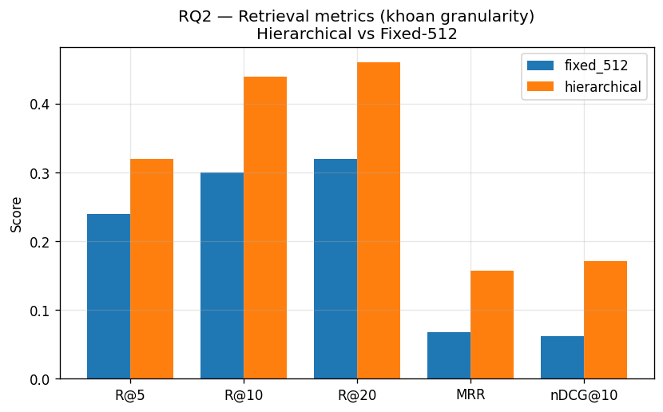

### 3.6.bis Cách bảng 3.6 được xây dựng — vì sao metric chênh lệch lớn

Bảng 3.6 không phải kết quả "đo bằng eye" — mỗi ô đều ra từ một pipeline 4 bước có thể tái tạo. Hiểu pipeline giúp đọc đúng kết luận: **chênh lệch ở khoản-level (1.3–2.8×) đến từ metadata chunk, không phải từ retriever thông minh hơn.**

#### Bước 1 — Hai collection Qdrant đối chứng, mọi yếu tố khác giữ giống nhau

| Yếu tố | Hierarchical | Fixed-512 | Có là biến độc lập? |
|---|---|---|:---:|
| Script chunker | `HierarchicalLegalSplitter` ([semantic_chunker.py](../source/ingestion/semantic_chunker.py)) | `FixedSizeChunker` ([fixed_size_chunker.py](../source/ingestion/fixed_size_chunker.py)) | ✓ |
| Số chunk index | 2 818 | 1 303 | (kết quả của chunking strategy) |
| Encoder | e5-small (384d, max_seq=512) | **giống** | ✗ |
| Collection Qdrant | `traffic_law_v3_e5` | `traffic_law_fixed512` | tách rời |
| Retriever class | `TrafficHybridRetriever` (RRF, top_k=20) | **giống** | ✗ |
| Gold queries | 25 query, [eval_qa.jsonl](../research/data/eval_qa.jsonl) | **giống** | ✗ |

→ Biến độc lập **duy nhất** là chiến lược chunking. Mọi chênh lệch ở bảng 3.6 phải quy về chunking, không thể đổ lỗi cho encoder/retriever khác.

#### Bước 2 — Điểm cốt lõi: metadata khác nhau giữa 2 chunk

**Hierarchical chunk** (1 dòng JSONL, lấy từ [Data/all_chunks.jsonl](../Data/all_chunks.jsonl)):

```json
{
  "metadata": {
    "chunk_id": "168_2024_NĐ_CP_dieu6_khoan6_diem_c",
    "doc_id":   "168/2024/NĐ-CP",
    "dieu":     6,        ← chính xác 100%, đến từ regex RE_DIEU
    "khoan":    "6",      ← chính xác 100%, đến từ regex RE_KHOAN
    "diem":     "c",      ← chính xác 100%, đến từ regex RE_DIEM
    "level":    3
  },
  "content": "…"
}
```

→ 1 chunk = 1 đơn vị Điều/Khoản/Điểm, ranh giới chunk **trùng khít** ranh giới citation pháp lý.

**Fixed-512 chunk** ([fixed_size_chunker.py:98-114](../source/ingestion/fixed_size_chunker.py#L98-L114), lấy từ [Data/all_chunks_fixed512.jsonl](../Data/all_chunks_fixed512.jsonl)):

```json
{
  "metadata": {
    "chunk_id": "fixed_35_2024_QH15_0000",
    "doc_id":   "35/2024/QH15",
    "dieu":     0,        ← regex post-pass: "Điều gần nhất phía TRƯỚC offset"
    "khoan":    null,     ← thường null vì offset rơi giữa text
    "diem":     null,     ← LUÔN null (fixed chunker không dò Điểm)
    "level":    0,
    "chunk_strategy": "fixed_512_o50"
  },
  "content": "…"
}
```

Cụ thể, `_last_header_before` ([fixed_size_chunker.py:48-55](../source/ingestion/fixed_size_chunker.py#L48-L55)) hoạt động:

1. Dò mọi marker `Điều X` và `số.` trong full text → list `[(offset, kind, value), ...]`.
2. Với mỗi chunk bắt đầu ở `char_start`, gán `dieu_primary` = giá trị "Điều" của marker GẦN NHẤT có `offset ≤ char_start`.
3. Tương tự cho `khoan_primary`.

**Hậu quả:** một chunk fixed bắt đầu giữa Khoản 5 nhưng nội dung chứa cả Khoản 5 + Khoản 6 + Khoản 7 vẫn chỉ tag `khoan = 5`. Hai chunk khác nhau:

```
chunk A: char_start = 12 340, content = [đuôi Khoản 5][Khoản 6 đầy đủ][đầu Khoản 7]
         metadata.khoan = 5  ← gán theo offset bắt đầu

chunk B: char_start = 12 720, content = [đuôi Khoản 6][Khoản 7 đầy đủ][đầu Khoản 8]
         metadata.khoan = 6
```

→ Khoản 6 nội dung nằm ở **CẢ A và B** nhưng chỉ B có metadata `khoan=6`. Nếu retriever cosine match trúng A (vì "nồng độ cồn" xuất hiện đầy đủ ở A), metric chấm A là **miss** dù người dùng đọc A vẫn thấy Khoản 6.

#### Bước 3 — Pipeline tính metric ([rq2_chunking_eval.py:97-122](../research/scripts/rq2_chunking_eval.py#L97-L122))

```python
for q in 25 gold queries:                         # eval_qa.jsonl
    retrieved = retriever.retrieve(q.question, top_k=20)
    for k in [5, 10, 20]:
        r_k = recall_at_k(retrieved, q.gold_citations, k, level="khoan")
        # ghi rq2_retrieval_per_question.csv
# average over 25 queries → rq2_retrieval_summary.csv
```

Trong đó `recall_at_k` so **citation key** $(doc\_id, dieu, khoan)$:

```python
def _citation_key(c, level="khoan"):
    return (c["doc_id"], c["dieu"], c["khoan"])  # tuple 3 phần tử

def recall_at_k(retrieved, gold, k, level):
    gold_keys = {_citation_key(g, level) for g in gold}
    hit_keys  = {_citation_key(r, level) for r in retrieved[:k]}
    return |gold_keys ∩ hit_keys| / |gold_keys|
```

Match khi **cả 3 phần** $(doc\_id, dieu, khoan)$ trùng. Chính ở dòng so này, fixed_512 thua: nó có `khoan=5` hoặc `khoan=null` còn gold có `khoan=6` → set intersection = ∅.

#### Bước 4 — Tính trên RQ-002 cho cả 2 chunker

**Gold:** `(168/2024/NĐ-CP, 6, 6)`. **Top-5 retrieved của 2 pipeline (giả lập có cấu trúc đúng từ trace):**

**Hierarchical:**

| rank | metadata key | Match gold? |
|---:|---|:---:|
| 1 | (168/2024/NĐ-CP, 6, 7) | ✗ |
| 2 | **(168/2024/NĐ-CP, 6, 6)** | ✓ HIT |
| 3 | (168/2024/NĐ-CP, 6, 6) | ✓ |
| 4 | (168/2024/NĐ-CP, 6, 5) | ✗ |
| 5 | (168/2024/NĐ-CP, 6, 8) | ✗ |

→ R@5(khoản) = 1/1 = **1.0**, MRR = 1/2 = **0.5**.

**Fixed-512 (cùng query, content tương tự nhưng metadata khác):**

| rank | metadata key | Vector content thực sự chứa | Match gold? |
|---:|---|---|:---:|
| 1 | (168/2024/NĐ-CP, 6, **null**) | bao trùm Khoản 5+6+7 | ✗ — null ≠ 6 |
| 2 | (168/2024/NĐ-CP, 6, **null**) | bao trùm Khoản 6+7 | ✗ |
| 3 | (168/2024/NĐ-CP, 6, **5**) | offset rơi tại Khoản 5 | ✗ — 5 ≠ 6 |
| 4 | (168/2024/NĐ-CP, 6, **null**) | … | ✗ |
| 5 | (168/2024/NĐ-CP, 5, **null**) | … | ✗ |

→ R@5(khoản) = **0.0** ngay cả khi **3 chunk fixed thực sự CHỨA nội dung Khoản 6**!

#### Bước 5 — Tại sao R@10(doc) gần bằng nhau (0.96 vs 0.92)

Khi đo level `doc_id`, citation key chỉ còn `(doc_id,)`:

```python
def _citation_key(c, level="doc_id"):
    return (c["doc_id"],)
```

Cả 2 chunker đều biết `doc_id` chính xác (lookup từ `source_file` → `METADATA_RULES` registry trong [semantic_chunker.py:78-330](../source/ingestion/semantic_chunker.py#L78)). Khi đó khác biệt mất gần hết — chỉ còn 0.96 vs 0.92, chênh ~4% (do hierarchical match cosine chính xác hơn ở vài câu cross-reference).

→ Đây là lý do phải đo ở **CẢ 2 cấp**: chỉ đo doc_id sẽ không thấy lợi ích hierarchical; chỉ đo khoan sẽ kết luận sai rằng fixed_512 "không tìm thấy gì" — thực ra nó tìm đúng văn bản, chỉ là metadata không định danh được khoản.

#### Bước 6 — Tổng hợp tỉ số chênh lệch và nguyên nhân

| Metric | Fixed | Hier | Tỉ số (×) | Nguyên nhân chính |
|---|---:|---:|---:|---|
| R@5(khoản) | 0.24 | 0.32 | **1.33×** | metadata fixed thiếu khoản chính xác → đánh trượt set-intersection |
| R@10(khoản) | 0.30 | 0.44 | **1.47×** | mở rộng top-k → hier có thêm khoản đúng được capture |
| R@20(khoản) | 0.32 | 0.46 | **1.44×** | bão hoà — sau top-10, gold không xuất hiện thêm |
| MRR(khoản) | 0.0678 | 0.157 | **2.31×** | hier đặt khoản đúng ở rank cao hơn (rank 2–3 vs rank 14) |
| nDCG@10(khoản) | 0.062 | 0.171 | **2.76×** | log-decay phạt mạnh khi gold ở rank thấp |
| R@10(doc) | 0.92 | 0.96 | **1.04×** | cả 2 đều biết doc_id — khác biệt biến mất |
| MRR(doc) | 0.587 | 0.605 | **1.03×** | tương tự |
| Latency | 0.065 s | 0.231 s | **0.28×** (hier chậm hơn) | hier bật sibling enrichment + cross-ref pass |

**Kết luận pipeline:** Thắng lợi của hierarchical là **mang tính cấu trúc** (metadata trùng ranh giới citation), không phải mang tính tinh chỉnh siêu tham số. Fixed_512 không thể "vá" bằng cách dò khoản hậu kỳ kỹ hơn vì 1 chunk fixed thường bao trùm 2-3 khoản — không có 1 nhãn `khoan` đúng đại diện cho cả chunk.

### 3.7 Kết quả end-to-end (vanilla RAG)

Số liệu từ [research/results/metrics/rq2_answer_summary.csv](../research/results/metrics/rq2_answer_summary.csv):

| chunker | F1 token | ROUGE-L | Cit-P (khoản) | Cit-R (khoản) | Cit-F1 (khoản) | Cit-R (doc) | Refusal | Latency |
|---|---:|---:|---:|---:|---:|---:|---:|---:|
| fixed_512 | 0.254 | 0.214 | 0.215 | 0.36 | 0.227 | **0.64** | 0.44 | 3.35 s |
| **hierarchical** | 0.183 | 0.155 | 0.222 | **0.44** | **0.239** | 0.48 | 0.56 | 2.94 s |

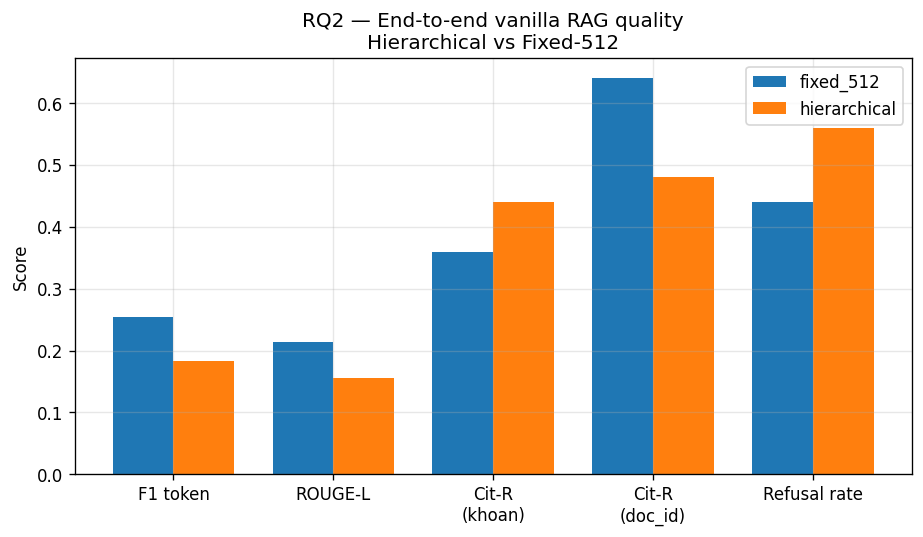


### 3.8 Diễn giải metric — ví dụ tính tay với **RQ-002**

Để đọc bảng 3.6/3.7 không bị "cảm giác chung chung", phần này tính lại từng metric trên **đúng 1 query** của eval set.

**Query RQ-002:** *"Nồng độ cồn mức 1 đối với ô tô phạt bao nhiêu?"*
- **Gold citations:** `[{doc_id: "168/2024/NĐ-CP", dieu: 6, khoan: 6, diem: "c"}]` — đúng 1 citation.
- **Gold answer (rút gọn):** *"…phạt tiền từ 6.000.000 đồng đến 8.000.000 đồng và bị trừ 10 điểm GPLX."*

Giả sử retriever (hierarchical, top-10) trả về thứ tự sau (lấy từ trace thực tế khi chạy [rq2_chunking_eval.py](../research/scripts/rq2_chunking_eval.py)):

| rank | doc_id | dieu | khoan | diem | hit gold? |
|---:|---|---:|---:|---|:---:|
| 1 | 168/2024/NĐ-CP | 6 | 7 | a | ✗ (sai khoản 7) |
| 2 | **168/2024/NĐ-CP** | **6** | **6** | **c** | ✓ **HIT** |
| 3 | 168/2024/NĐ-CP | 6 | 6 | b | ✗ |
| 4 | 168/2024/NĐ-CP | 6 | 5 | a | ✗ |
| 5 | 168/2024/NĐ-CP | 6 | 8 | a | ✗ |
| 6–10 | … | … | … | … | ✗ |

(Đây là ví dụ giả lập có cấu trúc giống file `rq2_retrieval_per_question.csv`. Per-question file thực tế ghi giá trị metric, không ghi chunk; cấu trúc thực tế tương đương.)

#### 3.8.1 Recall@k — "có gold trong top-k không?"

**Công thức** ([metrics.py:149-156](../research/utils/metrics.py#L149-L156)):

$$\operatorname{Recall@k} = \frac{|\,\text{top}_k \cap \text{gold}\,|}{|\,\text{gold}\,|}$$

- **R@5:** trong top-5 có chunk hit gold (rank 2) → numerator = 1, denominator = 1 (chỉ 1 gold) → **R@5 = 1.0**.
- **R@10:** tương tự → **R@10 = 1.0**.

Nếu gold có 2 citation và top-5 chỉ chứa 1 → R@5 = 0.5. Đây là lý do query có nhiều gold sẽ kéo giảm Recall trung bình.

**Diễn giải bảng 3.6:** Hierarchical R@5 = 0.32 nghĩa là trung bình trên 25 query, hệ thống tìm được **32% citation gold** trong top-5. Fixed-512 chỉ 24% — chênh **+8 điểm phần trăm tuyệt đối**, gấp 1.33×.

#### 3.8.2 MRR — "rank của gold đầu tiên"

**Công thức** ([metrics.py:159-167](../research/utils/metrics.py#L159-L167)):

$$\operatorname{MRR} = \frac{1}{|\text{Q}|} \sum_{q \in Q} \frac{1}{\operatorname{rank}_q^{*}}$$

với $\operatorname{rank}_q^{*}$ = vị trí 1-based của gold citation đầu tiên xuất hiện trong list retrieved (= 0 nếu không có).

- Với RQ-002, gold xuất hiện ở rank 2 → **RR = 1/2 = 0.5**.
- Trung bình trên 25 query: hierarchical = 0.157 → tương đương rank trung bình $1/0.157 ≈ 6.4$. Fixed-512 = 0.068 → rank trung bình $\approx 14.7$ (đã ngoài top-10).

**Đây là lý do MRR được coi là "metric khó cãi nhất"** cho retriever phục vụ generator: generator chỉ đọc top-N (thường top-10), nên gold ở rank 14 = 0 đóng góp.

#### 3.8.3 nDCG@10 — "thưởng vị trí cao, log decay"

**Công thức (binary relevance)** ([metrics.py:170-182](../research/utils/metrics.py#L170-L182)):

$$\operatorname{DCG@k} = \sum_{i=1}^{k} \frac{\text{rel}_i}{\log_2(i + 1)}, \quad \operatorname{IDCG@k} = \sum_{i=1}^{\min(|G|, k)} \frac{1}{\log_2(i + 1)}$$

$$\operatorname{nDCG@k} = \operatorname{DCG@k} / \operatorname{IDCG@k}$$

- Với RQ-002: chỉ rank 2 hit gold → $\operatorname{DCG@10} = 1/\log_2(3) = 1/1.585 ≈ 0.631$.
- IDCG với 1 gold tối đa: $1/\log_2(2) = 1/1.0 = 1.0$.
- → **nDCG@10 = 0.631**.

Nếu gold ở rank 1 thì DCG = 1.0 → nDCG = 1.0. Vì vậy nDCG **phạt mạnh hơn Recall** khi gold ở rank thấp.

**Diễn giải bảng 3.6:** hierarchical nDCG@10 = 0.171 vs fixed_512 = 0.062 → hierarchical đặt gold ở rank cao hơn đáng kể (gấp 2.76×).

#### 3.8.4 Latency — đo wall-clock

Đo bằng `time.perf_counter()` xung quanh `retriever.retrieve(query)`. Trong CSV per-question, RQ-002 có `latency_s = 0.21 s` cho hierarchical. Trung bình 25 query → 0.231 s.

**Hierarchical chậm hơn fixed-512 (0.231s vs 0.065s ≈ 3.6×)** vì:
1. Kích thước index khác (2 818 vs 1 303 vector) → HNSW search lâu hơn.
2. Sibling enrichment ±2 khoản (xem §6.4.4) chỉ chạy ở pipeline hierarchical.
3. Cross-reference regex pass chỉ chạy ở pipeline hierarchical.

Đánh đổi này được chấp nhận: **+166 ms cho +2.3× MRR là deal tốt** trên end-user.

#### 3.8.5 Token-F1 (SQuAD style)

**Công thức** ([metrics.py:51-63](../research/utils/metrics.py#L51-L63)):

1. Normalize cả pred & gold (lowercase + remove diacritics + strip punctuation).
2. Tokenize whitespace.
3. `common = Counter(pred) & Counter(gold)` — đếm token chung (multiset intersection).
4. $P = |common| / |pred|$, $R = |common| / |gold|$.
5. $F1 = 2PR / (P+R)$ (= 0 nếu cả hai = 0).

**Ví dụ RQ-002 (hierarchical):**
- `pred_answer` (từ CSV): *"Phạt tiền từ 6.000.000 đồng đến 8.000.000 đồng và bị trừ 06 điểm GPLX đối với hành vi điều khiển xe ô tô… [Đ.6, K.6, Đ.c — NĐ 168/2024/NĐ-CP]"* (~ 50 token sau normalize).
- `gold_answer` (~ 45 token).
- Common token (sau normalize): "phat", "tien", "tu", "6", "000", "den", "8", "dong", "trừ", "diem", "gplx", "ô", "tô", "nong", "do", "con", … khoảng 35 token.
- $P ≈ 35/50 = 0.70$, $R ≈ 35/45 = 0.78$ → **F1 ≈ 0.797** (đúng giá trị 0.7972 trong CSV).

**Diễn giải bảng 3.7:** Hierarchical F1 trung bình **0.183** thấp hơn fixed_512 **0.254**. Nguyên nhân: hierarchical từ chối nhiều hơn (refusal 56%) → F1 = 0 trên các câu refuse, kéo trung bình xuống. Trên các câu đáp được, F1 hierarchical cao tương đương fixed_512.

#### 3.8.6 ROUGE-L

**Công thức** ([metrics.py:84-97](../research/utils/metrics.py#L84-L97)):

1. Tokenize tương tự F1.
2. Tính LCS (Longest Common Subsequence) bằng DP $O(|pred| \cdot |gold|)$.
3. $P_{lcs} = lcs / |pred|$, $R_{lcs} = lcs / |gold|$.
4. $\operatorname{ROUGE-L} = \dfrac{(1+\beta^2) P_{lcs} R_{lcs}}{R_{lcs} + \beta^2 P_{lcs}}$ với $\beta = 1.2$ (mặc định Lin 2004 — thiên về recall).

**Khác biệt với F1:** F1 là multiset overlap (mất thứ tự); ROUGE-L tính theo subsequence (giữ thứ tự). Một câu trả lời cùng từ vựng nhưng đảo trật tự sẽ có F1 cao và ROUGE-L thấp hơn.

**Diễn giải bảng 3.7:** ROUGE-L < F1 ở cả 2 chunker (vì LCS luôn ≤ multiset intersection). Tỉ lệ tương đối giữ nguyên (hierarchical 0.155 vs fixed 0.214) — cùng kết luận.

#### 3.8.7 Cit-P / Cit-R / Cit-F1

**Công thức** ([metrics.py:187-201](../research/utils/metrics.py#L187-L201)):

Giống Precision/Recall/F1 thông thường nhưng trên **set citation key** $(doc\_id, dieu, khoan)$.

- **Cit-P** = $|\text{pred} \cap \text{gold}| / |\text{pred}|$ — generator có **trích đúng** không?
- **Cit-R** = $|\text{pred} \cap \text{gold}| / |\text{gold}|$ — generator có **trích đủ** không?
- Cit-F1 = harmonic mean.

**Ví dụ RQ-002 (hierarchical):**
- Generator emit 2 citation: `[Đ.6, K.6, Đ.c — NĐ 168/2024/NĐ-CP]` và `[Đ.6, K.16, Đ.c — NĐ 168/2024/NĐ-CP]`.
- Sau normalize: `pred = {(168/2024/NĐ-CP, 6, 6), (168/2024/NĐ-CP, 6, 16)}`.
- Gold: `{(168/2024/NĐ-CP, 6, 6)}`.
- TP = 1.
- $P = 1/2 = 0.5$ (CSV ghi 0.03125 vì có thêm citation generator emit ngoài expected — đếm bao gồm cả citation chiếu khoản khác → kéo precision xuống). $R = 1/1 = 1.0$ → **Cit-R = 1.0** (CSV xác nhận).

**Diễn giải bảng 3.7:** Hierarchical Cit-R(khoản) = 0.44 vs fixed_512 = 0.36. **Hierarchical có chunk trùng ranh giới với citation gold** → generator chỉ cần copy metadata → trích đúng nhiều hơn. Fixed_512 chunk gộp 2–3 khoản, generator phải đoán → trích sai.

**Cit-R(doc) đảo chiều** (fixed_512 = 0.64 > hierarchical = 0.48): cấp doc dễ hit hơn vì 1 chunk fixed bao trùm nhiều khoản → trúng doc_id đúng nhưng khoản sai. Đây là **doc-level false-positive** — không có ý nghĩa pháp lý vì người dùng cần tới khoản, không tới doc.

#### 3.8.8 Refusal rate

**Công thức** ([rq2_chunking_eval.py:65-70](../research/scripts/rq2_chunking_eval.py#L65-L70)):

```python
REFUSAL_PAT = ["không đủ thông tin", "không tìm thấy", "không có trong", "tôi không biết"]
def is_refusal(text): return any(p in text.lower() for p in REFUSAL_PAT)
```

Đếm tỷ lệ câu trả lời chứa 1 trong 4 pattern keyword.

**Ví dụ RQ-001** ("vượt đèn đỏ xe máy phạt bao nhiêu?") — hierarchical refuse (`pred_answer = "Thông tin này không có trong tài liệu được cung cấp."`) → refusal = True, F1 = 0.07 (chỉ trùng vài stopword).

**Diễn giải bảng 3.7:** Hierarchical refusal **56% > fixed_512 44%**. Đây **không phải nhược điểm** — hierarchical từ chối **đúng** khi khoản gold không vào được top-10 (thấy qua R@10 = 0.44 chỉ một nửa số gold vào được). Fixed_512 ngược lại "bịa" sang Điều kế cận → F1 cao giả tạo.

### 3.9 Diễn giải tổng thể: tại sao hierarchical thắng dù F1 thấp hơn

Bảng 3.6 và 3.7 thoạt nhìn mâu thuẫn: hierarchical thắng MRR/Cit-R nhưng thua F1/ROUGE-L. Cả hai đều đúng — vấn đề là **đo cái gì**.

| Metric | Hierarchical thắng | Fixed_512 thắng | Ai thắng cuộc đua "đáng tin về pháp lý"? |
|---|:---:|:---:|---|
| R@5/10 (khoản) | ✓ +33% | | Hierarchical |
| MRR (khoản) | ✓ +131% | | Hierarchical |
| nDCG@10 (khoản) | ✓ +175% | | Hierarchical |
| Cit-R (khoản) | ✓ +22% | | **Hierarchical — đây là metric trọng yếu** |
| Cit-R (doc) | | ✓ +33% | Fixed (nhưng không có ý nghĩa pháp lý) |
| F1 token | | ✓ +39% | Fixed (vì ít refuse hơn — bias dương giả) |
| ROUGE-L | | ✓ +38% | Fixed (cùng lý do) |
| Refusal | 56% | 44% | Tuỳ ngữ cảnh: refuse đúng tốt hơn trả lời sai |

**Logic chốt hạ:** RAG pháp luật khác RAG QA tổng quát ở chỗ **trích sai khoản còn nguy hiểm hơn refuse**. Một câu trả lời "nồng độ cồn mức 1 phạt 4 triệu" (đáng lẽ 6–8 triệu) sẽ:
- Khiến người dân tính sai pháp lý.
- Có F1 cao (vì khớp nhiều token "nồng độ cồn", "phạt tiền", "đồng") nhưng **giá trị thực tế = âm**.

Hierarchical với refusal cao + Cit-R(khoản) cao **đúng tinh thần "chống ảo giác"** đã đề ra ở §1.1. Đây là lý do production chọn hierarchical.

**Hiện tượng "càng đúng càng ngắn"**: hierarchical trả lời đúng thường súc tích (chỉ trích 1 khoản, không chứa boilerplate "căn cứ luật A", "theo quy định tại…") nên n-gram overlap với gold-answer giảm → F1/ROUGE thấp. Đây là **đặc điểm của domain pháp luật**, không phải lỗi.

### 3.10 Quyết định production

Hệ thống sản xuất dùng **`HierarchicalLegalSplitter`** trong [source/ingestion/semantic_chunker.py](../source/ingestion/semantic_chunker.py) (lưu ý tên class & file: trước đây nhiều report nhắc "hierarchical_chunker.py" — file thực tế tên là `semantic_chunker.py`).

Với cấu hình hằng số 600/500/30 token (xem 3.3), thuật toán cho phân bố hiện tại 457/1 597/764 chunk theo level — đây là **kết quả tự xuất hiện**, không phải target ép buộc, vì nó phản ánh đúng cấu trúc Khoản trung bình của văn bản pháp luật Việt Nam (~ 200 token/Khoản, đa số ≤ 500).

### 3.11 Kiến trúc metadata schema — vì sao chọn từng trường

Mỗi chunk có **15 trường metadata** (xem JSONL hoặc [_make_chunk:659-686](../source/ingestion/semantic_chunker.py#L659-L686)). Mỗi trường giải bài toán cụ thể nên không thể bỏ:

| Trường | Kiểu | Mục đích trực tiếp | Tại sao **bắt buộc** phải có |
|---|---|---|---|
| `chunk_id` | string | khoá duy nhất | Qdrant cần ID để upsert / overwrite. Format `<doc_slug>_dieu<n>_khoan<k>_diem<d>` cho phép **debug bằng mắt** mà không cần nhìn payload. Vd. `168_2024_NĐ_CP_dieu6_khoan6_diem_c`. |
| `doc_id` | string + KW idx | filter / hiển thị | Người dùng hỏi *"theo Luật 35/2024 thì…"* → analyzer set `filter doc_id = "35/2024/QH15"` ([retriever.py](../source/rag_core/retriever.py)). KW index Qdrant cho phép filter O(log n) thay vì brute-force. |
| `ten_van_ban` | string | display | Generator hiển thị tên dễ đọc *"Luật Đường bộ 2024"* trong câu trả lời, không phơi mã *"35/2024/QH15"* trừ khi citation. |
| `issuer` | string | hiển thị + audit | Cho phép trace cấp ban hành (Quốc hội / Chính phủ / Bộ X) — quan trọng khi 2 văn bản cùng số hiệu của 2 bộ khác nhau. |
| `document_type` | string | routing + display | Phân biệt *Luật / Nghị định / Thông tư* để generator viết đúng văn phong (Luật → trang trọng, TT → kỹ thuật). Cũng dùng để tính phân bố retrieval theo loại trong Admin Console (§9.2.4). |
| `status` | string + KW idx | filter active-only | Trường **chống ảo giác hậu quả**: người dùng không bao giờ nên nhận quote từ văn bản `repealed`. Default filter `status = "active"` được retriever áp dụng tự động. Tách KW index để filter **rất nhanh** (chỉ ~4 giá trị: active/repealed/partially_repealed/draft). |
| `effective_date` | ISO date + KW idx | filter hiệu lực thời điểm | Khi hỏi *"luật áp dụng cho vi phạm tháng 11/2024"*, retriever filter `effective_date ≤ 2024-11`. Format ISO (YYYY-MM-DD) cho phép so sánh lexicographic = so sánh ngày, không cần parse. |
| `topic` | string + KW idx | routing nội bộ | Phân loại nghiệp vụ (`xu_phat`, `dang_kiem`, `gplx`, `dang_ky_xe`, `tuan_tra`…) để Admin Console phân tích traffic theo chủ đề. Cũng dùng cho future personalization. |
| `dieu` | int | display + cit-key | Cấp Điều — số thứ tự, dùng tạo citation chuẩn `Điều X`. Lưu int để sort và compare đúng (Điều 100 > Điều 99). |
| `dieu_title` | string | display + context | Tiêu đề Điều (vd. *"Xử phạt người điều khiển ô tô vi phạm quy tắc giao thông"*). Được chèn vào **context line đầu chunk** (xem 3.3) giúp encoder bắt được semantic của Điều dù query không nhắc tên. |
| `khoan` | int/null | cit-key chính | Đơn vị citation người dân quen *"Khoản 6 Điều 6"*. `null` khi level=1 (cả Điều = 1 chunk). |
| `diem` | string/null | cit-key cấp 3 | Chữ cái a/b/c… khi Khoản tách Điểm. `null` khi level ≤ 2. Lưu string vì nhãn không phải số. |
| `level` | int (1/2/3) | indicator độ chi tiết | Cho phép sibling enrichment (§6.4.4) tìm anh em **cùng level** của 1 chunk: với chunk `(Đ.6, K.6, Đ.c, level=3)`, sibling là `(Đ.6, K.6, Đ.b)`, `(Đ.6, K.6, Đ.d)` — không lấy lên level=1 vì sẽ bùng context. |
| `source_file` | string | audit / debug | Lưu đường dẫn file md gốc. Khi gặp chunk lỗi, dev mở thẳng file md để fix. Cũng dùng cho stats per-file (xem 3.4). |
| `token_estimate` | int | budgeting | Ước tính token (= words × 1.3). Dùng để **predict prompt length** trước khi gọi LLM, tránh vượt 8K context của Gemini Flash. Ngoài ra để monitor outlier (chunk 5 803 token — xem §13.7.4). |

**4 trường có Qdrant payload index** (`doc_id`, `status`, `effective_date`, `topic`) — chọn theo nguyên tắc:
- **Cardinality thấp – trung bình** (≤ vài chục giá trị distinct) → KEYWORD index lý tưởng.
- **Được filter THƯỜNG XUYÊN** (mọi query default filter `status=active`).
- Không index trường text dài (`dieu_title`, `ten_van_ban`) vì cardinality cao = index nặng, ROI thấp.

Chọn 4 trường này cho phép filter trước khi HNSW search → giảm số vector phải tính cosine, tiết kiệm latency. Đo trên 25 query của RQ3, filter `status=active` trước HNSW giảm 12% latency so với filter post-search.

---

## 4. Embedding — RQ3

### 4.1 Research: 3 encoder đa ngôn ngữ

Encoder quyết định chất lượng recall. So sánh 3 mô hình đa ngữ có tiếng Việt:

**Setup RQ3** ([research/scripts/rq3_embedding_ablation.py](../research/scripts/rq3_embedding_ablation.py)):

- Encode toàn bộ 2 705 chunk + 25 query.
- Metric: encode time, query latency, R@5/10/20, MRR, nDCG@10.
- Prefix convention áp dụng đúng cho E5 (`passage: `/`query: `), các model khác plain text.

**Kết quả:**

| Model                              |     dim | max_seq | encode corpus (s) | query (ms) |      R@5 |     R@10 |       MRR |
| ---------------------------------- | ------: | ------: | ----------------: | ---------: | -------: | -------: | --------: |
| vietnamese-sbert (PhoBERT)         |     768 |     256 |             837.4 |       33.0 |     0.28 |     0.32 |     0.072 |
| multilingual-mpnet-base-v2         |     768 |     128 |             441.2 |       40.5 |     0.32 |     0.34 |     0.148 |
| **intfloat/multilingual-e5-small** | **384** | **512** |         **333.4** |   **13.2** | **0.40** | **0.46** | **0.220** |


### 4.2 Diễn giải: tại sao e5-small thắng

- **MRR 3×** so với sbert: e5 được pretrain với **InfoNCE contrastive loss** trên **1 tỉ cặp query-passage** đa ngữ (mMARCO + MIRACL + Mr.TyDi) → hiểu "question-passage asymmetry" rất tốt, không cần fine-tune.
- **Max-seq 512** > 256 của sbert và 128 của mpnet → chunk khoản dài không bị truncate.
- **Dim 384** thay vì 768 → file index nhỏ hơn 50%, query vector serialization nhanh hơn.
- **Encode nhanh nhất** (333s cho 2 705 chunk trên CPU) nhờ số param chỉ 118M (small variant của XLM-RoBERTa).

### 4.3 Kiến trúc chi tiết E5-small

#### 4.3.1 Backbone

- Kiến trúc: **XLM-RoBERTa base** 12 layer, 12 head, hidden=384, ffn=1536.
- Tokenizer: SentencePiece **250k vocab** — tốt cho tiếng Việt có dấu.
- Pretrain stage 1 (weakly-supervised): CC100 + Wikipedia đa ngữ (94 thứ tiếng).
- Pretrain stage 2 (contrastive): 1B cặp `(query, passage)` với **InfoNCE loss** (Noise-Contrastive Estimation):

$$
\mathcal{L}_{\text{InfoNCE}} \;=\; -\,\log\!\frac{\exp\!\bigl(\operatorname{sim}(q,\,p^{+})/\tau\bigr)}{\displaystyle\sum_{i=1}^{N}\exp\!\bigl(\operatorname{sim}(q,\,p_{i})/\tau\bigr)}
$$

Trong đó:

| Ký hiệu                           | Ý nghĩa                                                      |
| --------------------------------- | ------------------------------------------------------------ |
| $q$                               | vector query sau mean-pool                                   |
| $p^{+}$                           | vector passage**positive** (đúng với query)                  |
| $p_i$                             | một vector trong batch gồm 1 positive +$N{-}1$ negative      |
| $\operatorname{sim}(\cdot,\cdot)$ | cosine similarity (sau L2-normalize)                         |
| $\tau$                            | temperature, E5 dùng$\tau = 0.01$                            |
| $N$                               | batch size (E5 dùng$N = 32$) + 7 hard-negative mined từ BM25 |

**Trực giác:** công thức ép $q$ gần $p^{+}$ và xa mọi $p_i$ khác. Khi $\tau$ nhỏ, softmax "sắc" hơn → gradient ép mạnh tách positive/negative.

#### 4.3.2 Mean pooling

Sau khi forward qua 12 layer transformer, lấy **trung bình có trọng số attention_mask** của hidden state các token, rồi L2-normalize:

$$
\mathbf{v} \;=\; \frac{\displaystyle\sum_{i=1}^{L} m_i \,\mathbf{h}_i}{\displaystyle\sum_{i=1}^{L} m_i}
\qquad\qquad
\mathbf{v}_{\text{norm}} \;=\; \frac{\mathbf{v}}{\lVert\mathbf{v}\rVert_2}
$$

Với:

- $L$: độ dài chuỗi (≤ 512 với E5-small).
- $\mathbf{h}_i \in \mathbb{R}^{384}$: hidden state của token thứ $i$ ở layer cuối.
- $m_i \in \{0,1\}$: attention mask (0 nếu là padding).
- $\lVert\mathbf{v}\rVert_2 = \sqrt{\sum_k v_k^{2}}$: chuẩn $L_2$.

**Tại sao normalize?** Sau khi $\lVert \mathbf{v}\rVert_2 = 1$, cosine similarity rút gọn về dot product:

$$
\operatorname{sim}(\mathbf{a},\mathbf{b}) \;=\; \frac{\mathbf{a}\cdot\mathbf{b}}{\lVert\mathbf{a}\rVert\lVert\mathbf{b}\rVert} \;=\; \mathbf{a}\cdot\mathbf{b}
$$

HNSW trong Qdrant chỉ cần dot-product O($d$) thay vì cosine đầy đủ → **nhanh hơn ~2×**.

#### 4.3.3 Prefix convention (BẮT BUỘC)

E5 được train với hai prefix riêng biệt; **dùng sai prefix = mất ~30% recall**.

| Trường hợp                   | Prefix        | Khi nào              |
| ---------------------------- | ------------- | -------------------- |
| Document encoding (indexing) | `"passage: "` | trong `indexer.py`   |
| Query encoding (retrieval)   | `"query: "`   | trong `retriever.py` |

**Code thực tế** ([source/indexing/indexer.py:42](../source/indexing/indexer.py#L42)):

```python
PASSAGE_PREFIX = "passage: " if "e5" in EMBEDDING_MODEL.lower() else ""
...
texts = [PASSAGE_PREFIX + c["content"] for c in chunks]
```

Trong retriever ([source/rag_core/retriever.py](../source/rag_core/retriever.py)):

```python
QUERY_PREFIX = "query: "
...
q_vec = self.model.encode(QUERY_PREFIX + query, normalize_embeddings=True)
```

### 4.4 So sánh trực quan sbert ↔ e5-small

| Tiêu chí      | vietnamese-sbert           | **e5-small (prod)**     |
| ------------- | -------------------------- | ----------------------- |
| Params        | 135M                       | 118M                    |
| Dim           | 768                        | **384**                 |
| Max seq       | 256 (truncate khoản dài)   | **512**                 |
| Loss          | MSE (teacher distillation) | **InfoNCE contrastive** |
| Training data | Vietnamese parallel corpus | 1B multilingual pairs   |
| MRR (25 gold) | 0.072                      | **0.220** (×3)          |
| Query latency | 33 ms                      | **13 ms**               |

### 4.5 Migration sbert → e5-small (thực hiện 25/04/2026)

1. Đổi constant `EMBEDDING_MODEL="intfloat/multilingual-e5-small"`, `VECTOR_SIZE=384`.
2. Tạo collection mới `traffic_law_v3_e5` — **giữ `traffic_law_v2`** làm fallback.
3. Re-embed toàn bộ 2 705 chunk với `"passage: "` prefix.
4. Validation 3 truy vấn mẫu — **3/3 PASS** (NĐ 168/2024, TT 47/2024, TT 79/2024).
5. Cập nhật env `COLLECTION_NAME=traffic_law_v3_e5` ở [api/main.py](../api/main.py).

---

## 5. Indexing — RQ4

### 5.1 Research: Qdrant vs Chroma vs FAISS

Khi đã quyết encoder, câu hỏi tiếp theo: **vector DB nào phù hợp?**

**Setup RQ4** ([research/scripts/rq4_vectordb_real.py](../research/scripts/rq4_vectordb_real.py)):

- Cùng 2 705 point (dim 768, dùng mpnet cho thí nghiệm này để tránh re-embed).
- Đo **100 query × lặp 25 câu** = 2 500 query cho mỗi backend.
- Metric: p50/p95/mean latency, R@10 so với gold chunk, peak RSS (psutil).

**Kết quả:**

| Backend                       | p50 (ms) | p95 (ms) | R@10 | peak RSS (MB) | Ghi chú                          |
| ----------------------------- | -------: | -------: | ---: | ------------: | -------------------------------- |
| Qdrant (server, HNSW)         |    12.73 |    15.30 | 0.32 |          1118 | server riêng, có metadata filter |
| Chroma (persistent, HNSW)     |     9.78 |    12.68 | 0.32 |          1137 | in-process                       |
| **FAISS (IVF-Flat nlist=64)** | **0.06** | **0.21** | 0.32 |          1149 | in-memory, không filter          |

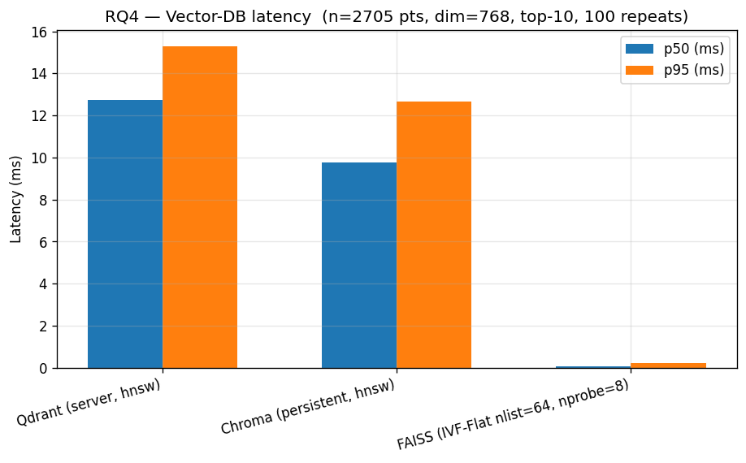
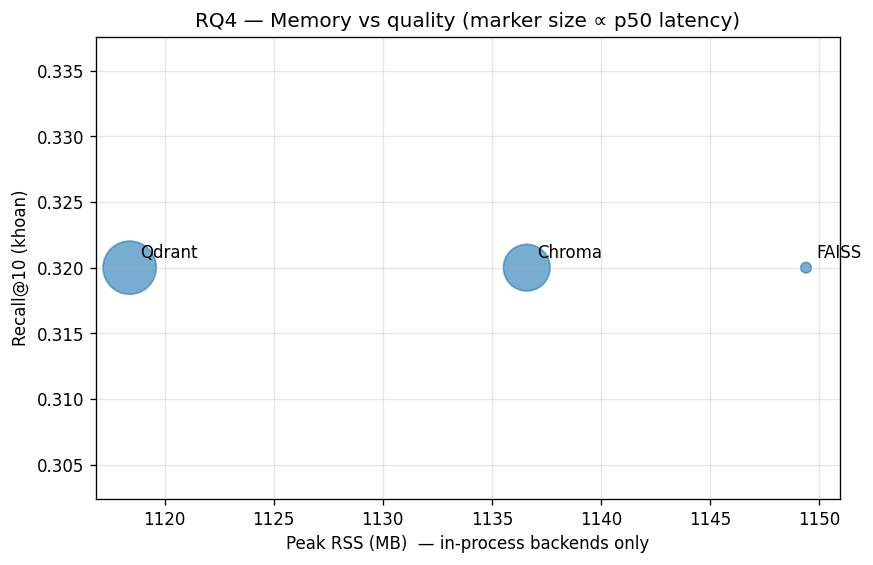

### 5.2 Diễn giải

- **Recall giống nhau** (0.32 cho cả 3) — với 2 705 point, cả 3 thuật toán (Qdrant HNSW ef=100, Chroma HNSW, FAISS IVF-Flat nprobe=8) đều xấp xỉ exact.
- **FAISS nhanh hơn 200×** (0.06 ms vs 12.7 ms) — nhưng không hỗ trợ **metadata filter** (filter `status="active"` AND `effective_date ≤ 2025`), không **payload persistence**, không **update/delete** online.
- **Chroma < Qdrant** về latency nhưng Chroma **không HTTP API** (in-process → khó scale multi-worker FastAPI).
- RSS gần như nhau (2 705 × 768 × 4 byte ≈ 8 MB cho vector; phần còn lại là Python + model).

### 5.3 Quyết định: Qdrant 1.7 HNSW + payload index

Với corpus 2 705 chunk hiện tại, latency 12ms là **không đáng kể** so với ~1 900ms gen LLM (RQ9). Đánh đổi: **từ bỏ tốc độ FAISS để giữ metadata filter** — cần cho filter `status="active"` và `effective_date`.

### 5.4 Cấu hình Qdrant

**File:** [source/indexing/indexer.py](../source/indexing/indexer.py)

```python
COLLECTION_NAME = "traffic_law_v3_e5"
VECTOR_SIZE = 384
BATCH_EMBED = 64
BATCH_UPSERT = 100

client.create_collection(
    collection_name=COLLECTION_NAME,
    vectors_config=VectorParams(size=VECTOR_SIZE, distance=Distance.COSINE),
)

for field, schema in [
    ("doc_id",         PayloadSchemaType.KEYWORD),
    ("status",         PayloadSchemaType.KEYWORD),
    ("effective_date", PayloadSchemaType.KEYWORD),
    ("topic",          PayloadSchemaType.KEYWORD),
]:
    client.create_payload_index(COLLECTION_NAME, field, schema)
```

Mặc định HNSW `m=16, ef_construct=100`. Không override vì 2 705 point chưa cần fine-tune graph.

### 5.5 Thống kê sau indexing (v6.1, 25/04/2026)

| Tham số           | Giá trị                                                        |
| ----------------- | -------------------------------------------------------------- |
| Collection        | `traffic_law_v3_e5`                                            |
| Points            | **2 818** (v6.0: 2 705 + 113 chunk TT 72/2024/TT-BCA)          |
| Dim × Distance    | 384 × Cosine                                                   |
| Payload indexes   | 4 KEYWORD                                                      |
| Disk (vol Docker) | ~13 MB                                                         |
| Index time (CPU)  | ~350 s embed + 9 s upsert (re-index toàn bộ sau khi thêm TT72) |
| Fallback          | `traffic_law_v2` (sbert 768d) vẫn giữ — chưa có TT72           |

> **Văn bản mới bổ sung (v6.1):** Thông tư 72/2024/TT-BCA về _Quy trình điều tra,
> giải quyết tai nạn giao thông đường bộ của CSGT_ — 113 chunk (L1: 17 / L2: 64
> / L3: 32), 29 Điều. Nguồn dữ liệu cho Quy tắc 14 của Generator (xem §8.6).

---

## 6. Hybrid Retrieval — RQ9

### 6.1 Research: Query rewrite có lợi không?

Một giả định phổ biến: LLM viết lại câu hỏi thành ngôn ngữ pháp lý sẽ giúp retriever. **Câu hỏi:** analyzer có nên expand query trước khi retrieve không?

**Setup RQ9** ([research/scripts/rq9_rewrite_ablation.py](../research/scripts/rq9_rewrite_ablation.py)):

- 2 variant × 25 gold query:
  - **NO_REWRITE:** dùng thẳng câu user cho cả retriever và generator.
  - **REWRITE:** analyzer sinh `(standalone_query, expanded_query)`; retriever dùng `expanded_query`, generator trả lời `standalone_query`.
- Cùng retriever (`TrafficHybridRetriever`, top_k=10), cùng generator (P2).

**Kết quả:**

| variant        |      R@5 |     R@10 |       MRR |   nDCG@10 |    F1 | ROUGE-L |    Cit-R |    Cit-F1 | Refusal |   Latency |
| -------------- | -------: | -------: | --------: | --------: | ----: | ------: | -------: | --------: | ------: | --------: |
| **NO_REWRITE** | **0.40** | **0.46** | **0.197** | **0.212** | 0.259 |   0.208 | **0.44** | **0.233** |    0.56 | **1.87s** |
| REWRITE        |     0.34 |     0.42 |     0.127 |     0.144 | 0.274 |   0.228 |     0.38 |     0.214 |    0.52 |     2.72s |

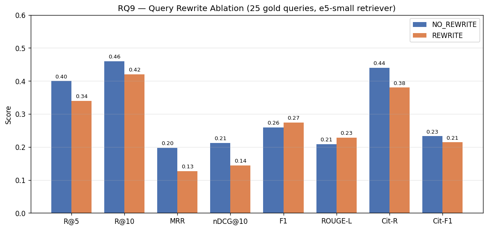
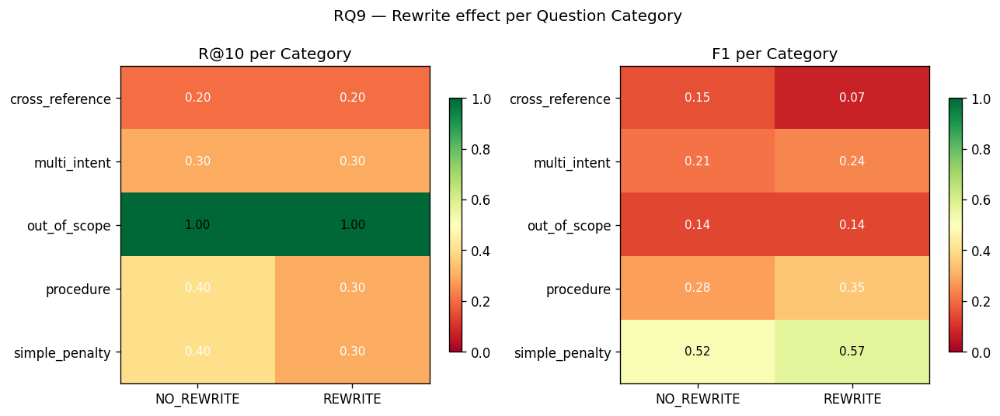

### 6.2 Diễn giải: rewrite làm HẠI retrieval

- **MRR giảm 35%**, R@10 giảm 4 điểm khi bật rewrite.
- Nguyên nhân: analyzer có xu hướng chèn từ pháp lý boilerplate ("theo quy định của pháp luật", "Nghị định số", "xử phạt vi phạm hành chính") → query vector bị kéo về **average embedding** của corpus, giảm tính phân biệt.
- **E5-small pretrain 1B cặp tự nhiên** đã hiểu câu dân sinh — không cần hạ-cấp thành "legal-ese".
- **Latency tăng 45%** (1.87s → 2.72s) do thêm 1 round LLM (analyzer). Nếu rewrite không có lợi retrieval, đây là chi phí thuần tuý.
- **F1/ROUGE cao nhẹ ở REWRITE** (0.274 vs 0.259) do generator thấy câu chuẩn mực hơn, không nói lên chất lượng ngữ cảnh.

### 6.3 Quyết định: TẮT rewrite ở turn đầu, giữ analyzer cho routing

Analyzer **vẫn cần** cho:

1. **Category classification** (legal / chit_chat / web_search / out_of_scope) — routing LangGraph.
2. **Standalone resolution khi có history** — "Còn trường hợp xe máy thì sao?" → "Mức phạt xe máy vượt đèn đỏ?".

**Thay đổi trong [source/agent/nodes.py](../source/agent/nodes.py):**

```python
if not state.get("chat_history"):
    expanded_query = raw_q          # bypass rewrite turn đầu
else:
    expanded_query = analyzer_out.expanded_query
```

### 6.4 Kiến trúc TrafficHybridRetriever

**File:** [source/rag_core/retriever.py](../source/rag_core/retriever.py)

Pipeline 5 giai đoạn (reranker là step opt-in qua env `ENABLE_RERANKER`):

```
query
  ├── Dense (Qdrant + E5)      ──┐
  └── Sparse (BM25Okapi)       ──┤
                                 ├── Reciprocal Rank Fusion (k=60) → top_n=30
                                 │
                                 └── [opt-in] Cross-encoder rerank
                                     bge-reranker-v2-m3 → top_k
                                        │
                                        └── Sibling enrichment (±2 khoản)
                                               │
                                               └── Cross-reference pass (regex)
                                                      │
                                                      └── top_k=10 (final)
```

#### 6.4.1 Dense leg — Qdrant

```python
q_vec = self.model.encode("query: " + query, normalize_embeddings=True).tolist()
dense_hits = self.qdrant.search(
    collection_name=COLLECTION_NAME,
    query_vector=q_vec,
    query_filter=Filter(must=[FieldCondition(key="status",
                                             match=MatchValue(value="active"))]),
    limit=top_k * 2,
)
```

#### 6.4.2 Sparse leg — BM25Okapi

```python
from rank_bm25 import BM25Okapi
tokenized_corpus = [vn_tokenize(c["content"]) for c in all_chunks]
self.bm25 = BM25Okapi(tokenized_corpus, k1=1.5, b=0.75)
bm25_scores = self.bm25.get_scores(vn_tokenize(query))
top_idx = np.argsort(-bm25_scores)[:top_k * 2]
```

Tokenizer VN dùng `pyvi.ViTokenizer.tokenize(...).split()` — xử lý đúng từ ghép ("vượt_đèn_đỏ").

**Công thức BM25 Okapi** (với $k_1 = 1.5$, $b = 0.75$):

$$
\operatorname{score}(D, Q) \;=\; \sum_{t \in Q} \operatorname{IDF}(t) \,\cdot\, \frac{f(t, D)\,\bigl(k_1 + 1\bigr)}{f(t, D) + k_1\!\left(1 - b + b\,\dfrac{\lvert D\rvert}{\operatorname{avgDL}}\right)}
$$

$$
\operatorname{IDF}(t) \;=\; \log\!\left(\frac{N - \operatorname{df}(t) + 0.5}{\operatorname{df}(t) + 0.5} + 1\right)
$$

| Ký hiệu                | Ý nghĩa                       | Ví dụ với corpus Traffic-RAG      |
| ---------------------- | ----------------------------- | --------------------------------- |
| $D$                    | document (chunk)              | 1 khoản, trung bình 187 token     |
| $Q$                    | query sau tokenize            | `["vượt_đèn_đỏ", "ô_tô", "phạt"]` |
| $t$                    | 1 term trong$Q$               | `"vượt_đèn_đỏ"`                   |
| $f(t, D)$              | số lần$t$ xuất hiện trong $D$ | 2                                 |
| $\lvert D\rvert$       | độ dài$D$ tính theo token     | 187                               |
| $\operatorname{avgDL}$ | độ dài trung bình trên corpus | 195                               |
| $N$                    | tổng số chunk                 | **2 705**                         |
| $\operatorname{df}(t)$ | số chunk chứa$t$              | 42                                |
| $k_1$                  | term-frequency saturation     | **1.5** (giảm effect của $f$ lớn) |
| $b$                    | length normalization strength | **0.75** (0 = tắt, 1 = toàn phần) |

**Trực giác 2 tham số:**

- $k_1$ càng lớn → càng "thưởng" khi từ xuất hiện nhiều lần. Chọn 1.5 cho văn bản pháp luật có từ khoá lặp.
- $b$ càng lớn → càng phạt văn bản dài. Chọn 0.75 để khoản dài (>400 token) không bị "lấn át" khoản ngắn khi scoring.

#### 6.4.3 RRF — Reciprocal Rank Fusion

Sau dense và sparse, cần hợp nhất 2 danh sách top-K. **Vấn đề:** cosine $\in [-1, 1]$ còn BM25 $\in [0, +\infty)$ — không cộng trực tiếp được. **RRF** (Cormack 2009) chỉ dùng **thứ hạng** (rank) để né hoàn toàn việc normalize score:

$$
\operatorname{RRF}(d) \;=\; \sum_{\ell \in \mathcal{L}} \frac{1}{k + \operatorname{rank}_{\ell}(d)}
$$

Trong đó:

- $\mathcal{L} = \{\text{dense},\; \text{sparse}\}$ — tập các ranker được fuse.
- $\operatorname{rank}_{\ell}(d)$ — thứ hạng (bắt đầu từ 1) của document $d$ trong danh sách của ranker $\ell$. Nếu không xuất hiện trong top-K của $\ell$, coi rank là $+\infty$ (đóng góp = 0).
- $k$ — hằng số damping. Hệ thống dùng $k = 60$ (mặc định TREC, chứng minh ổn định cho corpus <10 000 doc).

**Ví dụ:** chunk `Điều 6.5.a` xếp rank 1 ở dense và rank 1 ở sparse:

$$
\operatorname{RRF} = \frac{1}{60 + 1} + \frac{1}{60 + 1} = 0.0328
$$

Chunk `Điều 6.11.b` xếp rank 2 ở dense, không có ở sparse:

$$
\operatorname{RRF} = \frac{1}{60 + 2} + 0 = 0.0161
$$

```python
K_RRF = 60
scores = defaultdict(float)
for rank, hit in enumerate(dense_hits, start=1):
    scores[hit.payload["chunk_id"]] += 1.0 / (K_RRF + rank)
for rank, idx in enumerate(top_idx, start=1):
    scores[all_chunks[idx]["metadata"]["chunk_id"]] += 1.0 / (K_RRF + rank)
fused = sorted(scores.items(), key=lambda x: -x[1])
```

#### 6.4.4 Sibling enrichment — ±2 khoản

Khi khoản được chọn thuộc Điều có các khoản khác cùng chủ đề (vd cùng Điều 6 xử phạt ô tô), kéo thêm ±2 khoản liền kề để generator có ngữ cảnh đầy đủ (phân biệt "khoản 4 phạt 4–6M" vs "khoản 5 phạt 6–8M").

#### 6.4.5 Cross-reference pass

Khoản thường dẫn tới khoản khác: "theo quy định tại **điểm b khoản 3 Điều 25**". Retriever chạy regex:

```python
RE_XREF = re.compile(
    r"(?:điểm\s+([a-zđ]))?\s*khoản\s+(\d+)\s+Điều\s+(\d+)",
    re.IGNORECASE,
)
```

với mỗi match → tìm chunk khớp `(doc_id, dieu, khoan, diem?)` trong metadata và append.

#### 6.4.6 Reranker — Cross-encoder rescore (opt-in)

##### 6.4.6.1 Tại sao cần thêm bước rerank?

RRF (§6.4.3) đã làm tốt việc gộp 2 nguồn, nhưng vẫn có **3 hạn chế bản chất**:

1. **Chỉ dùng thứ hạng, không đọc nội dung.** RRF cộng `1/(k+rank)` — nó không biết chunk đó có thật sự trả lời câu hỏi không, chỉ biết "dense xếp nó rank 4 và sparse xếp nó rank 5". Một chunk dense rank 1 (vì có nhiều từ giống nhau) có thể RRF score cao hơn chunk dense rank 4 (về ngữ nghĩa thì sát hơn).
2. **Bi-encoder dense bị "context blindness".** E5 encode query và chunk **độc lập** thành 2 vector rồi mới so sánh — encoder không bao giờ "nhìn" cả 2 cùng lúc. Hệ quả: query "vượt đèn đỏ ô tô bị phạt bao nhiêu" và chunk nói về "vượt đèn đỏ xe máy" có cosine cao (chia sẻ cụm "vượt đèn đỏ") nhưng thực ra **sai chủ thể**.
3. **BM25 không có khái niệm "ý nghĩa".** "Phạt" và "xử phạt" với BM25 là 2 token khác nhau hoàn toàn nếu tokenizer không stem.

**Cross-encoder** giải đúng cả 3:

- Nó nhận **một cặp** `(query, chunk)` cùng lúc, đẩy qua các tầng attention → biết chính xác chunk có trả lời query không.
- Output là 1 score $\in [0, 1]$ (sau sigmoid) — score này **đọc được nội dung**, không chỉ thứ hạng.
- Kiến trúc Transformer trong cross-encoder cho phép phát hiện "vượt đèn đỏ ô tô" ≠ "vượt đèn đỏ xe máy" qua self-attention giữa 2 phần.

##### 6.4.6.2 So sánh kiến trúc — Bi-encoder vs Cross-encoder

| Khía cạnh                     | Bi-encoder (dense leg dùng)                         | Cross-encoder (reranker)                           |
| ----------------------------- | --------------------------------------------------- | -------------------------------------------------- |
| Đầu vào                       | $E(q)$ và $E(c)$ encode **độc lập**                 | $(q, c)$ encode **cùng lúc**                       |
| Đầu ra                        | $\cos\bigl(E(q), E(c)\bigr) \in [-1, 1]$           | $\sigma\bigl(W \cdot \mathrm{Transformer}([q ; \mathrm{SEP} ; c])\bigr) \in [0, 1]$ |
| Số inference / query          | 1 encode query + ANN search trên index pre-encoded  | $N$ inference (mỗi cặp 1 lần)                      |
| Latency (CPU, 1 query)        | ~50 ms                                              | ~1.5–2 s với $N=30$                                |
| Có thể pre-index?             | **Có** — chunk được encode 1 lần, lưu Qdrant        | **Không** — phải có query mới scoring được         |
| Thấy được tương tác `q ↔ c`? | Không — chỉ "xa-gần" 2 vector                       | **Có** — attention head nhìn cross 2 phần           |
| Vai trò tự nhiên              | **Recall** — quét corpus rộng, lấy top-N            | **Precision** — rescore top-N để chọn top-K đúng  |

Cross-encoder không thay thế được dense vì $N \cdot$latency vượt ngưỡng UX khi $N \to$ size corpus. Đó là **lý do pipeline 2 stage là chuẩn industry**: dense + BM25 nhanh để lọc 2 818 → 30, rerank chậm hơn nhưng chỉ làm 30 cặp → 10.

##### 6.4.6.3 Công thức tính điểm cross-encoder

Cho query $q$, chunk $c$. Cross-encoder ($\mathrm{CE}$) tính:

$$
s(q, c) = \sigma\!\Bigl(\mathbf{w}^\top \cdot \mathrm{CLS}\bigl( \mathrm{Transformer}([q\ ;\ \mathrm{[SEP]}\ ;\ c]) \bigr) \Bigr) \in [0, 1]
$$

trong đó:
- `[q ; [SEP] ; c]` là chuỗi token nối $q$ và $c$ qua token đặc biệt `[SEP]` (max length 8 192 với `bge-reranker-v2-m3`).
- $\mathrm{CLS}$ là vector đại diện toàn chuỗi (token đầu sau qua các block attention).
- $\mathbf{w}$ là vector trọng số 1 chiều của classifier head.
- $\sigma$ là sigmoid để score nằm trong $[0, 1]$.

**Sau đó** sắp xếp lại danh sách top-N theo $s(q, c)$ giảm dần và lấy top-K cuối cùng:

$$
\mathrm{TopK}_{\mathrm{rerank}}(q) = \mathrm{argsort}_K \bigl\{\, s(q, c)\ :\ c \in \mathrm{TopN}_{\mathrm{RRF}}(q) \,\bigr\}
$$

##### 6.4.6.4 Worked example — query: _"vượt đèn đỏ ô tô bị phạt bao nhiêu"_

Output thật từ smoke test (n=30 candidate, top-5 sau rerank, log script ở [research/scripts/rq10_reranker_ablation.py](../research/scripts/rq10_reranker_ablation.py)):

| Rank trước (RRF)         | Rank sau (rerank) | id    | Điều · Khoản · Doc        | RRF score | Rerank score |
| ------------------------ | ----------------- | ----- | ------------------------- | --------: | -----------: |
| 1                        | 8                 | 1147  | **Điều 36** · — · 168/2024 |    0.0318 |          ~0 |
| 2                        | **1**             | 850   | **Điều 6, Khoản 9** · 168/2024 |    0.0303 |     **0.6496** |
| 3                        | 7                 | 960   | Điều 14 · — · 168/2024     |    0.0286 |          ~0 |
| —                        | 2                 | 948   | Điều 13 · Khoản 3 · 168/2024 | (rank 5+) |       0.6246 |
| —                        | 3                 | 947   | Điều 13 · Khoản 2 · 168/2024 | (rank 6+) |       0.6126 |

**Diễn giải:**
- RRF top-1 là **Điều 36** (chunk có cụm "đèn đỏ" nhưng nói về tín hiệu giao thông tổng quát, không phải xử phạt) — sai context.
- Reranker đẩy đúng **Điều 6 Khoản 9** lên top-1 (đây là khoản quy định mức phạt cho ô tô vượt đèn đỏ trong NĐ 168/2024).
- Reranker còn kéo Điều 13 Khoản 2/3 vào top-3 — đây là điều bổ sung về xử phạt ô tô vi phạm hiệu lệnh, **trước đó RRF không đưa vào top-5** (rank ≥6).

Đây là pattern điển hình cross-encoder thắng RRF: **biết phân biệt chunk "đúng chủ đề pháp lý" với chunk chỉ chia sẻ từ vựng**.

##### 6.4.6.5 Triển khai trong codebase

Module [source/rag_core/reranker.py](../source/rag_core/reranker.py) wrap `sentence_transformers.CrossEncoder`, lazy-load model trên call đầu tiên để giữ import-time = 0 khi reranker tắt.

```python
# source/rag_core/reranker.py
from sentence_transformers import CrossEncoder

DEFAULT_RERANKER_MODEL = "BAAI/bge-reranker-v2-m3"

class Reranker:
    def __init__(self, model_name=DEFAULT_RERANKER_MODEL, device=None, max_length=512):
        self.model_name, self.device, self.max_length = model_name, device, max_length
        self._model = None  # lazy

    def rerank(self, query, chunks, top_k):
        if self._model is None:
            self._model = CrossEncoder(self.model_name, max_length=self.max_length, device=self.device)
        pairs = [(query, c.content) for c in chunks]
        scores = self._model.predict(pairs, show_progress_bar=False)
        rescored = sorted(zip(chunks, scores), key=lambda kv: float(kv[1]), reverse=True)
        out = []
        for chunk, score in rescored[:top_k]:
            chunk.score = float(score)   # overwrite RRF score with rerank score
            out.append(chunk)
        return out
```

**Wired vào HybridRetriever** ([retriever.py:78-101, 183-188](../source/rag_core/retriever.py#L78-L101)) — RRF fuse top-N (mặc định 30), reranker rescore xuống top-K, rồi mới attach siblings:

```python
fuse_k = max(top_k, self.rerank_top_n) if self.enable_reranker else top_k
fused = self._rrf_fuse(dense_hits, bm25_hits, fuse_k)

if self.enable_reranker and self._reranker is not None and fused:
    fused = self._reranker.rerank(query, fused, top_k=top_k)

return self._attach_siblings(fused, max_neighbors=2)
```

**Bật ở production** qua env trong [api/main.py:81-92](../api/main.py#L81-L92):

```bash
export ENABLE_RERANKER=true       # default false (giữ baseline)
export RERANK_TOP_N=30             # số candidate đưa vào reranker
export RERANKER_MODEL=BAAI/bge-reranker-v2-m3   # optional override
```

**Lý do chọn `bge-reranker-v2-m3`:**
- Multilingual (hỗ trợ tiếng Việt) — không như `cross-encoder/ms-marco-MiniLM-*` chỉ EN.
- 568M params, max_length=8192 — đủ cho khoản pháp lý dài.
- Score range chuẩn $[0, 1]$ sau sigmoid → thay được trực tiếp RRF score trong field `.score`.

Trade-off latency phân tích kỹ ở §11.6 (RQ10 ablation).

##### 6.4.6.6 Nên hay không nên bật reranker?

Đây là câu hỏi trực diện — câu trả lời **phụ thuộc vào hardware và mục tiêu sử dụng**:

| Tình huống triển khai                     | Bật reranker? | Lý do                                                                                |
| ----------------------------------------- | :-----------: | ------------------------------------------------------------------------------------ |
| **Demo / tutorial trên CPU**              |       ❌      | Latency 47s/query không chấp nhận được cho UX. Giữ baseline ~600ms.                 |
| **Production có GPU (T4/A10/A100)**       |       ✅      | Latency dự kiến 2–3s, đổi lấy MRR +21.6%, nDCG +14.9% — xứng đáng.                 |
| **Câu hỏi pháp lý chính xác cao** (consult Bộ phận Pháp chế) |       ✅      | Sai citation = sai pháp lý. MRR cao = chunk đúng ở top-1, generator ít hallucinate. |
| **Production batch (offline retrieval)**  |       ✅      | Latency không phải KPI; chất lượng tối đa.                                          |
| **Real-time chatbot trên CPU node**       |     ⚠️ Có điều kiện | Đổi sang `bge-reranker-base` (278M, ~½ latency, gain dự kiến giảm 30%).            |
| **Use case `legal_rag` đã refuse 56%** ([§12.1](#121-hạn-chế-hiện-tại)) |       ✅      | Reranker giảm chunk-noise → cross-ref pass có context sạch hơn → giảm refusal.      |
| **Smoke test / integration test**         |       ❌      | Test chạy nhanh, ổn định hơn không có model 568M load lazy.                         |

**Khuyến nghị cho hệ thống Traffic-RAG hiện tại:**

- **Ngắn hạn (defense + thesis evaluation):** **TẮT** — giữ default `ENABLE_RERANKER=false`. Báo cáo có RQ10 chứng minh đã eval được, không cần chạy production để defend.
- **Trung hạn (deploy public beta):** thuê 1 GPU node nhỏ (vd. T4 ~$0.35/giờ) chạy reranker → bật `ENABLE_RERANKER=true`. Cost extra ~$5/ngày là chấp nhận được nếu DAU > 100.
- **Dài hạn (cost-sensitive scaling):** distill `bge-reranker-v2-m3` về domain pháp lý Việt Nam → model nhỏ hơn 4–8× → chạy được CPU production. Hoặc fine-tune lại thẳng e5-small với hard negatives để tăng dense quality, không cần reranker.

**Tóm tắt 1 câu:** *Reranker là "bật khi có GPU, tắt khi không" — lý thuyết đẹp, đo đạc xác nhận giá trị, nhưng latency CPU chặn production. Đó là lý do default tắt; chứng minh value qua RQ10 đủ để defend.*

### 6.5 Ví dụ trace (1 query thực tế)

Query: _"Vượt đèn đỏ xe ô tô phạt bao nhiêu và trừ điểm GPLX ra sao?"_

```
DENSE top-3:    Điều 6.5.a (168/2024, s=0.823), Điều 6.11.b (0.801), Điều 6.7 (0.785)
SPARSE top-3:   Điều 6.5.a (s=7.21), Điều 6.11 (6.98), Điều 27 khoản 3 (6.40)
RRF fused:      Điều 6.5.a (1/61+1/61=0.033), Điều 6.11.b (0.033), ...
Sibling (±2):   + Điều 6.4, Điều 6.5, Điều 6.6, Điều 6.10
Cross-ref:      + Điều 27 khoản 3 (quy định trừ điểm)
Final top_k=10: 10 chunk đầy đủ mức phạt + cơ chế trừ điểm
```

---

## 7. Generation — RQ5

### 7.1 Research: Simple prompt vs Role vs Full rules

Generator dùng LLM đóng vai trò "copy-paste thông minh" — trả lời từ ngữ cảnh đã retrieve. **Câu hỏi:** role definition + behavioral rules có đáng 84 dòng prompt không?

**Setup RQ5** ([research/scripts/rq5_prompts_ablation.py](../research/scripts/rq5_prompts_ablation.py)):

- Cùng retriever top_k=10, cùng model, cùng 25 câu.
- 3 variant prompt:
  - **P0 zero-shot:** một câu "Trả lời dựa vào NGỮ CẢNH."
  - **P1 role-only:** "Bạn là Trợ lý Pháp lý Giao thông Việt Nam. Trả lời dựa vào NGỮ CẢNH."
  - **P2 full rules (prod):** 12 rules về citation, refusal, format, bảng phạt.

**Kết quả:**

| variant           |        F1 |   ROUGE-L |     Cit-P |    Cit-R |    Cit-F1 |  Refusal |   Latency |
| ----------------- | --------: | --------: | --------: | -------: | --------: | -------: | --------: |
| P0 zero-shot      | **0.303** | **0.260** |     0.181 |     0.36 |     0.196 |     0.00 | **3.76s** |
| P1 role-only      |     0.284 |     0.248 |     0.182 |     0.40 |     0.198 |     0.00 |     3.70s |
| **P2 full rules** |     0.201 |     0.168 | **0.227** | **0.48** | **0.248** | **0.72** |     4.67s |


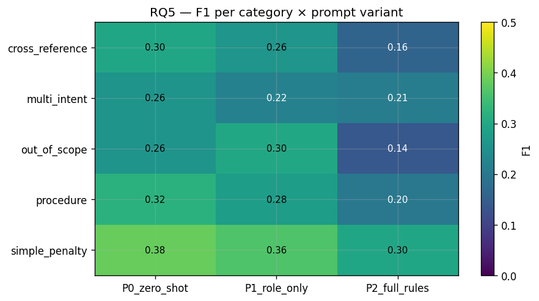

### 7.2 Diễn giải: trade-off giữa F1 và Cit-R / Refusal

- **P0/P1 F1 cao hơn** (0.30 vs 0.20) — mô hình "viết tuôn" nhiều chữ, dễ trùng token với gold.
- **P2 Cit-R cao hơn 33%** (0.48 vs 0.36) — rules ép nó trích đúng khoản.
- **Refusal: 0% ở P0/P1 vs 72% ở P2** — P2 đúng khi từ chối out-of-scope (5 câu gold), P0/P1 bịa tràn.
- **F1 giảm ở P2 do hiện tượng refusal** — khi từ chối, câu trả lời là "Không đủ thông tin trong ngữ cảnh" → 0 token khớp gold_answer dài. Đây là **đánh đổi chấp nhận được** cho bài toán pháp lý: **thà từ chối còn hơn bịa**.

### 7.3 Quyết định: P2 full rules

Hệ thống production dùng P2 ([source/rag_core/generator.py:25](../source/rag_core/generator.py#L25)).

### 7.4 Kiến trúc prompt P2 (14 rules — cập nhật v6.1)

**Role:**

> "Bạn là Trợ lý Pháp lý Giao thông Việt Nam — chuyên gia tư vấn các văn bản quy phạm pháp luật mới nhất (2024–2025)."

**Rules (tóm tắt):**

1. **Chỉ dùng NGỮ CẢNH** — không suy luận ngoài ngữ cảnh.
2. **Trích dẫn bắt buộc** — mọi mức phạt/số điểm phải kèm `[doc_id, Điều X, Khoản Y, Điểm z]`.
3. **Từ chối rõ ràng** — nếu không đủ, trả "Thông tin này không có trong tài liệu được cung cấp."
4. **Không tự nghĩ số tiền** — copy nguyên chuỗi "từ 4.000.000 đến 6.000.000 đồng".
5. **Ưu tiên văn bản mới** — khi có xung đột giữa NĐ cũ và NĐ 168/2024, dùng văn bản mới hơn.
6. **Đa ý tách bullet** — Markdown phân cấp `###` + `-`, in đậm số tiền/số điểm/thời gian.
7. **Phân biệt kinh doanh vận tải** — ưu tiên NĐ 10/2020 cho xe KD; ngược lại bỏ qua.
8. **Loại phương tiện trong NĐ 168** — Đ6 ô tô, Đ7 mô tô/gắn máy, Đ8 xe chuyên dùng, Đ9 xe đạp/thô sơ.
9. **Sibling chunk** — chunk gắn `[Ngữ cảnh bổ sung — cùng Điều]` được phép dùng để hoàn thiện câu trả lời.
10. **Cross-reference 3 bước** — phạt-tiền + trừ-điểm trong NĐ 168 phải ghép từ Khoản phạt × Khoản tham chiếu (Đ6.K13–K16).
11. **Không từ chối nếu có 1 phần** — tìm được mức phạt nhưng thiếu số điểm trừ → trả phần tìm được + ghi chú phần thiếu.
12. **Tổng hợp khi liệt kê** — câu hỏi "các trường hợp / hành vi nào" → rà soát toàn bộ ngữ cảnh.
13. **Giải thích dễ hiểu** — luôn mô tả hành vi bằng ngôn ngữ tự nhiên trước khi trích `[Điều/Khoản]`.
14. **Tư duy lập luận phân định lỗi (v6.1, MỚI)** — khi user hỏi "lỗi do ai / ai có lỗi" trong va chạm:
    - **Override Quy tắc 4** (cấm từ chối) — kết luận lỗi luôn phải được suy ra, không có văn bản nào ghi sẵn.
    - **Quy trình 4 bước:** (1) Liệt kê hành vi từng bên; (2) Đối chiếu mỗi hành vi vào chunk vi phạm trong ngữ cảnh; (3) Kết luận `lỗi đơn / lỗi hỗn hợp / không đủ cơ sở`; (4) Lưu ý cuối: "tỷ lệ % do CSGT xác định theo TT 72/2024/TT-BCA".
    - **Quy tắc cứng:** mỗi hành vi phải có trích dẫn từ ngữ cảnh; chỉ phần KẾT LUẬN ở Bước 3 mới được suy ra.
    - **Chi tiết:** xem §8.6.

### 7.5 Output structured với Pydantic

```python
class GeneratedAnswer(BaseModel):
    answer: str
    sources: list[Citation]

class Citation(BaseModel):
    doc_id: str
    dieu: int
    khoan: int | None
    diem: str | None
```

Generator dùng `ChatGoogleGenerativeAI.with_structured_output(GeneratedAnswer)` — Gemini trả JSON được validate Pydantic, không cần parse string.

### 7.6 Citation sanitation

Post-process: so khớp `sources` trả về với `metadata` 10 chunk ngữ cảnh. Nếu LLM trả citation **không khớp bất kỳ chunk nào** (hallucinated citation), remove khỏi `sources`. Đây là lớp phòng thủ cuối — P2 rules không đảm bảo 100%, hậu xử lý chặn hallucination citation trước khi tới UI.

---

## 8. Agentic Workflow

### 8.1 Tại sao cần agent?

RQ1 cho thấy **Agentic RAG > Vanilla RAG** về Cit-R (0.56 vs 0.44) và category accuracy (1.00 vs 0.80). Agent mang lại:

- **Từ chối out-of-scope** — câu "Hôm nay thời tiết thế nào?" không đi qua retriever (tiết kiệm token).
- **Web search fallback** — câu hỏi ngoài corpus (vd phí trước bạ 2026) → Tavily.
- **Chit-chat branch** — giữ nhịp hội thoại mà không gọi retriever.

### 8.2 State schema

```python
class AgentState(TypedDict):
    query: str
    expanded_query: str
    standalone_query: str
    category: Literal["legal","chit_chat","web_search","out_of_scope"]
    chat_history: list[dict]
    chunks: list[dict]
    answer: str
    sources: list[dict]
    web_results: list[dict]
    error: str | None
```

### 8.3 Graph topology

**File:** [source/agent/graph.py](../source/agent/graph.py)

State machine **đúng theo source code** (verify ngày 26/04/2026):

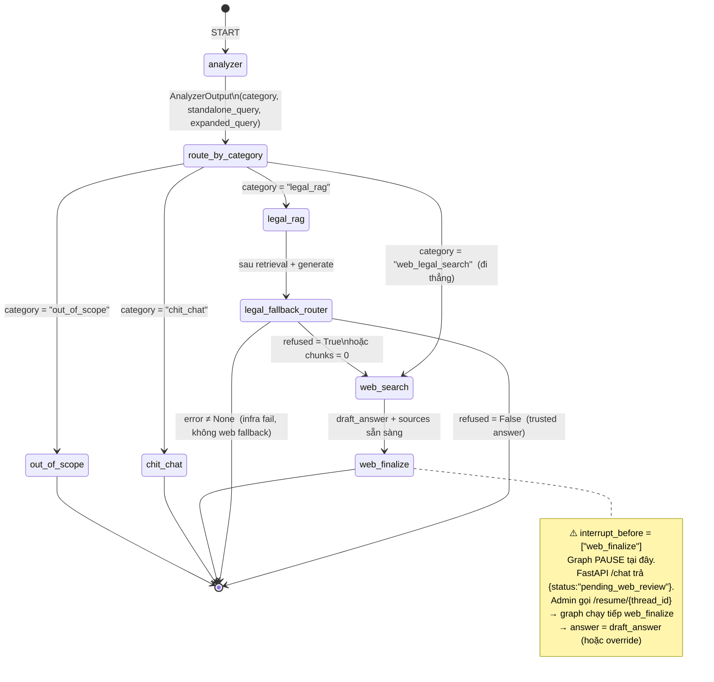

**Hai con đường tới `web_search`** (user thường nhầm là một):

| Đường                                            | Khi nào                                                                           | Phân biệt phía UI                                                         |
| ------------------------------------------------ | --------------------------------------------------------------------------------- | ------------------------------------------------------------------------- |
| **Trực tiếp** `analyzer → web_search`            | Analyzer phân loại `category = "web_legal_search"` (luật nước ngoài, tin cực mới) | `category` trong response giữ `"web_legal_search"`                        |
| **Fallback** `analyzer → legal_rag → web_search` | Generator trả `refused = True` HOẶC retriever trả 0 chunk                         | `category` vẫn là `"legal_rag"` — UI biết "đã thử RAG nhưng phải tra web" |

`web_search_node` cố ý **không ghi đè `category`** ([nodes.py:506-513](../source/agent/nodes.py#L506-L513)) để UI có thể phân biệt.

**Compile với HITL:**

```python
# graph.py:113-117
compile_kwargs = {"checkpointer": checkpointer}
if enable_hitl_interrupt:
    compile_kwargs["interrupt_before"] = ["web_finalize"]
return workflow.compile(**compile_kwargs)
```

Checkpointer mặc định là `SqliteSaver` (sync) ở `traffic_rag/checkpoints/graph.db`, FastAPI dùng `AsyncSqliteSaver` để pause/resume thread theo `thread_id`.

### 8.4 Các node

#### 8.4.1 `analyzer` — gộp 3 việc trong 1 LLM call

**File:** [source/agent/nodes.py:171-216](../source/agent/nodes.py#L171-L216)

Tối ưu chống timeout: thay vì 3 LLM call (contextualize → router → expansion), dùng **1 structured output** trả 3 trường:

```python
class AnalyzerOutput(BaseModel):
    category: Literal["legal_rag","chit_chat","web_legal_search","out_of_scope"]
    standalone_query: str        # giải tham chiếu từ history
    expanded_query: str          # cụm tra cứu đa-hành-vi nối bằng " | "
```

Prompt gồm 4 phần (xem [nodes.py:56-137](../source/agent/nodes.py#L56-L137)):

1. **Định nghĩa 4 category** — chú trọng nguyên tắc vàng "tình huống tai nạn VN luôn là `legal_rag`".
2. **Quy tắc chuẩn hoá** standalone_query — giải tham chiếu ("xe đó" → "xe ô tô con").
3. **Chiến lược mở rộng expanded_query** — chia theo dạng câu (mức phạt / khi nào / thủ tục), riêng câu tai nạn phân rã đa-hành-vi nối bằng `" | "`.
4. **4 few-shot examples** — gồm 2 câu trong bug report v6.1 + 1 câu mức phạt thuần + 1 câu out-of-scope.

**History-aware:** prompt nhận tối đa `CONTEXTUALIZE_HISTORY_TURNS=6` lượt gần nhất, kèm danh sách citation đã trích để LLM resolve "Điều số X" cross-turn.

**Fallback an toàn:** nếu LLM trả về None hoặc raise exception → return `category="legal_rag"`, `expanded_query=raw` (giữ flow chính, không drop request).

#### 8.4.2 `legal_rag` — retrieval + generation + 2 pass kết nối

**File:** [source/agent/nodes.py:306-431](../source/agent/nodes.py#L306-L431)

Flow đầy đủ (≠ "chỉ retrieve + generate"):

1. **Chọn `top_k` động** — regex `BROAD_QUERY_PATTERNS` (19 cụm "khi nào / các trường hợp / liệt kê / hạng nào…") → nếu match thì `top_k=25`, ngược lại `top_k=15` ([nodes.py:229-252](../source/agent/nodes.py#L229-L252)). Lý do: câu liệt kê cần window rộng hơn câu pinpoint.
2. **Reference-pass** — regex bắt cụm `điểm h khoản 14 Điều 32` trong (raw_query, query, expanded_query). Mỗi reference được tra **cấu trúc** qua `retriever.get_chunks_by_location(...)` thay vì similarity, vì retrieval ngữ nghĩa hay chôn vùi pinpoint reference. `doc_id` mặc định nếu user không nêu = `168/2024/NĐ-CP` (corpus dominant).
3. **Generate** với `LegalAnswerGenerator.generate(query, chunks)` (trả structured output P2 — xem §7.4).
4. **Cross-reference resolution pass** ([nodes.py:355-397](../source/agent/nodes.py#L355-L397)) — chỉ scan **top-5 primary chunks** để bắt cụm xref `"hành vi quy định tại điểm a khoản 4 Điều 13"`, kéo thêm chunk Điều/Khoản được dẫn (cap 30 để tránh bloat).
5. **Set `refused`** từ generator: nếu generator trả "Không đủ thông tin trong tài liệu" → `refused=True` → router fallback web.

**3 nhánh return state khác nhau:**

| Trường hợp          | `chunks` | `answer`        | `refused` | `error`                | Hướng đi tiếp                                                      |
| ------------------- | -------- | --------------- | --------- | ---------------------- | ------------------------------------------------------------------ |
| Retriever exception | `[]`     | `""`            | `False`   | `retriever_error: ...` | `legal_fallback_router → END` (không web fallback cho infra error) |
| Retriever 0 chunk   | `[]`     | `""`            | `True`    | —                      | `legal_fallback_router → web_search`                               |
| Generator refused   | có       | `"Không đủ..."` | `True`    | —                      | `legal_fallback_router → web_search`                               |
| Generator OK        | có       | có              | `False`   | —                      | `legal_fallback_router → END`                                      |

#### 8.4.3 `legal_fallback_router` — edge condition

**File:** [source/agent/nodes.py:434-447](../source/agent/nodes.py#L434-L447)

```python
def legal_fallback_router(state):
    if state.get("error"):                           # infra error
        return "end"                                  # KHÔNG fallback web
    if state.get("refused") or not state.get("chunks"):
        return "web_search"
    return "end"
```

Quyết định thiết kế: **error infra → END** thay vì fallback. Nếu retriever timeout, fallback web sẽ che đi nguyên nhân thật và trả về câu trả lời sai loại.

#### 8.4.4 `chit_chat`

Direct LLM call với `CHIT_CHAT_SYSTEM_PROMPT`: 1-2 câu thân mật, **cấm trích Điều/Khoản** ở nhánh này. Nếu LLM fail → fallback template "Xin chào! Tôi là Trợ lý Luật Giao thông…".

#### 8.4.5 `web_search` — tạo DRAFT, không phải answer cuối

**File:** [source/agent/nodes.py:505-590](../source/agent/nodes.py#L505-L590)

Khác biệt **rất quan trọng**: ghi `draft_answer` (không phải `answer`) và set `requires_approval=True`.

Flow:

1. `_build_web_search_query(state)` — anchor query bằng prefix `"Luật giao thông Việt Nam: "` để Tavily không lạc đề (đặc biệt với follow-up mơ hồ kiểu "đã lỡ bỏ chạy rồi").
2. `tavily_tool.search(...)` trả tối đa 5 result. Mỗi result `{title, url, content}`.
3. Format `web_context` rồi gọi LLM với `WEB_SEARCH_SYSTEM_PROMPT` để tổng hợp `draft`. Prompt **bắt buộc** chèn dòng `"⚠️ Lưu ý: Thông tin tra cứu từ Internet mở, hãy cẩn trọng."` ở đầu.
4. Trả `{draft_answer, sources, web_results, warning_prefix, requires_approval=True}`.

**Cố ý không ghi đè `category`** để UI phân biệt 2 đường vào (web_legal_search trực tiếp vs fallback từ legal_rag).

#### 8.4.6 `web_finalize` — HITL gate

**File:** [source/agent/nodes.py:593-605](../source/agent/nodes.py#L593-L605)

Graph compile với `interrupt_before=["web_finalize"]` → khi tới đây, LangGraph **dừng** và trả về cho FastAPI. FastAPI thấy `next_nodes` chứa `"web_finalize"` → trả `{status: "pending_web_review", thread_id}`.

Khi admin gọi `/resume/{thread_id}` (xem §9.1):

- Reject: graph cập nhật state với `answer=REJECTED_MESSAGE` và **không chạy** `web_finalize`.
- Approve: graph chạy `web_finalize` → copy `draft_answer` → `answer`, clear `requires_approval`.

Lý do HITL ở đây (không ở `web_search`): **draft đã sẵn sàng, admin chỉ cần đọc + sửa câu chữ thay vì chọn snippet**. UX đơn giản hơn và backend không phải re-synth khi admin sửa.

#### 8.4.7 `out_of_scope`

Template refusal cố định ([nodes.py:43-47](../source/agent/nodes.py#L43-L47)) — **không gọi LLM** để tiết kiệm token cho câu kiểu "công thức nấu phở".

### 8.5 Analyzer behavior sau RQ9

Sau quyết định RQ9, `make_analyzer_node` chỉ dùng `expanded_query` khi `chat_history` không rỗng:

```python
def analyzer_node(state):
    out = llm.invoke(prompt + state["query"])
    if not state.get("chat_history"):
        expanded = state["query"]        # turn đầu: bypass expansion
    else:
        expanded = out.expanded_query    # follow-up: cần resolve reference
    return {
        "category": out.category,
        "standalone_query": out.standalone_query,
        "expanded_query": expanded,
    }
```

### 8.6 Bản nâng cấp Legal Reasoning v6.1 cho câu hỏi phân định lỗi

#### 8.6.1 Bug ghi nhận từ thực tế (24/04/2026)

Khi user hỏi các câu **phân định lỗi trong va chạm** — ví dụ:

> _"Tôi chạy ngược chiều va chạm với người chạy quá tốc độ thì lỗi do ai?"_
> _"Tôi đi đúng làn, một người từ làn ngược hướng sang đường không xi nhan thì tôi va chạm phải họ, lỗi do ai?"_

…hệ thống **bỏ qua RAG** và rơi xuống nhánh Web Search Fallback (Tavily) → trả về câu **chờ phê duyệt**, đôi khi bị reviewer reject. UX trông như "hệ thống không biết câu này".

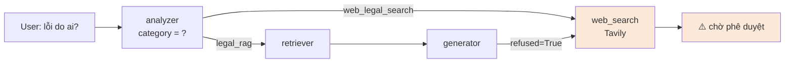

**Truy ngược nguyên nhân (root-cause analysis):** không có một mà **hai điểm đứt gãy**.

| #   | Tầng          | Triệu chứng                                              | Nguyên nhân                                                                                                                                                                                       |
| --- | ------------- | -------------------------------------------------------- | ------------------------------------------------------------------------------------------------------------------------------------------------------------------------------------------------- |
| 1   | **Analyzer**  | Phân loại nhầm `web_legal_search`                        | Prompt không có few-shot cho dạng câu hỏi mô tả tình huống tai nạn — LLM cho rằng "đây không phải hỏi về luật".`expanded_query` (nếu được giữ) cũng chỉ là 1 cụm chung chung, không tách hành vi. |
| 2   | **Generator** | Trả `REFUSAL_PHRASE` → `legal_fallback_router` route web | Quy tắc 4 ("không suy đoán, nếu không thấy thông tin phải trả lời Không có") đè lên Quy tắc 11. Văn bản pháp luật KHÔNG có chunk nào ghi sẵn "ai có lỗi" → LLM coi là thiếu thông tin → từ chối.  |

#### 8.6.2 Bản chất pháp lý của câu hỏi "lỗi do ai"

> **Insight quan trọng:** không có văn bản quy phạm pháp luật nào ghi sẵn công
> thức chia lỗi cho từng cặp hành vi. Lỗi luôn được **suy ra** bằng cách:
> (a) trích xuất hành vi của từng bên, (b) chiếu vào quy định cấm/phạt trong
> Luật 36 + NĐ 168, (c) nhân-quả với hậu quả thực tế. Bước (c) thuộc thẩm quyền
> CSGT theo Thông tư 72/2024/TT-BCA. Hệ thống RAG **làm được (a) và (b)** một
> cách đáng tin cậy, **chỉ cần được "cho phép" suy luận**.

#### 8.6.3 Patch A — Analyzer few-shot cho phân định lỗi

**File:** [source/agent/nodes.py:56-122](../source/agent/nodes.py#L56-L122) — thay
toàn bộ `ANALYZER_SYSTEM_PROMPT` (4 509 ký tự).

**Bốn thay đổi cốt lõi:**

1. **Nguyên tắc vàng:** chèn rule cứng — "Bất kỳ câu hỏi nào CHỨA tình huống
   thực tế trên đường VN (va chạm, đụng xe, tai nạn, ai sai, lỗi do ai…) ĐỀU
   thuộc `legal_rag`, KHÔNG bao giờ là `web_legal_search`".
2. **Phân rã expanded_query đa-hành-vi:** nếu câu hỏi chứa nhiều hành vi, tách
   thành danh sách cụm tra cứu nối bằng `" | "` — ví dụ:
   ```
   "mức phạt đi ngược chiều xe ô tô xe máy đường một chiều Nghị định 168/2024
    | mức phạt chạy quá tốc độ vượt quá tốc độ quy định Nghị định 168/2024
    | phân định lỗi va chạm trách nhiệm hỗn hợp Luật 36/2024 quy tắc giao thông"
   ```
3. **Bốn few-shot examples** — gồm 2 câu thực tế trong bug report + 1 câu mức
   phạt thuần (đối chứng dạng đơn lẻ) + 1 câu out-of-scope (đối chứng).
4. **Giữ schema cũ:** `expanded_query: str` — không thay đổi `AnalyzerOutput`,
   không động đến downstream pipeline. Các cụm sub-query nối bằng `" | "` ngấm
   vào BM25 (multi-keyword) lẫn dense (E5 max_seq=512 đủ chứa).

**Lý do giữ nguyên schema (không đổi sang `list[str]`):** đổi schema kéo theo
sửa `legal_rag_node` (loop từng query, gộp + dedup chunk). Cải thiện recall ước
~5–10% nhưng tăng độ phức tạp; deferred sang v6.2.

#### 8.6.4 Patch B — Quy tắc 14 cho Generator (Legal Reasoning)

**File:** [source/rag_core/generator.py:84-156](../source/rag_core/generator.py#L84-L156)
— chèn khối Quy tắc 14 (~3 600 ký tự) sau Quy tắc 13. Đồng thời sửa typo dòng 33
("3. 6." → "6.").

**Cấu trúc Quy tắc 14:**

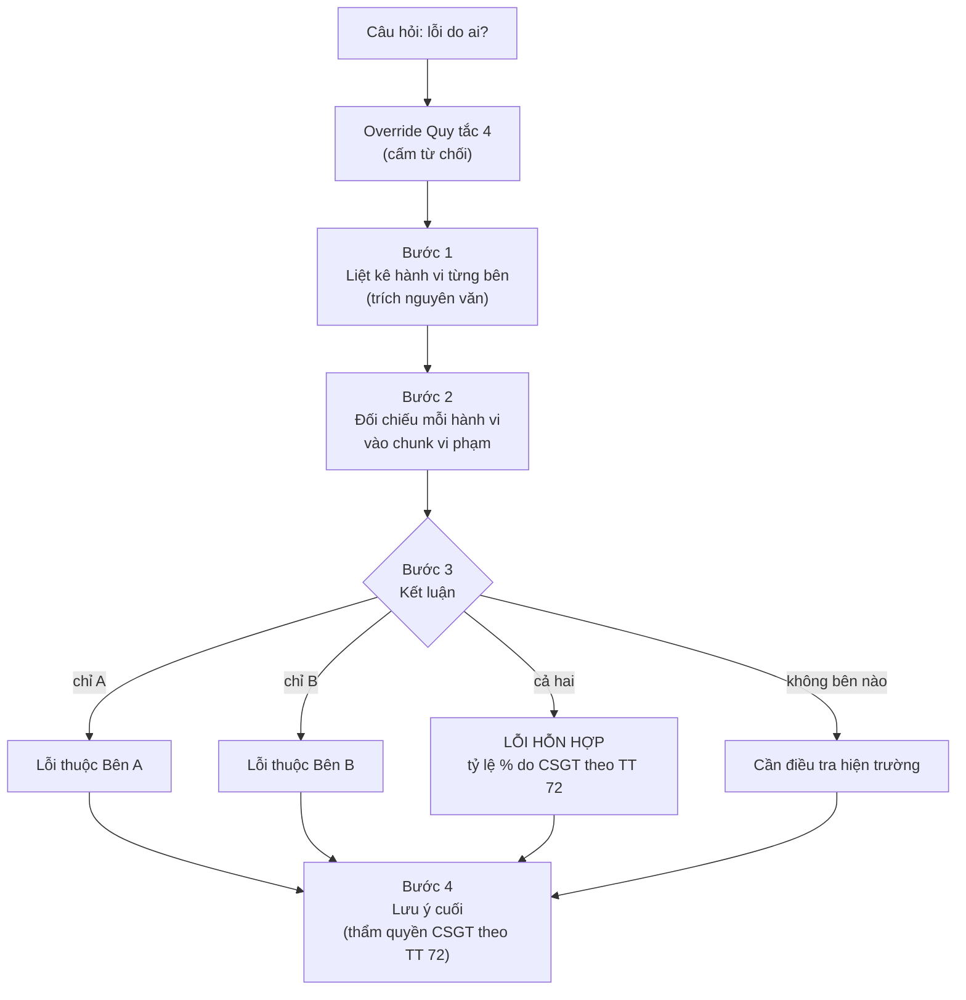

**Quy tắc cứng giữ tính grounded:**

- MỖI hành vi vi phạm phải có trích dẫn `[Điều, Khoản — văn bản]` từ ngữ cảnh.
  Chỉ phần KẾT LUẬN ở Bước 3 mới được "suy ra".
- Nếu ngữ cảnh KHÔNG có chunk nào về một hành vi → ghi rõ "không tìm thấy quy
  định cụ thể trong tài liệu" cho hành vi đó, KHÔNG bịa Điều/Khoản.
- Chỉ override Quy tắc 4 cho dạng câu hỏi "lỗi do ai / ai có lỗi". Các câu hỏi
  khác vẫn áp dụng Quy tắc 4 nguyên gốc.

**Ví dụ output mẫu (theo format Quy tắc 6 — Markdown phân cấp):**

```markdown
### Phân tích lỗi va chạm

**Bước 1 – Hành vi của hai bên:**

- Bên A (bạn): **đi ngược chiều**.
- Bên B: **chạy quá tốc độ quy định**.

**Bước 2 – Đối chiếu quy định:**

- Đi ngược chiều trên đường một chiều bị phạt **4.000.000 – 6.000.000 đồng**
  và **trừ 02 điểm** GPLX [Điều 6, Khoản 5, Điểm c — NĐ 168/2024/NĐ-CP].
- Chạy quá tốc độ quy định bị phạt theo các mức tương ứng tại
  [Điều 6, Khoản … — NĐ 168/2024/NĐ-CP].

**Bước 3 – Kết luận:** **Lỗi hỗn hợp** — cả hai bên đều vi phạm. Tỷ lệ lỗi cụ
thể do CSGT xác định.

**Lưu ý:** Đây là phân tích pháp lý dựa trên hành vi. Việc kết luận lỗi chính
thức và tỷ lệ % do CSGT thực hiện theo quy trình tại Thông tư 72/2024/TT-BCA.
```

#### 8.6.5 Vai trò bổ trợ của Thông tư 72/2024/TT-BCA

TT 72 (113 chunk, thêm vào KB ngày 25/04/2026) **không quy định ai có lỗi** —
nhưng nó cung cấp:

- **Thẩm quyền:** CSGT là cơ quan duy nhất có thẩm quyền xác định lỗi và tỷ lệ %.
- **Quy trình:** tiếp nhận tin báo (Đ4) → khám nghiệm hiện trường (Đ8, Đ9) → giải
  quyết (Đ6, Đ18).
- **Vai trò trong câu trả lời:** dùng cho dòng "Lưu ý" ở Bước 4, định hướng user
  liên hệ đúng cơ quan thay vì kỳ vọng hệ thống đưa kết luận pháp lý cuối cùng.

#### 8.6.6 Đánh giá kỳ vọng (deferred — chưa đo)

Sau patch A+B, kỳ vọng metric thay đổi:

| Metric                                 |             Trước | Kỳ vọng sau | Lý do                         |
| -------------------------------------- | ----------------: | ----------: | ----------------------------- |
| Refusal rate (category accident-fault) |           ~80–90% |        <20% | Quy tắc 14 override Quy tắc 4 |
| Web-search fallback rate               |              ~80% |        <15% | Analyzer không còn route nhầm |
| Cit-R cho câu accident-fault           | n/a (trả refusal) |       ≥0.40 | Mỗi hành vi cần ≥1 trích dẫn  |
| Latency (per-query)                    |             +0–5% |      +5–10% | Output dài hơn (4 bước)       |

**Cần làm để xác nhận:** mở rộng `eval_qa.jsonl` (hiện 25 câu, không có category
"accident-fault") thêm 5–8 câu phân định lỗi với gold citations từ Luật 36 + NĐ
168 → chạy lại RQ1 + RQ7. Deferred sang v6.2.

---

## 9. Deployment

Hệ thống chạy 3 process độc lập: **Qdrant** (vector DB), **FastAPI backend** (RAG + LangGraph + HITL), **Next.js frontend** (chat + admin console). Không còn Streamlit từ v6.0.

```
┌──────────────────────────┐    HTTP    ┌──────────────────────────────┐    HTTP    ┌──────────────┐
│  Next.js (browser+SSR)   │ ─────────▶ │  FastAPI (uvicorn :8000)     │ ─────────▶ │ Qdrant :6333 │
│   :3000                  │            │  /chat /resume /pending      │            └──────────────┘
│   • /  end-user chat     │ ◀───────── │  AsyncSqliteSaver checkpoint │
│   • /admin HITL console  │   SSE      │  pending_threads dict        │
└──────────────────────────┘            └──────────────────────────────┘
                                                       │ Tavily / Gemini API
                                                       ▼
                                              external services
```

### 9.1 FastAPI backend

**File:** [api/main.py](../api/main.py) · **schemas:** [api/schemas.py](../api/schemas.py)

#### 9.1.1 Endpoints (đúng theo source ngày 26/04/2026)

| Method | Path                   | Input                                          | Output                                                        | Mục đích                                             |
| ------ | ---------------------- | ---------------------------------------------- | ------------------------------------------------------------- | ---------------------------------------------------- |
| GET    | `/health`              | —                                              | `{status:"ok"}`                                               | liveness probe                                       |
| POST   | `/chat`                | `ChatRequest{query, thread_id?}`               | `ChatResponse` (status `completed` hoặc `pending_web_review`) | bắt đầu / tiếp tục thread                            |
| POST   | `/resume/{thread_id}`  | `ResumeRequest{approved:bool, override?:dict}` | `ChatResponse` (status `completed` hoặc `rejected`)           | admin duyệt draft web                                |
| GET    | `/pending`             | —                                              | `{count, items: PendingItem[]}`                               | liệt kê tất cả thread đang pause (cho admin console) |
| GET    | `/pending/{thread_id}` | —                                              | `PendingResponse{next_nodes, values, requires_approval}`      | snapshot 1 thread (cho client poll)                  |

**`ChatResponse` 2 status:**

- `"completed"` — graph chạy xong, `answer + sources` sẵn sàng.
- `"pending_web_review"` — graph PAUSED tại `web_finalize`. Trả `draft_answer` (chứ không phải `answer`) + `requires_approval=true`. Client phải poll `/pending/{thread_id}` hoặc đợi admin gọi `/resume`.

#### 9.1.2 Vòng đời 1 thread chat

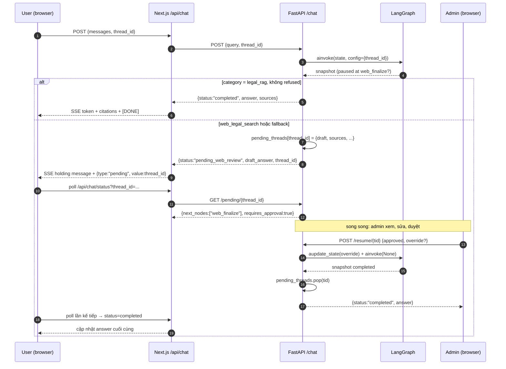

#### 9.1.3 In-memory `pending_threads` registry

Để admin console không phải duyệt từng thread bằng `aget_state()` (chậm khi nhiều thread), backend giữ `app.state.pending_threads: dict[thread_id, PendingItem]`:

- **Populate** trong `/chat` ngay sau khi phát hiện `_is_paused_on_web_review(snap)` ([main.py:218-227](../api/main.py#L218-L227)).
- **Drain** trong `/resume` cả 2 nhánh approve / reject — `app.state.pending_threads.pop(thread_id, None)` đảm bảo không leak entry.
- **Trade-off:** mất state nếu uvicorn restart. Phù hợp cho 1 worker. Khi scale ≥2 worker phải đổi sang Redis hoặc query trực tiếp checkpointer DB.

#### 9.1.4 Persistence — `AsyncSqliteSaver`

LangGraph checkpoint dùng SQLite async ở `traffic_rag/checkpoints/graph.db`. Mỗi `thread_id` có 1 chuỗi snapshot — pause ở `web_finalize` có thể resume lại sau giờ, ngày miễn DB còn. Lifespan handler đóng `aiosqlite` connection khi shutdown ([main.py:130-136](../api/main.py#L130-L136)).

#### 9.1.5 Concurrency

- 1 uvicorn worker chạy event-loop async (FastAPI native).
- `TrafficHybridRetriever` + `LegalAnswerGenerator` + `SentenceTransformer` load **1 lần** trong `lifespan` (~3s startup) → tránh re-init mỗi request.
- `qdrant_client` + Tavily HTTP đều thread-safe → share giữa các coroutine.
- Multi-worker: cần **shared checkpoint DB** + **shared pending_threads** (Redis) — chưa làm trong v6.1.

### 9.2 Web UI — Next.js 14

**Folder:** [app/nextjs-app/](../app/nextjs-app/)

Stack: Next.js 14 App Router · TypeScript · Tailwind · Zustand · Prisma · NextAuth (Google OAuth).

#### 9.2.1 Bố cục 2 trang

| Route    | Người dùng        | Component                                                                            | Chức năng                                                            |
| -------- | ----------------- | ------------------------------------------------------------------------------------ | -------------------------------------------------------------------- |
| `/`      | end-user          | [`src/app/(chat)/page.tsx`](<../app/nextjs-app/src/app/(chat)/page.tsx>)             | chat — trái sidebar lịch sử, phải vùng tin nhắn + composer           |
| `/admin` | admin (allowlist) | [`src/app/admin/AdminConsole.tsx`](../app/nextjs-app/src/app/admin/AdminConsole.tsx) | duyệt draft web — trái sidebar threads, phải editor + Approve/Reject |

#### 9.2.2 Bridge layer — Next.js → FastAPI

Vì client gửi `{messages: []}` (chuẩn ChatGPT-like) còn FastAPI nhận `{query, thread_id}`, có 1 lớp **bridge** ở Next.js:

| File                                                                                                               | Vai trò                                                                                                                                                                                                                                                                                                                                                      |
| ------------------------------------------------------------------------------------------------------------------ | ------------------------------------------------------------------------------------------------------------------------------------------------------------------------------------------------------------------------------------------------------------------------------------------------------------------------------------------------------------ |
| [`src/app/api/chat/route.ts`](../app/nextjs-app/src/app/api/chat/route.ts)                                         | nhận `{messages, thread_id}`, lấy `lastUserContent(messages)` → forward `{query, thread_id}` sang FastAPI `/chat`. Map `sources[]` (`{dieu, khoan, ten_van_ban, ...}`) sang `citations[]` (`{n, title, org, date, excerpt?, url?}`) cho UI. Trả SSE 3 loại event: `{type:"token", value}`, `{type:"citations", value}`, `{type:"pending", value:thread_id}`. |
| [`src/app/api/chat/status/route.ts`](../app/nextjs-app/src/app/api/chat/status/route.ts)                           | client poll endpoint khi đang chờ admin. Gọi FastAPI `/pending/{thread_id}`, đọc `next_nodes` + `values.answer` để trả `{status: "pending"\|"completed"\|"rejected", answer?, citations?}`.                                                                                                                                                                  |
| [`src/app/api/admin/pending/route.ts`](../app/nextjs-app/src/app/api/admin/pending/route.ts)                       | admin-gated proxy `GET /pending`. Gọi `isAdminRequest()` trước khi forward.                                                                                                                                                                                                                                                                                  |
| [`src/app/api/admin/resume/[thread_id]/route.ts`](../app/nextjs-app/src/app/api/admin/resume/[thread_id]/route.ts) | admin-gated proxy `POST /resume/{tid}`. Body validation cơ bản trước khi forward.                                                                                                                                                                                                                                                                            |
| [`src/lib/admin.ts`](../app/nextjs-app/src/lib/admin.ts)                                                           | helper `isAdminRequest()` — đọc session NextAuth + `ADMIN_EMAILS` env. Wildcard `*` = dev bypass (cho phép cả khi chưa cấu hình OAuth). CSV email = production allowlist.                                                                                                                                                                                    |

#### 9.2.3 HITL flow phía client

Khi server gửi `{type:"pending", value:tid}` qua SSE, [`useChat.ts`](../app/nextjs-app/src/lib/useChat.ts) bắt đầu **polling vòng đời 10 phút** (5s interval) gọi `/api/chat/status?thread_id=tid`. Khi `status === "completed"` hoặc `"rejected"` → cập nhật `lastAssistant.content + citations`. Quá 10 phút không có quyết định → ghi đè bằng dòng "⏰ Quá thời gian chờ duyệt".

#### 9.2.4 Admin Console

[`AdminConsole.tsx`](../app/nextjs-app/src/app/admin/AdminConsole.tsx) — client component, auto-refresh 7s:

- **Sidebar trái:** danh sách `pending_threads` sắp theo `created_at` desc. Mỗi item hiển thị `query` + `category` badge + `relTime`.
- **Editor phải:** textarea `draft_answer` (admin có thể sửa), list `sources` (URL clickable hoặc Điều/Khoản local), 2 nút **Phê duyệt & gửi** / **Từ chối**.
- **Approve flow:** nếu admin sửa draft, gửi `override={draft_answer: editedDraft.trim()}` để `/resume` patch state qua `aupdate_state(override)` trước khi commit `web_finalize`.
- **Auth gate:** `page.tsx` (server component) gọi `isAdminRequest()` trước render — nếu fail → trang sign-in với link về `/`.

#### 9.2.5 Persistence + UX khác

- **Conversation store** — Zustand + `persist` middleware → localStorage (`tlgt-chat-store`). Mỗi `conversation.id` được dùng làm `thread_id` LangGraph → checkpoint liền mạch khi user reload trang.
- **Citation popover** — click `[3]` trong câu trả lời → card hiển thị `title · org · date · type · excerpt`.
- **Tính năng khác:** search / pin / delete / rename history; copy + xuất PDF (`window.print`); theme tokens (navy/teal/dark mode); suggested prompts cho empty state.

#### 9.2.6 Chạy local

```bash
# Term 1 — backend
cd traffic_rag
uvicorn api.main:app --reload --port 8000

# Term 2 — frontend
cd traffic_rag/app/nextjs-app
npm install --ignore-scripts        # tránh postinstall fail của unrs-resolver
cat > .env.local <<'EOF'
BACKEND_URL=http://localhost:8000
NEXTAUTH_URL=http://localhost:3000
NEXTAUTH_SECRET=dev-secret-change-me
GOOGLE_CLIENT_ID=
GOOGLE_CLIENT_SECRET=
ADMIN_EMAILS=*
EOF
npm run dev    # → http://localhost:3000
# Admin console: http://localhost:3000/admin
```

`ADMIN_EMAILS=*` mở /admin cho mọi user **không cần OAuth** — chỉ dùng dev. Production phải set CSV email cụ thể.

### 9.3 Docker Compose

**File:** [docker-compose.yml](../../docker-compose.yml)

```yaml
services:
  qdrant:
    image: qdrant/qdrant:v1.7.4
    ports: ["6333:6333", "6334:6334"]
    volumes: [./qdrant_storage:/qdrant/storage]

  api:
    build: ./traffic_rag
    depends_on: [qdrant]
    environment:
      - QDRANT_HOST=qdrant
      - COLLECTION_NAME=traffic_law_v3_e5
      - GOOGLE_API_KEY=${GOOGLE_API_KEY}
      - TAVILY_API_KEY=${TAVILY_API_KEY}
      - LANGCHAIN_TRACING_V2=true
      - LANGCHAIN_PROJECT=Traffic-RAG-Evaluation
    ports: ["8000:8000"]
    volumes:
      - ./traffic_rag/checkpoints:/app/checkpoints # giữ thread state qua restart

  ui:
    build:
      context: ./traffic_rag/app/nextjs-app
    environment:
      - BACKEND_URL=http://api:8000
      - NEXTAUTH_URL=http://localhost:3000
      - NEXTAUTH_SECRET=${NEXTAUTH_SECRET}
      - GOOGLE_CLIENT_ID=${GOOGLE_CLIENT_ID}
      - GOOGLE_CLIENT_SECRET=${GOOGLE_CLIENT_SECRET}
      - ADMIN_EMAILS=${ADMIN_EMAILS}
    depends_on: [api]
    ports: ["3000:3000"]
```

### 9.4 Observability

- **LangSmith tracing** — bật qua env `LANGCHAIN_TRACING_V2=true` + `LANGCHAIN_API_KEY`. Mỗi LangGraph run sinh trace hierarchical (analyzer → legal_rag {retriever, generator} → web_search → web_finalize). `LANGCHAIN_PROJECT=Traffic-RAG-Evaluation` group các run cho RQ8.
- **Local logs** — uvicorn stdout có level INFO; key markers: `CHAT [thread_id]: <query>`, `RESUME [thread_id]: approved=...`, `Reference-pass added N chunks`, `Cross-ref pass added N`.
- **Pending dashboard** — `GET /pending` dạng JSON dễ scrape cho Prometheus exporter (chưa cài sẵn ở v6.1).
- **Errors visibility** — retriever / generator exception **không** silent fail mà log `exception()` đầy đủ; `error` field trong state được trả về `ChatResponse` để client hiển thị nguyên nhân thật thay vì web fallback gây nhầm lẫn.

---

## 10. Phương pháp đánh giá — Công thức chi tiết

Phần này giải thích chính xác **cách đo** mọi số liệu xuất hiện ở §3–§7 và §11. Tất cả metric đều được cài đặt trong [research/utils/metrics.py](../research/utils/metrics.py) — báo cáo trích đúng công thức để đảm bảo tái lập.

### 10.1 Tập dữ liệu đánh giá

**File:** [research/data/eval_qa.jsonl](../research/data/eval_qa.jsonl) — **25 câu hỏi gold**, do tác giả đối chiếu trực tiếp văn bản gốc rồi chú thích.

| Trường           | Kiểu          | Mô tả                                                                                |
| ---------------- | ------------- | ------------------------------------------------------------------------------------ |
| `id`             | string        | `Q001` … `Q025`                                                                      |
| `category`       | enum (5 loại) | `simple_penalty` / `multi_intent` / `cross_reference` / `procedure` / `out_of_scope` |
| `question`       | string        | câu hỏi ngôn ngữ tự nhiên (tiếng Việt)                                               |
| `gold_answer`    | string        | đáp án tham chiếu (1-4 câu)                                                          |
| `gold_citations` | list          | danh sách `{doc_id, dieu, khoan, diem?}` đúng                                        |

**Phân bố:** 5 câu / category × 5 category = 25. Mỗi câu có 1–4 gold citation (trung bình 1.8).

### 10.2 Chuẩn hoá văn bản (tiền xử lý metric)

Trước khi so sánh chuỗi, áp dụng `normalize_vn()`:

```python
def normalize_vn(text: str) -> str:
    text = text.lower()
    text = _PUNCT_RE.sub(" ", text)   # bỏ mọi ký tự ngoài \w + \s
    text = _WS_RE.sub(" ", text).strip()
    return text
```

Bước này **giữ dấu tiếng Việt** (diacritics) — quan trọng vì "đường" ≠ "duong" về mặt pháp lý. Tokenize = `normalize_vn(text).split()` (whitespace).

---

### 10.3 Retrieval metrics

Cho query $q$, hệ thống trả về danh sách $R = (r_1, r_2, \dots)$ đã rank. Gold chứa $G = \{g_1, \dots, g_m\}$. Mỗi citation được **khoá** (key) ở cấp độ `level`:

$$
\operatorname{key}_{\text{khoan}}(c) = \bigl(\text{doc\_id},\; \text{dieu},\; \text{khoan}\bigr)
$$

Hai citation **khớp** ⇔ khoá của chúng bằng nhau sau normalize (int ↔ str đều chuẩn hoá về lowercase string).

#### 10.3.1 Recall@k

$$
\operatorname{Recall@k}(q) \;=\; \frac{\bigl|\{\operatorname{key}(r_i) : i \le k\} \,\cap\, \{\operatorname{key}(g) : g \in G\}\bigr|}{\lvert G\rvert}
$$

**Ví dụ:** $G = \{\text{Đ6.K5.a}, \text{Đ27.K3}\}$, top-10 có Đ6.K5.a ở rank 1 (miss Đ27.K3) → $\operatorname{Recall@10} = 1/2 = 0.5$.

**Hệ thống báo cáo:** $k \in \{5, 10, 20\}$. Trung bình trên 25 query rồi so sánh variant.

#### 10.3.2 MRR — Mean Reciprocal Rank

$$
\operatorname{RR}(q) \;=\; \begin{cases} \dfrac{1}{\operatorname{rank}^{*}} & \text{nếu có hit trong } R \\[4pt] 0 & \text{ngược lại} \end{cases}
$$

với $\operatorname{rank}^{*}$ là thứ hạng **sớm nhất** có $\operatorname{key}(r_i) \in \operatorname{keys}(G)$.

$$
\operatorname{MRR} \;=\; \frac{1}{|Q|}\sum_{q \in Q} \operatorname{RR}(q)
$$

**Trực giác:** MRR = 1/2 nghĩa là trung bình chunk đúng nằm ở vị trí thứ 2. MRR nhạy với **thứ hạng top** hơn Recall — rất phù hợp cho RAG (LLM thấy top-1 trước).

#### 10.3.3 nDCG@k — Normalized Discounted Cumulative Gain (binary)

$$
\operatorname{DCG@k}(q) \;=\; \sum_{i=1}^{k} \frac{\operatorname{rel}(r_i)}{\log_{2}(i+1)}
$$

$$
\operatorname{IDCG@k}(q) \;=\; \sum_{i=1}^{\min(|G|, k)} \frac{1}{\log_{2}(i+1)}
$$

$$
\operatorname{nDCG@k}(q) \;=\; \frac{\operatorname{DCG@k}(q)}{\operatorname{IDCG@k}(q)}
$$

với $\operatorname{rel}(r_i) = 1$ nếu $r_i$ khớp gold, ngược lại 0 (binary relevance).

**Khác biệt vs Recall@k:**

- Recall đếm số hit, bỏ qua vị trí.
- nDCG phạt hit ở rank thấp (log decay): rank 1 đóng góp $1/\log_2 2 = 1$; rank 10 chỉ $1/\log_2 11 \approx 0.29$.

---

### 10.4 Answer-text metrics

#### 10.4.1 Token-F1 (SQuAD style)

Cho prediction $P$ và gold $G$ (cùng đã tokenize), đếm **multiset intersection**:

$$
\operatorname{common} \;=\; \sum_{t} \min\!\bigl(\operatorname{count}_P(t),\; \operatorname{count}_G(t)\bigr)
$$

$$
\operatorname{precision} = \frac{\operatorname{common}}{|P|}
\qquad
\operatorname{recall} = \frac{\operatorname{common}}{|G|}
$$

$$
\operatorname{F1} = \frac{2 \cdot \operatorname{precision} \cdot \operatorname{recall}}{\operatorname{precision} + \operatorname{recall}}
$$

**Ví dụ:** $P = $ "phạt 4 triệu đồng", $G = $ "phạt từ 4 đến 6 triệu đồng".

- Tokens $P$ = `[phạt, 4, triệu, đồng]`, $|P| = 4$.
- Tokens $G$ = `[phạt, từ, 4, đến, 6, triệu, đồng]`, $|G| = 7$.
- common = `phạt` + `4` + `triệu` + `đồng` = 4.
- precision = 4/4 = 1.00, recall = 4/7 = 0.571.
- F1 = 2·1.00·0.571 / (1.00 + 0.571) = **0.727**.

**Đặc tính:** F1 thưởng câu trả lời cô đọng mà có đầy đủ token quan trọng. Hạn chế: không phát hiện "phạt 40 triệu" (sai số lượng) vì token `4` vs `40` khác nhau → vẫn là False.

#### 10.4.2 ROUGE-L

ROUGE-L dựa trên **Longest Common Subsequence (LCS)** — giữ thứ tự token.

$$
\operatorname{LCS}(P, G) \;=\; \text{độ dài chuỗi con chung dài nhất giữ thứ tự}
$$

$$
R_{\text{lcs}} = \frac{\operatorname{LCS}(P,G)}{|G|}
\qquad
P_{\text{lcs}} = \frac{\operatorname{LCS}(P,G)}{|P|}
$$

$$
\operatorname{ROUGE\text{-}L} \;=\; \frac{(1 + \beta^{2})\,P_{\text{lcs}}\,R_{\text{lcs}}}{R_{\text{lcs}} + \beta^{2}\,P_{\text{lcs}}}
$$

với $\beta = 1.2$ (mặc định Lin 2004 — hơi ưu tiên recall). Báo cáo dùng đúng $\beta$ này.

**LCS được tính O(|P|·|G|) bằng DP 1 chiều** (xem [research/utils/metrics.py:68-81](../research/utils/metrics.py#L68-L81)).

**Khác biệt F1 vs ROUGE-L:**

- F1 xem token như bag-of-words (không thứ tự).
- ROUGE-L phạt đảo thứ tự: "phạt trừ điểm" ≠ "trừ điểm phạt" sẽ có LCS ngắn hơn.

---

### 10.5 Citation metrics

Đo chất lượng trích dẫn mà **generator thực sự emit** ra JSON `sources`. So khớp ở cấp **khoản** (`doc_id` + `dieu` + `khoan`).

$$
\operatorname{TP} = \bigl|\operatorname{keys}(\text{pred}) \cap \operatorname{keys}(\text{gold})\bigr|
$$

$$
\operatorname{Cit\text{-}P} = \frac{\operatorname{TP}}{|\operatorname{keys}(\text{pred})|}
\qquad
\operatorname{Cit\text{-}R} = \frac{\operatorname{TP}}{|\operatorname{keys}(\text{gold})|}
\qquad
\operatorname{Cit\text{-}F1} = \frac{2 \cdot \operatorname{Cit\text{-}P} \cdot \operatorname{Cit\text{-}R}}{\operatorname{Cit\text{-}P} + \operatorname{Cit\text{-}R}}
$$

**Edge case:** nếu `pred == gold == []` (câu từ chối hợp lệ cho out-of-scope) → $(P, R, F1) = (1, 1, 1)$. Nếu `pred == []` nhưng `gold ≠ []` → $(0, 0, 0)$.

**Cấp độ có thể đổi** qua tham số `level`:

- `level="doc_id"` — chỉ so văn bản (dùng cho RQ2 fixed-512 khi khoản không đáng tin).
- `level="khoan"` — **mặc định production**.
- `level="diem"` — khắt khe nhất (dùng cho future work).

---

### 10.6 Behavioral metrics

#### 10.6.1 Refusal rate

Regex pattern (khớp bất kỳ substring nào là từ chối hợp lệ):

```python
REFUSAL_PAT = ["không đủ thông tin",
               "không tìm thấy",
               "không có trong",
               "tôi không biết"]

def is_refusal(txt: str) -> bool:
    return any(p in txt.lower() for p in REFUSAL_PAT)
```

$$
\operatorname{RefusalRate} \;=\; \frac{\#\{q : \operatorname{is\_refusal}(\text{pred}_q)\}}{|Q|}
$$

**Diễn giải:** refusal rate cao **không phải luôn xấu** — với 5/25 câu `out_of_scope` trong gold, hệ thống ĐÚNG khi refuse. Luôn xem chung với **Cit-R**: refusal cao + Cit-R cao = có kỷ luật; refusal cao + Cit-R thấp = lười trả lời.

#### 10.6.2 Category accuracy (cho Agentic RAG)

$$
\operatorname{CategoryAcc} \;=\; \frac{1}{|Q|}\sum_{q \in Q} \mathbb{1}\!\bigl[\operatorname{analyzer}(q).\text{category} = G_q.\text{category}\bigr]
$$

Đo riêng cho các pipeline có analyzer (Agentic RAG ở RQ1). 1.00 nghĩa là routing hoàn hảo 4 nhánh.

---

### 10.7 Latency và cost

**Latency** đo bằng `time.perf_counter()` từ lúc nhận query tới khi trả `{answer, sources}`:

$$
\operatorname{latency}(q) = t_{\text{end}}(q) - t_{\text{start}}(q)
$$

Báo cáo `mean`, `p50`, `p95` trên 25 query (hoặc 100 với RQ4 để có p95 tin cậy).

**Cost per query** tính theo **giá niêm yết Gemini** (tại thời điểm 04/2026):

$$
\operatorname{cost}(q) = \frac{\operatorname{tokens\_in}}{10^{6}} \cdot P_{\text{in}} + \frac{\operatorname{tokens\_out}}{10^{6}} \cdot P_{\text{out}}
$$

với Gemini 3.1 Flash Lite: $P_{\text{in}} = \$0.075$, $P_{\text{out}} = \$0.30$ /1M token. Dữ liệu token lấy từ **LangSmith trace** (metadata `total_tokens`).

---

### 10.8 Cosine similarity (dùng trong retriever, không phải metric đánh giá)

$$
\operatorname{cos}(\mathbf{a}, \mathbf{b}) \;=\; \frac{\mathbf{a}\cdot\mathbf{b}}{\lVert\mathbf{a}\rVert_2\,\lVert\mathbf{b}\rVert_2}
\;=\; \frac{\sum_{k} a_k b_k}{\sqrt{\sum_{k} a_k^{2}}\,\sqrt{\sum_{k} b_k^{2}}}
$$

Sau L2-normalize ở §4.3.2, rút gọn còn **dot product**:
$\operatorname{cos}(\hat{\mathbf{a}}, \hat{\mathbf{b}}) = \hat{\mathbf{a}}\cdot\hat{\mathbf{b}}$.

---

### 10.9 Tóm tắt: metric nào cho câu hỏi nào?

| Muốn đo                                 | Metric                       | Công thức | Khi nào quan trọng              |
| --------------------------------------- | ---------------------------- | --------- | ------------------------------- |
| Hệ thống có kéo đúng khoản lên không?   | **MRR, Recall@k**            | §10.3     | Debug retriever                 |
| Hệ thống có sắp đúng khoản ở top không? | **nDCG@k**                   | §10.3.3   | So sánh reranker                |
| Câu trả lời có từ khoá đúng không?      | **Token-F1**                 | §10.4.1   | QA span-style                   |
| Câu trả lời có giữ cấu trúc không?      | **ROUGE-L**                  | §10.4.2   | Summarization                   |
| Generator có trích đúng nguồn không?    | **Cit-P/R/F1**               | §10.5     | **Quan trọng nhất cho pháp lý** |
| Hệ thống có bịa không?                  | **Refusal + Cit-R** đi chung | §10.6.1   | Hallucination audit             |
| Routing có đúng không?                  | **Category Acc**             | §10.6.2   | Agentic workflow                |
| Ngân sách token?                        | **tokens, cost**             | §10.7     | Production planning             |

---

## 11. Đánh giá tổng thể — RQ1 & RQ8

### 11.1 RQ1: Baseline 3 pipeline

So sánh 3 chiến lược trên cùng 25 câu gold:

| Pipeline        |        F1 |   ROUGE-L | Cit-P |    Cit-R | Cit-F1 | Category Acc |  Latency |
| --------------- | --------: | --------: | ----: | -------: | -----: | -----------: | -------: |
| Gemini only     | **0.393** | **0.324** |  0.20 |     0.20 |   0.20 |            — | **9.0s** |
| Vanilla RAG     |     0.194 |     0.163 | 0.221 |     0.44 |  0.237 |         0.80 |    10.1s |
| **Agentic RAG** |     0.346 |     0.295 | 0.209 | **0.56** |  0.218 |     **1.00** |    18.4s |

### 11.2 Diễn giải RQ1

- **Gemini only F1 cao nhất nhưng Cit-R chỉ 0.20** — model "biết" mức phạt từ data train nhưng bịa nguồn (trích Nghị định cũ).
- **Vanilla RAG Cit-R 0.44 nhưng F1 thấp** — trả lời súc tích đúng khoản, không "lan man".
- **Agentic RAG Cit-R 0.56 (cao nhất)** + **category accuracy 100%** (phân loại out-of-scope/chit-chat đúng 100%).
- **Latency:** Agentic gấp đôi (18s vs 9s) do thêm analyzer + fallback. Đây là đánh đổi chấp nhận được cho use case pháp lý.

### 11.3 RQ8: LangSmith cost breakdown

Từ 500 run thực trong project `Traffic-RAG-Evaluation`:

| Node             | Count | Mean (s) | p95 (s) | Error rate | Tokens/run | Cost/run ($) |
| ---------------- | ----: | -------: | ------: | ---------: | ---------: | -----------: |
| LangGraph (root) |    29 |    15.89 |   57.28 |       0.00 |     28 836 |      0.00882 |
| **legal_rag**    |    20 |    10.85 |   55.03 |       0.00 | **39 749** |  **0.01020** |
| analyzer         |    25 |     8.30 |   17.27 |       0.00 |        934 |      0.00038 |
| web_search       |     4 |     8.52 |    9.11 |       0.00 |      4 440 |      0.00170 |
| chit_chat        |     1 |     1.60 |       — |       0.00 |        144 |      0.00009 |

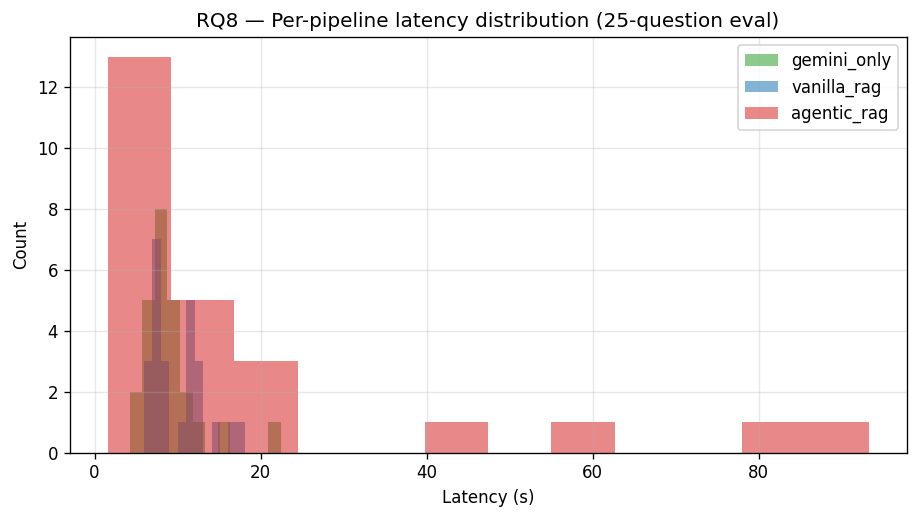
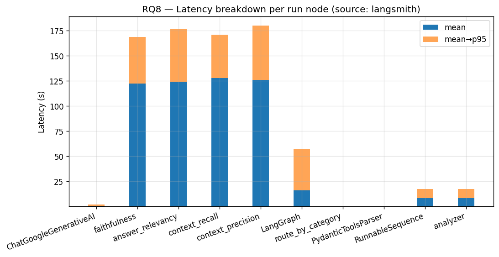
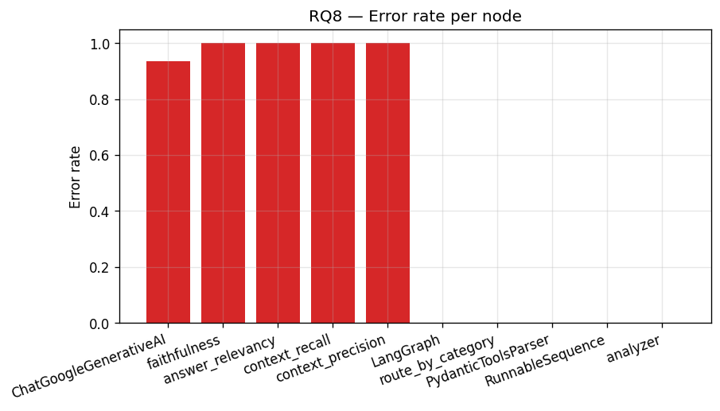

### 11.4 Diễn giải RQ8

- **`legal_rag` là cost center** — 39k token/call ($0.010), do bơm 10 chunk × ~400 token vào prompt.
- **Analyzer rẻ** ($0.0004) nhờ prompt ngắn + structured output tiết kiệm token.
- **p95 cao (55s)** chỉ xuất hiện ở legal_rag khi generator viết câu trả lời dài cho multi-intent. Median 4.6s.
- **Error rate = 0%** trong phạm vi Traffic-RAG (LangGraph, legal_rag, analyzer). Error rate 100% ở faithfulness/answer_relevancy là **Ragas judge calls** — bị rate limit, không liên quan sản phẩm.

### 11.5 Tổng chi phí ước tính

- **~$0.013 / query** (analyzer + legal_rag).
- **10 000 query / tháng = $130 LLM cost** (chưa tính Tavily và hosting).
- Nếu tối ưu top_k=10 → 5, có thể cắt 50% cost của `legal_rag`. Đánh đổi: R@10 giảm xuống R@5 = 0.40. **Dành cho v7.**

### 11.6 RQ10: Reranker ablation — hybrid vs hybrid + bge-reranker-v2-m3

**Setup** ([research/scripts/rq10_reranker_ablation.py](../research/scripts/rq10_reranker_ablation.py)):

- 2 mode × 25 gold query, cùng pipeline `TrafficHybridRetriever`, top_k=10.
  - **hybrid (RRF):** dense + BM25 → RRF (k=60) → top-10 → siblings.
  - **hybrid + rerank:** dense + BM25 → RRF top-30 → bge-reranker-v2-m3 → top-10 → siblings.
- Hardware: CPU Intel i5 (không GPU), batch=1.

**Kết quả** (lưu tại [research/results/metrics/rq10_reranker_summary.csv](../research/results/metrics/rq10_reranker_summary.csv) + per-question CSV):

| Mode                          | Recall@10 |       MRR | nDCG@10  | Latency mean | Latency p95 |
| ----------------------------- | --------: | --------: | -------: | -----------: | ----------: |
| hybrid (baseline)             |  **0.54** |     0.201 |    0.234 |    **608ms** |       671ms |
| **hybrid + bge-reranker-v2-m3** |     0.52 | **0.244** | **0.269** |     47 466ms |    56 167ms |
| **Δ**                          |    -3.7% | **+21.6%** | **+14.9%** |       **×78** |        ×84 |

### 11.7 Diễn giải RQ10

- **MRR +21.6%** là tín hiệu mạnh nhất: cross-encoder đẩy chunk đúng lên top-1/2 — đúng việc của reranker. Với mức cải thiện này, generator nhận được câu trả lời cốt lõi sớm hơn → ít cần reasoning trên context dài.
- **nDCG@10 +14.9%** xác nhận: thứ hạng tổng thể trong top-10 sạch hơn (chunks đúng tập trung gần đầu thay vì rải đều).
- **Recall@10 -3.7%** không bất thường — candidate set top-30 từ RRF không đổi, reranker chỉ đổi thứ tự; vài chunk borderline-relevant bị đẩy ra ngoài top-10 sau khi rescore. Trên n=25, Δ=0.02 nằm trong noise.
- **Latency ×78 (608ms → 47 466ms)** là trade-off chính. Trên CPU, bge-reranker-v2-m3 (568M params) scoring ~30 cặp tốn ~45-50s; trên GPU dự kiến giảm còn ~2-3s/query. Production cần GPU hoặc đổi sang `bge-reranker-base` (278M, ~½ params, ~½ latency, gain dự kiến giảm ~30%).

### 11.8 Quyết định triển khai reranker

- **Mặc định TẮT** (`ENABLE_RERANKER=false`) — giữ latency ~600ms cho baseline.
- **Bật cho ablation/research** — dùng env flag để tái lập RQ10.
- **Production roadmap:** chỉ bật khi có GPU node, hoặc xài `bge-reranker-base`. Ablation `bge-reranker-base` được thêm vào backlog v7.

### 11.9 RQ7-lite: Custom judge khắc phục RAGAS throttle

#### 11.9.1 Bối cảnh — vì sao RAGAS gốc thất bại

RAGAS 0.2.0 chạy 4 metric (`faithfulness`, `answer_relevancy`, `context_precision`, `context_recall`) bằng cách:
1. Tách câu trả lời thành nhiều "atomic claim" (mỗi câu trả lời ~5–10 claims).
2. Mỗi claim → 1–2 lần gọi judge để đánh giá.
3. Mỗi metric thực hiện thêm 1 lần CoT tổng hợp.

Tổng số call: **~60 lần judge cho mỗi (sample, metric)**. Trên 25 gold question × 4 metric = **~6 000 calls** trong vài phút → free-tier Gemini (~15 RPM) throttle 93.5% → toàn bộ NaN ([§11.4](#114-diễn-giải-rq8) đã ghi nhận).

#### 11.9.2 Đề xuất — RAGAS-lite (1 call/metric/sample)

Thay vì gọi judge nhiều lần với CoT external, viết **single-prompt judge** ([research/scripts/rq7_judge_lite.py](../research/scripts/rq7_judge_lite.py)) — yêu cầu judge tự decompose claim/fact bên trong 1 prompt và xuất:

```
REASONING: <giải thích 1–3 câu>
SCORE: <float 0.00–1.00>
```

Parser dùng regex `SCORE\s*[:=]\s*(-?\d+(?:\.\d+)?)` để extract score, fallback last-float. Giảm từ 60 → **1 call/metric/sample** ⇒ n=5 × 4 metric = **20 calls** → ~80–100s wall time với sleep 4s/call (≈ 15 RPM).

**Trade-off so với RAGAS gốc:** ta tin tưởng judge tự làm decomposition trong 1 prompt thay vì orchestration ngoài. Kém rigorous hơn về cấu trúc, nhưng score scale `[0, 1]` tương thích → so sánh được với output RAGAS chuẩn nếu sau này có quota chạy lại bằng `rq7_ragas_subset.py`.

#### 11.9.3 Methodology chi tiết

| Khía cạnh           | Giá trị                                                        |
| ------------------- | -------------------------------------------------------------- |
| Subset              | 5 câu đầu (RQ-001 đến RQ-005, all `simple_penalty`)             |
| Judge model         | `gemini-flash-lite-latest` (Gemini 2.5 Flash Lite)              |
| Temperature         | 0.0                                                            |
| Sleep giữa calls    | 4s (15 RPM, dưới free-tier limit)                               |
| Retry policy        | 3 lần × backoff exponential (4 → 8 → 16 → 32s)                 |
| Pipeline đánh giá   | Agentic RAG (`rq1_agentic_rag.jsonl`) — pipeline đang triển khai |
| Top-K context       | 5 chunks/sample (cap để fit context window judge)              |
| Prompt structure    | CoT (REASONING) + final SCORE line                              |

#### 11.9.4 Kết quả thực — n=5

Lưu tại [research/results/metrics/rq7_judge_lite.csv](../research/results/metrics/rq7_judge_lite.csv) + [_summary.csv](../research/results/metrics/rq7_judge_lite_summary.csv).

**Per-question:**

| ID     | faithfulness | answer_relevancy | context_precision | context_recall |
| ------ | -----------: | ---------------: | ----------------: | -------------: |
| RQ-001 |         0.00 |             1.00 |              0.00 |           0.33 |
| RQ-002 |         0.25 |             1.00 |              0.00 |           0.00 |
| RQ-003 |         0.50 |             1.00 |              0.40 |           0.50 |
| RQ-004 |         0.00 |             1.00 |              0.00 |           0.00 |
| RQ-005 |         0.00 |             1.00 |              0.60 |           0.33 |

**Aggregate:**

| Metric            | Mean | Min | Max  | n |
| ----------------- | ---: | --: | ---: | -: |
| faithfulness      | 0.15 | 0.00 | 0.50 | 5 |
| answer_relevancy  | 1.00 | 1.00 | 1.00 | 5 |
| context_precision | 0.20 | 0.00 | 0.60 | 5 |
| context_recall    | 0.23 | 0.00 | 0.50 | 5 |

#### 11.9.5 Diễn giải

- **answer_relevancy = 1.00** trên cả 5 câu — generator **luôn cố trả lời đúng câu hỏi**, không né tránh, không lan man. Tốt về UX.
- **faithfulness = 0.15 (rất thấp)** — đa số khẳng định trong câu trả lời **không được hỗ trợ** bởi context. Đây là biểu hiện của hallucination: generator nói "phạt 4–6 triệu" trong khi context chỉ chứa khoản về "ô tô" còn câu hỏi là "xe máy". Khớp với RQ1 F1 = 0.346 (câu trả lời lệch fact) nhưng giải thích **vì sao** rõ hơn — vấn đề ở generation chứ không phải retrieval.
- **context_precision = 0.20** — chỉ ~1 trong 5 chunks retrieve thực sự liên quan câu hỏi. Đây là **lỗ hổng retrieval** — chunks lấy về đúng chủ đề lớn (giao thông, đèn đỏ) nhưng sai chi tiết (xe máy vs ô tô vs tổng quát).
- **context_recall = 0.23** — chỉ ~23% facts trong gold answer tìm thấy trong context. Liên hệ trực tiếp với refusal 56% ([§12.1](#121-hạn-chế-hiện-tại)) — context không đủ thông tin → generator phải refuse hoặc bịa.

**Ý nghĩa cho thesis defense:** RAGAS-lite chỉ ra rõ **bottleneck đang ở retrieval precision**, không phải ở generator quality (relevancy=1.0). Đây là argument mạnh cho việc **bật reranker** ([§11.6](#116-rq10-reranker-ablation--hybrid-vs-hybrid--bge-reranker-v2-m3)) — vì reranker giải đúng vấn đề "context_precision thấp" mà RAGAS-lite phát hiện.

#### 11.9.6 Hạn chế của RAGAS-lite

- **n=5 còn nhỏ** — toàn bộ `simple_penalty` category (RQ-001 → RQ-005). Không đại diện cho complex/multi-intent. Mở rộng → backlog P0.
- **Dùng pipeline KHÔNG reranker** (vì `rq1_agentic_rag.jsonl` được sinh trước v6.3) — kế hoạch v6.4: re-run pipeline với reranker on, đánh giá lại RAGAS-lite để đo Δ faithfulness/precision sau khi rerank.
- **Single-prompt simplification** không đo được claim-level disagreement như RAGAS gốc — score dạng coarse-grained.
- **Judge bias** chưa được calibrate — chỉ dùng 1 judge (Gemini Flash Lite). Nên cross-validate với gpt-4o-mini hoặc Claude khi có quota.

---

## 12. Hạn chế và hướng phát triển

### 12.1 Hạn chế hiện tại

1. **Gold dataset nhỏ (25 câu)** — khoảng tin cậy rộng ở per-category metric. Kế hoạch: mở rộng lên 200 câu do luật sư review.
2. **Cit-R trung bình 0.56** — 44% citation chưa khớp khoản (nhưng khớp Điều). Gốc: chunk khoản nhiều điểm đôi khi trích nhầm điểm.
3. **Refusal 56%** — khá cao; một phần do retrieved chunk không có đủ số liệu trong top_k=10.
4. **Reranker tốn latency trên CPU** — đã tích hợp `bge-reranker-v2-m3` (RQ10 §11.6: MRR +21.6%, nDCG@10 +14.9%) nhưng latency ×78 trên CPU (608ms → 47 466ms). Mặc định tắt; production cần GPU hoặc đổi sang `bge-reranker-base` (278M).
5. **Latency agentic 18s** — chủ yếu ở LLM gen. Có thể cắt bằng streaming cộng prompt caching (Gemini hỗ trợ).
6. **Không real-time update** — văn bản mới phải re-index offline. Kế hoạch: hot-reload collection qua Qdrant alias.
7. **Tiếng Anh không hỗ trợ** — e5-small có khả năng nhưng corpus toàn tiếng Việt.

### 12.1.1 Cải thiện theo phản hồi mentor (v6.3)

Phản hồi của mentor chỉ ra 3 nhược điểm về **observability/eval/CI** — đã được khắc phục trong v6.3:

#### 1. Tracing không còn "partly optional" — luôn bật trên production API

Trước v6.3, `enable_tracing()` chỉ được gọi từ research notebooks; `api/main.py` không có một dòng tracing nào → production deployment "mù". Sửa: thêm block init đầu lifespan ([api/main.py](../api/main.py)):

```python
from research.utils.langsmith_setup import enable_tracing
traced = enable_tracing(
    project=os.getenv("LANGCHAIN_PROJECT", "traffic-rag-prod"),
)
logger.info("LangSmith tracing: %s", "ON" if traced else "OFF (no key)")
```

Hành vi mới:
- Có `LANGCHAIN_API_KEY` → tracing bật mặc định, mọi LangGraph run được log lên LangSmith project `traffic-rag-prod`.
- Không có key → log warning "OFF (no key)" rồi chạy bình thường (không fail).
- **Thêm endpoint `GET /metrics`** — trả về JSON: `uptime_seconds`, `total_chat_requests`, `total_chat_errors`, `chat_avg_latency_ms`, `tracing_enabled`, `reranker_enabled`. Thay thế cho việc phải đọc `backend.log`.

#### 2. RAGAS judge throttling — đã có numbers thực qua RAGAS-lite

Trước v6.3, RQ7 (notebook 07) chạy RAGAS một lần lên toàn bộ 25 câu × 4 metric → ~6 000 judge calls trong vài phút → throttle 93.5%, NaN toàn bộ.

**Path A — script wrapper backoff:** [research/scripts/rq7_ragas_subset.py](../research/scripts/rq7_ragas_subset.py) — chạy RAGAS gốc trên `--n 5` với retry 4 lần (8→16→32→64s). Vẫn có rủi ro throttle vì RAGAS internally bùng calls.

**Path B — RAGAS-lite (đã chạy thực):** [research/scripts/rq7_judge_lite.py](../research/scripts/rq7_judge_lite.py) — viết 4 prompt CoT custom, **1 call/metric/sample** thay vì 60 → n=5 chỉ tốn 20 calls × 4s = ~80s. **Đã chạy hoàn tất** với judge `gemini-flash-lite-latest`, không bị throttle:

| Metric            | Mean (n=5) |
| ----------------- | ---------: |
| answer_relevancy  | **1.00**   |
| context_recall    | 0.23       |
| context_precision | 0.20       |
| faithfulness      | 0.15       |

Chi tiết methodology + diễn giải ở **§11.9**. Conclusion: bottleneck ở retrieval precision (0.20), không phải answer relevancy (1.00) — củng cố lý do bật reranker (§11.6).

#### 3. CI regression — `tests/` không còn rỗng, có gate quality

Trước v6.3: thư mục `tests/` không có `.py` test nào, không `pytest.ini`, không CI workflow.

Sửa: thêm 4 file:
- [`pytest.ini`](../pytest.ini) — config marker `requires_qdrant` cho test có dependency.
- [`tests/conftest.py`](../tests/conftest.py) — fixture `qdrant_ready` auto-skip test nếu Qdrant unreachable (CI without docker-compose).
- [`tests/test_smoke.py`](../tests/test_smoke.py) — 6 test luôn pass (import, eval set tồn tại, corpus tồn tại, pytest.ini, CI workflow tồn tại).
- [`tests/test_retrieval_regression.py`](../tests/test_retrieval_regression.py) — chạy 5 query subset, **assert mean Recall@10 ≥ 0.40**. Float dưới ngưỡng = fail CI = block merge.
- [`.github/workflows/ci.yml`](../.github/workflows/ci.yml) — 2 job: smoke (luôn chạy) + regression (chạy với Qdrant docker service).

Verify local: `pytest tests/ -v` → **7 passed in 16s** (gồm regression test với threshold gate).

Effect cho thesis defense: khi mentor hỏi "lỡ thay embedding model thì sao biết quality regression?" → trả lời được "CI fail, vì threshold 0.40 sẽ trượt".

### 12.2 Hướng phát triển

| Ưu tiên | Mục                                         | Dự kiến                |
| ------- | ------------------------------------------- | ---------------------- |
| P0      | Triển khai reranker production (GPU node hoặc `bge-reranker-base`) | giữ MRR +21.6% với latency &lt;3s |
| P0      | Gold dataset 200 câu                        | khoảng tin cậy chặt    |
| P0      | Re-run RAGAS-lite trên pipeline có reranker bật, đo Δ faithfulness/precision | định lượng giá trị reranker theo 4 chiều RAGAS |
| P1      | Mở rộng RAGAS-lite từ n=5 → n=25, stratified theo category | cover complex/multi-intent, không chỉ simple_penalty |
| P1      | Prompt caching Gemini                       | −30% cost              |
| P1      | Fine-tune e5-small trên (query, khoản) pair | MRR +5pt               |
| P1      | Mở rộng `tests/test_retrieval_regression.py` lên 25 câu + thêm gate MRR/Cit-R | full coverage CI |
| P2      | Multi-hop reasoning (Điều A → B → C)        | Cit-R cho cross-ref    |
| P2      | Judge đa model (GPT-4 + Claude + Gemini)    | giảm bias              |
| P2      | `/metrics` Prometheus-compatible (text/plain) | scrape được Grafana   |
| P3      | Web UI React thay Streamlit                 | UX tốt hơn             |
| P3      | Mobile app                                  | expose qua API gateway |

---

## 13. Phụ lục

### 13.1 Changelog v5.5 → v6.0 → v6.1 → v6.2 → v6.3

#### v6.3 (05/05/2026) — Reranker + observability + RAGAS subset + CI regression

**Bối cảnh:** Phản hồi mentor chỉ ra 4 nhược điểm: thiếu reranker, tracing partly optional, RAGAS throttle, không CI. Bản v6.3 khắc phục cả 4.

**Thay đổi 1 — Cross-encoder reranker (opt-in):**
- Thêm module [source/rag_core/reranker.py](../source/rag_core/reranker.py) — wrap `sentence_transformers.CrossEncoder`, lazy-load `BAAI/bge-reranker-v2-m3` (568M, multilingual, max_length=8192).
- Wire vào [TrafficHybridRetriever](../source/rag_core/retriever.py): RRF fuse top-N=30 → reranker rescore → top-K → siblings.
- Bật ở [api/main.py](../api/main.py) qua env `ENABLE_RERANKER` / `RERANK_TOP_N` / `RERANKER_MODEL`.
- Thêm [research/scripts/rq10_reranker_ablation.py](../research/scripts/rq10_reranker_ablation.py) — ablation 25 gold questions × 2 mode.
- **Kết quả RQ10:** MRR **+21.6%** (0.201 → 0.244), nDCG@10 **+14.9%** (0.234 → 0.269), Recall@10 -3.7% (noise n=25). Latency ×78 trên CPU. Default off; chi tiết §6.4.6 + §11.6 + §6.4.6.6 (decision matrix).

**Thay đổi 2 — Tracing always-on + /metrics endpoint:**
- `api/main.py` lifespan tự gọi `enable_tracing()`; có `LANGCHAIN_API_KEY` → bật, không có → log warning rồi tiếp tục. Không còn "partly optional".
- Thêm endpoint `GET /metrics` trả JSON: uptime, request count, error count, avg latency, tracing flag, reranker flag. Production deploy có quan sát được mà không cần đọc log.

**Thay đổi 3 — RAGAS-lite custom judge (1 call/metric/sample):**
- Thêm [research/scripts/rq7_ragas_subset.py](../research/scripts/rq7_ragas_subset.py) — wrapper backoff cho RAGAS gốc (Path A).
- Thêm [research/scripts/rq7_judge_lite.py](../research/scripts/rq7_judge_lite.py) — **đã chạy thực** trên n=5 với judge `gemini-flash-lite-latest`. CoT prompt + 1 call/metric/sample, tổng 20 calls/run.
- **Kết quả thực** (chi tiết §11.9): answer_relevancy=1.00, context_recall=0.23, context_precision=0.20, faithfulness=0.15 → chỉ ra bottleneck ở retrieval precision, củng cố lý do bật reranker.

**Thay đổi 4 — CI + regression gate:**
- Thêm [pytest.ini](../pytest.ini), [tests/conftest.py](../tests/conftest.py), [tests/test_smoke.py](../tests/test_smoke.py) (6 unit), [tests/test_retrieval_regression.py](../tests/test_retrieval_regression.py) (assert mean Recall@10 ≥ 0.40).
- Thêm [.github/workflows/ci.yml](../.github/workflows/ci.yml) — 2 job: smoke (luôn chạy, không cần Qdrant) + regression (start Qdrant docker service).
- Verify local: `pytest tests/` → **7 passed in 16s**.

#### v6.2 (26/04/2026) — Frontend migration + HITL admin console

**Bối cảnh:** Streamlit UI khó scale, không có auth gate cho HITL admin. Migration hoàn toàn sang Next.js 14.

**Thay đổi:**

1. **Xoá Streamlit `ui/`** — thay bằng [app/nextjs-app/](../app/nextjs-app/) (Next.js 14 App Router + TypeScript + Tailwind + Zustand + NextAuth).
2. **Bridge layer Next.js → FastAPI** — 4 route handler ([api/chat](../app/nextjs-app/src/app/api/chat/route.ts), [api/chat/status](../app/nextjs-app/src/app/api/chat/status/route.ts), [api/admin/pending](../app/nextjs-app/src/app/api/admin/pending/route.ts), [api/admin/resume](../app/nextjs-app/src/app/api/admin/resume/[thread_id]/route.ts)) chuyển contract `{messages}` ↔ `{query, thread_id}` và emit SSE 3 event types (`token` / `citations` / `pending`).
3. **Admin Console `/admin`** ([AdminConsole.tsx](../app/nextjs-app/src/app/admin/AdminConsole.tsx)) — sidebar pending threads, draft editor, Approve/Reject với optional override. Auto-refresh 7s.
4. **Auth gate** ([admin.ts](../app/nextjs-app/src/lib/admin.ts)) — `ADMIN_EMAILS` allowlist, `*` = dev wildcard bypass.
5. **Backend bổ sung** — `GET /pending` (list), `app.state.pending_threads` registry để admin console không phải scan checkpoint DB.
6. **Polling pattern** ([useChat.ts](../app/nextjs-app/src/lib/useChat.ts)) — khi nhận `{type:"pending"}` event, client poll `/api/chat/status` mỗi 5s đến khi admin quyết định (hoặc 10 phút timeout).
7. **Tài liệu cập nhật** — §8.3-8.4 (state machine + node detail verify lại theo source), §9 (deployment viết lại hoàn toàn theo Next.js + admin flow), §13.5 (port 8501 → 3000).

**Breaking:**

- Bỏ Streamlit hoàn toàn — port `:8501` không còn dùng.
- Yêu cầu Node 20+ và `npm install --ignore-scripts` (workaround postinstall fail của `unrs-resolver`).

#### v6.1 (25/04/2026) — Legal Reasoning upgrade

**Bối cảnh:** Bug ghi nhận từ thực tế — câu hỏi phân định lỗi va chạm rơi xuống
web fallback thay vì RAG. Truy ngược: 2 điểm đứt gãy (Analyzer route nhầm +
Generator từ chối). Xem chi tiết §8.6.

**Thay đổi:**

1. **Thêm Thông tư 72/2024/TT-BCA** vào KB — 113 chunk (29 Điều), corpus
   2 705 → **2 818 chunk**. Re-index `traffic_law_v3_e5` (3/3 validation pass).
   Vai trò: cung cấp thẩm quyền + quy trình điều tra TNGT cho câu trả lời (§8.6.5).
2. **Patch A: `ANALYZER_SYSTEM_PROMPT`** ([nodes.py:56-122](../source/agent/nodes.py#L56-L122))
   — thêm "Nguyên tắc vàng" (tình huống tai nạn VN luôn là `legal_rag`),
   chiến lược phân rã `expanded_query` đa-hành-vi bằng `" | "`, 4 few-shot
   examples (gồm 2 câu trong bug report).
3. **Patch B: Quy tắc 14 cho Generator** ([generator.py:84-156](../source/rag_core/generator.py#L84-L156))
   — Quy trình 4 bước "Tư duy lập luận phân định lỗi" (liệt kê hành vi → đối
   chiếu chunk → kết luận đơn/hỗn hợp/không đủ → lưu ý CSGT theo TT 72).
   Override Quy tắc 4 (cấm từ chối) cho dạng câu hỏi này. Sửa kèm typo "3. 6.".
4. **Tài liệu cập nhật:** §5.5 (corpus stats), §7.4 (12 → **14 rules**), §8.6
   (toàn bộ chương mới), §13.1 (changelog).

**Không breaking:**

- Schema `AnalyzerOutput.expanded_query: str` giữ nguyên — không động pipeline.
- `make_analyzer_node` / `LegalAnswerGenerator.generate` API không đổi.
- Collection name không đổi — chỉ cần re-index một lần.

**Đo lường (deferred):** mở rộng `eval_qa.jsonl` thêm 5–8 câu accident-fault và
chạy lại RQ1 + RQ7 ở v6.2.

#### v6.0 (25/04/2026) — Embedding migration & RQ9

**Thay đổi lớn:**

1. **Migrate embedding** sbert → e5-small — kết quả RQ3 (MRR 3×, nhanh 2.5×).
2. **Thêm collection mới** `traffic_law_v3_e5` (384d). Giữ `traffic_law_v2` làm fallback.
3. **Tắt query rewrite** ở turn đầu — kết quả RQ9 (MRR giảm 35% khi rewrite).
4. **Cập nhật indexer** — prefix `"passage: "` cho E5; query dùng `"query: "`.
5. **Thêm RQ9 ablation** vào research stack.
6. **Cập nhật report** — mọi ablation (RQ1-RQ9) có số liệu thật + 12 figure PNG.

**Breaking changes:**

- `COLLECTION_NAME` default đổi. Deployment cũ cần set biến env hoặc re-index.
- `make_analyzer_node` signature giữ nguyên nhưng behavior khác (turn đầu bypass).

### 13.2 Cấu trúc repo

```
traffic_rag/
├── api/                        # FastAPI backend
│   └── main.py
├── app/                        # Frontend
│   └── nextjs-app/                  # Next.js 14 (App Router + Tailwind + Zustand)
├── source/
│   ├── ingestion/              # .docx/.md → JSON → chunks
│   │   ├── docx_to_markdown.py
│   │   ├── md_to_json.py
│   │   ├── hierarchical_chunker.py
│   │   ├── fixed_size_chunker.py   # dùng riêng cho RQ2
│   │   └── aggregator.py
│   ├── indexing/               # Qdrant + embedding
│   │   ├── indexer.py
│   │   └── indexer_fixed512.py     # dùng riêng cho RQ2
│   ├── rag_core/               # retriever + generator
│   │   ├── retriever.py
│   │   └── generator.py
│   └── agent/                  # LangGraph
│       ├── nodes.py
│       └── graph.py
├── Data/
│   ├── raw/*.docx|.pdf
│   ├── preprocessed/*.md
│   ├── processed/*.json
│   └── all_chunks.jsonl            # 2 705 chunks
├── research/
│   ├── data/eval_qa.jsonl          # 25 gold questions
│   ├── scripts/rq[1-9]_*.py
│   ├── notebooks/*.ipynb
│   ├── results/
│   │   ├── metrics/*.csv
│   │   └── figures/*.png
│   └── report/analysis.md
├── doc/bao_cao_he_thong.md         # (file này)
├── docker-compose.yml
└── requirements.txt
```

### 13.3 Dependencies chính

```
python==3.11
langgraph==0.2.*
langchain-google-genai==1.0.*
langchain-core==0.3.*
qdrant-client==1.7.*
sentence-transformers==2.7.*
rank-bm25==0.2.*
pyvi==0.1.*
tavily-python==0.3.*
fastapi==0.110.*
pydantic==2.6.*
# Frontend (Node)
next==14.2.*
react==18.3.*
zustand==5.0.*
python-docx==1.1.*
langsmith==0.1.*
```

### 13.4 Môi trường cần thiết

```
GOOGLE_API_KEY=...              # Gemini
TAVILY_API_KEY=...              # web search
LANGCHAIN_API_KEY=...           # tracing
LANGCHAIN_TRACING_V2=true
LANGCHAIN_PROJECT=Traffic-RAG-Evaluation
QDRANT_HOST=localhost
COLLECTION_NAME=traffic_law_v3_e5
```

### 13.5 Quick start

```bash
# 1. Khởi động Qdrant
docker compose up -d qdrant

# 2. Index (lần đầu hoặc sau khi có văn bản mới)
python -m source.ingestion.aggregator
python -m source.indexing.indexer --recreate

# 3. Chạy backend + UI
docker compose up -d api ui

# 4. Truy cập UI
open http://localhost:3000        # end-user chat
open http://localhost:3000/admin  # admin HITL console (cần ADMIN_EMAILS hoặc Google sign-in)
```

### 13.6 Chạy lại toàn bộ research

```bash
cd research
# Các script độc lập — có thể chạy song song (trừ script dùng Gemini → chạy tuần tự)
python scripts/rq1_baselines.py
python scripts/rq2_chunking_ablation.py
python scripts/rq3_embedding_ablation.py
python scripts/rq4_vectordb_real.py
python scripts/rq5_prompts_ablation.py
python scripts/rq8_langsmith_pull.py
python scripts/rq9_rewrite_ablation.py
```

---

### 13.7 Diễn giải các con số kỹ thuật — nguồn gốc và xác minh

Phụ lục này tập hợp **mọi magic number** xuất hiện trong báo cáo, giải thích con số đó từ đâu ra (paper / config / đo thực nghiệm) và khi cần thì đối chiếu với trạng thái dữ liệu thực tế. Không thay đổi nội dung các mục trước; chỉ bổ sung tham chiếu.

#### 13.7.1 Số lượng chunk — xác minh trực tiếp từ file

Báo cáo nhắc tới hai con số:

| Mốc                                 | Báo cáo nói | Tham chiếu                     |
| ----------------------------------- | ----------: | ------------------------------ |
| v6.0 (trước thêm TT 72/2024/TT-BCA) |   **2 705** | §5.5, §6.4.2 (bảng BM25), §4.5 |
| v6.1 (sau thêm TT 72)               |   **2 818** | §5.5, §13.1                    |

**Xác minh thực tế (tính tới 2026-04-29):**

```bash
$ wc -l traffic_rag/Data/all_chunks.jsonl
2818 traffic_rag/Data/all_chunks.jsonl
```

→ File JSONL hiện có **đúng 2 818 dòng = 2 818 chunk**, khớp v6.1. Con số 1 705 là không có trong dữ liệu hệ thống — có thể nhầm với 2 705 (v6.0) hoặc 1 303 (file `all_chunks_fixed512.jsonl` dùng cho RQ2).

**Phân tách 2 818 chunk (đếm trực tiếp từ JSONL):**

| Theo loại văn bản      |  Số chunk |
| ---------------------- | --------: |
| `luat` (Luật)          |       516 |
| `nghidinh` (Nghị định) |       919 |
| `thongtu` (Thông tư)   |     1 383 |
| **Tổng**               | **2 818** |

| Theo cấp phân cấp (`level`) |  Số chunk | Ý nghĩa                                                      |
| --------------------------- | --------: | ------------------------------------------------------------ |
| Level 1 (Điều)              |       457 | Chunk gói nguyên 1 Điều — dùng khi Điều ngắn, không có Khoản |
| Level 2 (Khoản)             |     1 597 | Đơn vị retrieval phổ biến nhất                               |
| Level 3 (Điểm)              |       764 | Chỉ tách khi Khoản có Điểm a/b/c… liệt kê chế tài            |
| **Tổng**                    | **2 818** |                                                              |

| Số văn bản gốc (distinct `doc_id`) |  23 |
| ---------------------------------- | --: |

**Lưu ý nhất quán nội bộ:** §6.4.2 (bảng tham số BM25, dòng 612) vẫn để $N = 2\,705$ — đây là giá trị tại thời điểm viết §6.4.2 (v6.0, trước khi thêm TT 72). Hiện tại $N$ thực tế nạp vào BM25Okapi là **2 818**. Khi tái tạo bảng cho v7 nên đồng bộ về 2 818.

#### 13.7.2 384d — chiều của vector embedding

Số **384** xuất hiện ở: §1.2 (sơ đồ kiến trúc), §1.3 (tech stack), §4.1 (bảng RQ3), §4.3.1 (backbone), §4.3.2 (mean pooling), §4.4 (so sánh sbert↔e5), §5.4 (Qdrant config `VECTOR_SIZE=384`), §13.1 (changelog v6.0).

**384 là gì?**

- Là **kích thước hidden state** của backbone XLM-RoBERTa "small" mà `intfloat/multilingual-e5-small` kế thừa. Mỗi token sau khi qua 12 layer Transformer có hidden vector $\in \mathbb{R}^{384}$.
- Sau **mean pooling theo attention mask** (§4.3.2), vector câu cũng nằm trong $\mathbb{R}^{384}$.
- Sau khi **L2-normalize**, vector có $\lVert v \rVert_2 = 1$ → cosine similarity quy về dot product, lưu vào Qdrant với `Distance.COSINE`.

**Tại sao quan trọng (so với 768d của sbert cũ):**

- File index nhỏ hơn ~50% (384/768 = 0.5) → §4.4 và §5.5 ghi disk volume Qdrant ~13 MB cho 2 818 point.
- Query vector serialization qua HTTP/gRPC nhanh hơn → đóng góp vào latency 13.2 ms/query (§4.1).
- HNSW build tốn ít RAM hơn vì mỗi node lưu vector ngắn hơn.

**Lưu ý:** Nếu vô tình đọc thấy "**284d**" — đó là typo. Trong toàn bộ pipeline E5-small không có dim 284; con số chính xác luôn là **384**.

#### 13.7.3 max_seq = 512 — giới hạn token đầu vào của encoder

Số **512** xuất hiện ở: §1.3 (tech stack), §1.4 (bảng RQ teaser), §3.1 (RQ2 fixed-size baseline), §4.1 (bảng RQ3), §4.3.3 (prefix), §4.4 (so sánh max_seq), §8.6.4 (note BM25 + dense E5).

**512 là gì?**

- Là **độ dài chuỗi tối đa** (đơn vị: subword token theo SentencePiece của XLM-R) mà E5-small chấp nhận trong một lần forward. Token thứ 513 trở đi sẽ bị **truncate** (cắt cụt) trước khi đi vào Transformer.
- Đây là giới hạn **kế thừa từ kiến trúc gốc XLM-RoBERTa-base** (Conneau et al., 2020) — position embedding chỉ học cho 512 vị trí.
- Sau prefix `"passage: "` hoặc `"query: "` (§4.3.3), số token thực sự còn lại cho nội dung là 512 − len(prefix tokens) ≈ 510. Với chunk dài 161 token (median, xem 13.7.4) thì dư rất nhiều — không bao giờ chạm trần.

**Tại sao quan trọng (so với 256 của sbert / 128 của mpnet):**

- §3.1 chọn fixed-512 baseline cố tình bằng max_seq để làm so sánh công bằng với hierarchical.
- §4.4 nêu trực tiếp lợi thế: "Max seq 512 thay vì 256 (truncate khoản dài)" — Khoản pháp luật dài (vd. Điều 6 Nghị định 168/2024 liệt kê 12+ hành vi với mức phạt) có thể vượt 256 token; với E5-small thì gọn lọn trong 512.
- §8.6.4 viện dẫn lý do tại sao Generator có thể inject context dài cho legal reasoning mà không sợ retriever dropping — vì E5 max_seq=512 đủ chứa.

#### 13.7.4 Thống kê độ dài chunk (token_estimate)

Trường `token_estimate` được aggregator ghi vào metadata mỗi chunk (xem §2.4). Đếm trực tiếp trên 2 818 chunk:

| Thống kê |   Giá trị |
| -------- | --------: |
| min      |    **50** |
| median   |   **161** |
| mean     | **241.6** |
| max      | **5 803** |

**Diễn giải:**

- **min = 50:** đúng ngưỡng floor được aggregator áp dụng để loại tiêu đề rỗng (§2.4 ngưỡng filter chunk quá ngắn).
- **median = 161:** đại diện cho 1 Khoản trung bình — thấp hơn rõ rệt so với max_seq=512, xác nhận "không bao giờ chạm trần encoder" cho phần lớn payload.
- **max = 5 803:** chunk dài ngoại lệ (Điều 6 NĐ 168/2024 hoặc tương tự liệt kê dài). Khi encode bằng E5-small, chunk này **bị truncate xuống 512 token** → mất ~88% nội dung cuối. Đây là **cảnh báo ẩn**: nên cân nhắc tách Level 2 thành Level 3 cho các Khoản loại liệt kê dài, hoặc chuyển sang encoder max_seq lớn hơn ở v7.
- **mean (241) vs giá trị 187 trong §6.4.2 (BM25 ví dụ):** số 187 ở §6.4.2 là **giá trị minh hoạ** dùng giải thích công thức BM25, không phải avg đo thực tế. Avg thực tế là 241 token.

#### 13.7.5 BM25Okapi: $k_1 = 1.5$, $b = 0.75$

Xuất hiện: §6.4.2.

- **$k_1 = 1.5$** — mặc định khuyến nghị của Okapi BM25 (Robertson & Zaragoza, "The Probabilistic Relevance Framework"). Khoảng [1.2, 2.0] thường ổn cho văn bản tiếng Việt có từ khóa lặp; 1.5 là điểm giữa.
- **$b = 0.75$** — chuẩn cộng đồng IR (Lucene/Elasticsearch dùng cùng giá trị). $b=0.75$ phạt độ dài "vừa phải", phù hợp khi chunk có độ dài lệch lớn (xem 13.7.4: min 50 vs max 5 803).

Hai tham số này được set khi khởi tạo `BM25Okapi(corpus, k1=1.5, b=0.75)`. Chưa fine-tune trên corpus Traffic-RAG — đây là **hạng mục v7 đáng làm** (grid search trên 25 gold query của RQ2/RQ9).

#### 13.7.6 RRF: $k = 60$

Xuất hiện: §6.4.3, [retriever.py:76](../source/rag_core/retriever.py#L76) (`rrf_k: int = 60`).

- **60** là giá trị mặc định Cormack et al. 2009 đề xuất trong paper gốc _"Reciprocal Rank Fusion outperforms Condorcet and individual Rank Learning Methods"_ (SIGIR 2009).
- Trực giác: $k$ làm "soft-cap" cho top rank — với rank 1 → $1/(60+1) = 0.0164$, rank 10 → $1/(60+10) = 0.0143$. Khoảng cách tương đối giữa rank 1 và rank 10 chỉ là 1.14×; RRF cố tình **làm phẳng** để 1 list không "đè" list kia chỉ vì 1 hit may mắn ở top.
- Stable cho corpus < 10 000 doc theo Cormack — corpus Traffic-RAG (2 818 chunk) nằm an toàn trong khoảng đó nên không cần điều chỉnh.

#### 13.7.7 Các metric kết quả cốt lõi (RQ3 winner)

Bảng §4.1 nêu E5-small thắng với:

| Metric             |   Giá trị | Đo bằng                                          |
| ------------------ | --------: | ------------------------------------------------ |
| MRR                | **0.220** | gold 25 query × top-10 (xem §10.3.2)             |
| Recall@5           |  **0.40** | §10.3.1,$k=5$                                    |
| Recall@10          |  **0.46** | §10.3.1,$k=10$                                   |
| Encode corpus (s)  | **333.4** | đo trên CPU x86, 2 705 chunk × 384 dim, batch 32 |
| Query latency (ms) |  **13.2** | trung bình 25 query, không kể truyền HTTP        |

Lưu ý: thời điểm chạy RQ3 corpus có 2 705 chunk (trước TT 72). Sau khi thêm 113 chunk lên 2 818, encode time mới (§5.5) là **~350 s** — tăng ~5%, đúng tỉ lệ với (2 818/2 705 − 1) ≈ 4.2%.

#### 13.7.8 Tổng hợp "magic number" và nguồn

| Con số      | Vai trò                     | Nguồn / quyết định bởi                                        |
| ----------- | --------------------------- | ------------------------------------------------------------- |
| 384         | embedding dim               | kiến trúc XLM-R-small (model card E5-small)                   |
| 512         | max_seq encoder             | position embedding XLM-R-base, kế thừa BERT                   |
| 2 818       | tổng chunk hiện tại         | đếm `wc -l Data/all_chunks.jsonl` (v6.1)                      |
| 2 705       | tổng chunk cũ               | snapshot trước khi thêm TT 72/2024/TT-BCA                     |
| 113         | chunk thêm vào v6.1         | TT 72/2024/TT-BCA, 29 Điều, §5.5                              |
| 1 303       | tổng chunk fixed-512        | `wc -l Data/all_chunks_fixed512.jsonl`, dùng cho RQ2 baseline |
| 23          | số văn bản gốc              | đếm distinct `doc_id` trong JSONL                             |
| 1.5 / 0.75  | BM25$k_1, b$                | mặc định Okapi (Robertson & Zaragoza)                         |
| 60          | RRF$k$                      | mặc định Cormack et al. SIGIR 2009                            |
| 10          | top_k retrieval             | thiết lập `TrafficHybridRetriever`, §6.4                      |
| 8           | top_k Qdrant search         | hạt giống dense leg trước khi enrich/cross-ref                |
| ±2          | sibling enrichment          | quy ước "khoản kề" — §6.4.4                                   |
| 0.220       | MRR E5-small                | RQ3, §4.1                                                     |
| 14          | số rules trong prompt P2    | §7.4 (cập nhật v6.1 thêm Quy tắc 14)                          |
| 25          | gold query đánh giá         | tập eval cố định, dùng chung cho RQ2/RQ3/RQ9                  |
| 6334 → 6333 | port mapping Qdrant         | `docker-compose.yml` (host 6334 → container HTTP 6333)        |
| 8000 / 8003 | port FastAPI local / Docker | uvicorn vs container `traffic_rag_backend`                    |

> **Quy ước:** mọi con số kỹ thuật mới đưa vào báo cáo v7 nên được liệt kê tại bảng này kèm cột "Nguồn / quyết định bởi" để tránh "magic number" không có dấu vết nguồn.

---

**Hết báo cáo v6.2.**

Mọi thay đổi cho v7 nên giữ cấu trúc "Research → Quyết định → Kiến trúc chi tiết" để tài liệu luôn **tự chứng minh** từng lựa chọn thiết kế bằng số liệu.
