# SƠ ĐỒ TOÀN DIỆN HỆ THỐNG TRAFFIC-RAG

**Phiên bản:** v6.3 · **Ngày:** 2026-05-07 · **Tác giả:** Mạc Phú Phong

> Tài liệu này tổng hợp toàn bộ kiến trúc hệ thống Traffic-Law RAG dưới dạng sơ đồ. Mỗi sơ đồ phụ trách một khía cạnh khác nhau (context, component, ingestion, online flow, retrieval internals, HITL state, data model, deployment) để có thể đọc độc lập trong báo cáo / slide thuyết trình.

---

## Mục lục

1. [Sơ đồ ngữ cảnh (Level 1 — System Context)](#1-sơ-đồ-ngữ-cảnh)
2. [Sơ đồ thành phần (Level 2 — Container)](#2-sơ-đồ-thành-phần)
3. [Pipeline offline — Ingestion → Indexing](#3-pipeline-offline)
4. [Pipeline online — Agentic flow (LangGraph)](#4-pipeline-online)
5. [Cấu tạo Hybrid Retrieval](#5-hybrid-retrieval)
6. [Generation + Citation grounding](#6-generation--citation)
7. [State machine HITL (Human-in-the-Loop)](#7-state-machine-hitl)
8. [Data model — Chunk metadata schema](#8-data-model)
9. [Deployment topology](#9-deployment)
10. [Sơ đồ tuần tự (Sequence) — End-to-end request](#10-sequence-end-to-end)
11. [Ma trận đánh giá (Evaluation flow)](#11-evaluation-flow)

---

## 1. Sơ đồ ngữ cảnh

Cái nhìn cao nhất: ai dùng, hệ thống nói chuyện với những bên nào.

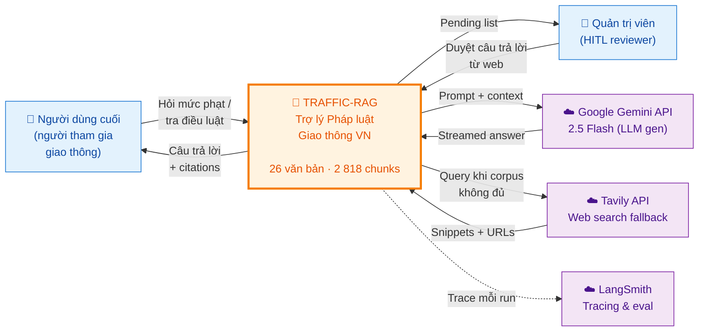

---

## 2. Sơ đồ thành phần

Bóc tách `🚦 Traffic-RAG` thành các container chạy thực tế.

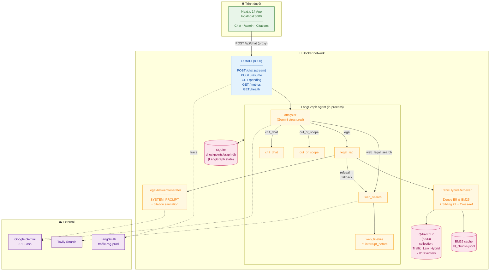

---

## 3. Pipeline offline

Chạy một lần (idempotent) khi bổ sung văn bản mới — biến `Data/raw/*.pdf` thành `2 818 chunks` đã có embedding trong Qdrant.

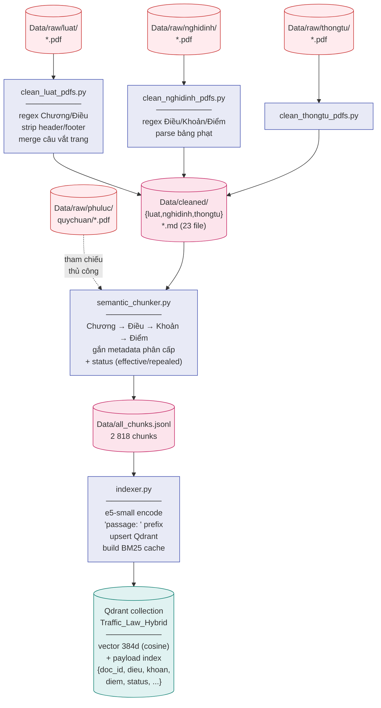

**Đặc điểm quan trọng:**

- **Idempotent:** chạy lại với `--recreate` sẽ xoá collection và build lại từ đầu, không nhân đôi vector.
- **Hierarchy preserved:** mỗi chunk giữ `{doc_id, dieu, khoan, diem, page, effective_date}` để retrieval lọc + citation chuẩn.
- **Status-aware:** chunk thuộc Luật cũ hết hiệu lực được gắn `status="repealed"` và lọc khỏi search mặc định.

---

## 4. Pipeline online

Mỗi request đi qua state-machine LangGraph:

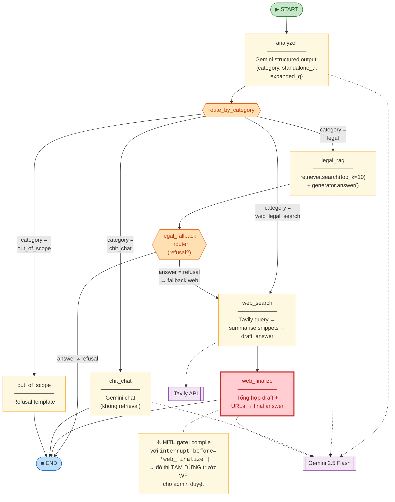

**4 nhánh phân loại theo `category`:**

| Category           | Khi nào                                                                  | Output                                     |
| ------------------ | ------------------------------------------------------------------------ | ------------------------------------------ |
| `legal`            | Câu hỏi về luật/nghị định/thông tư trong corpus                          | Answer + citations `[n]` → trust trực tiếp |
| `chit_chat`        | Lời chào, hỏi linh tinh                                                  | Trả lời ngắn từ Gemini, không retrieval    |
| `web_legal_search` | Câu hỏi pháp luật giao thông NHƯNG ngoài corpus (vd. phí đăng kiểm 2026) | Tavily → draft →**HITL pause**             |
| `out_of_scope`     | Câu hỏi không thuộc phạm vi (vd. thời tiết)                              | Template refusal                           |

---

## 5. Hybrid Retrieval

Bên trong `legal_rag` node, bước retrieve chia làm 4 pha:

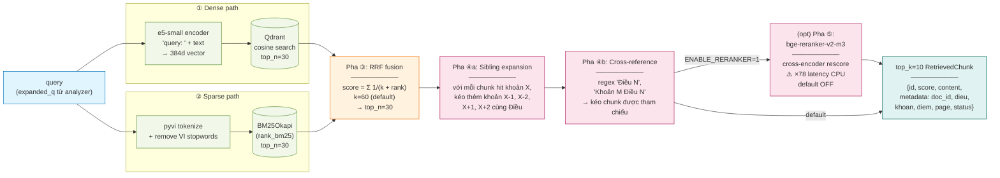

**Lý do chọn hybrid (RQ9):**

- Dense one-shot bị miss khi query có biến thể từ ("vượt đèn đỏ" vs "không chấp hành tín hiệu giao thông").
- BM25 one-shot bị miss khi query là paraphrase ("đậu xe sai chỗ" vs "dừng đỗ trên cầu").
- RRF fuse 2 bảng xếp hạng (không cần normalise score) → MRR tăng so với dense-only.
- Sibling/Cross-ref bù cho hiện tượng "khoản trỏ về Điều khác" — đặc thù văn bản pháp luật.

---

## 6. Generation + Citation

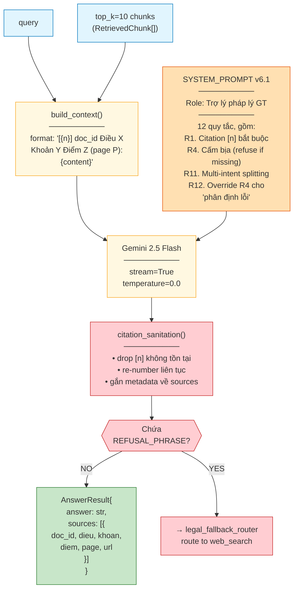

**Vì sao có node `citation_sanitation`:** LLM thỉnh thoảng sinh ra `[7]` trong khi context chỉ có `[1]…[5]`. Sanitiser drop citation lậu + re-number để frontend popover không bị broken link.

---

## 7. State machine HITL

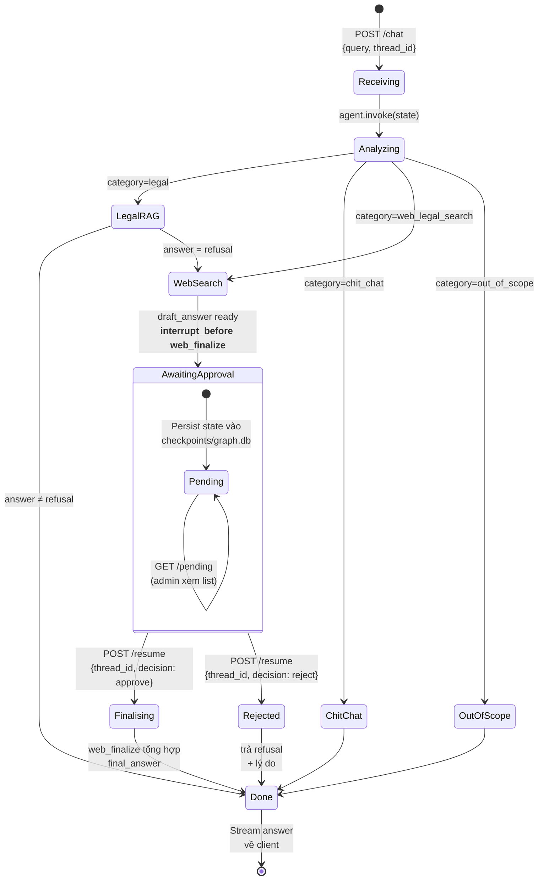

**Tại sao cần HITL ở `web_search` mà không phải `legal_rag`:**

| Nhánh        | Nguồn                                      | Độ tin cậy                    | Cần duyệt?     |
| ------------ | ------------------------------------------ | ----------------------------- | -------------- |
| `legal_rag`  | Corpus chính thức (Luật, NĐ, TT) đã verify | Cao                           | ❌ trust thẳng |
| `web_search` | Internet open (Tavily)                     | Thấp, có thể tin tức/blog sai | ✅ HITL        |

**State persistence:** `SqliteSaver` lưu toàn bộ `AgentState` vào `checkpoints/graph.db` theo `thread_id`. Khi `/resume` được gọi với cùng `thread_id`, LangGraph load lại state và resume từ ngay sau `interrupt_before` → admin có thể đóng tab trình duyệt rồi mở lại sau cũng vẫn duyệt được.

---

## 8. Data model

Schema metadata của một chunk trong Qdrant payload:

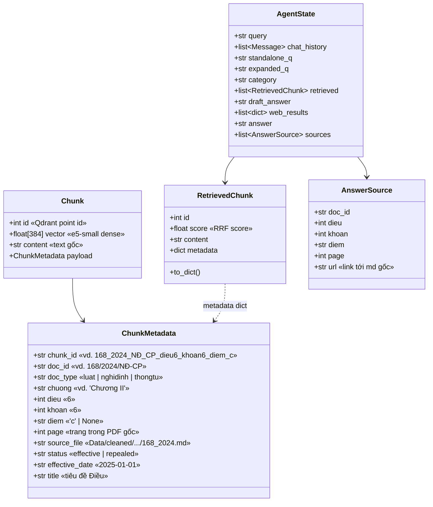

**Convention `chunk_id`:** `<doc_slug>_dieu<N>_khoan<K>_diem_<D>` cho phép debug bằng mắt mà không cần mở payload — ví dụ `168_2024_NĐ_CP_dieu6_khoan6_diem_c` đọc được luôn là _NĐ 168/2024 Điều 6 Khoản 6 Điểm c_.

---

## 9. Deployment

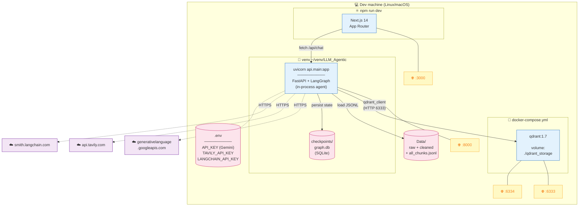

**Lưu ý môi trường:**

- File `.env` đặt ở **gốc repo** (`GitHub1/.env`), không trong `traffic_rag/`.
- `requirements.txt` cũng ở gốc, không trong `traffic_rag/`.
- Qdrant chạy trong Docker; Backend + Frontend chạy ngoài host (dev mode `--reload`).
- Production có thể dockerize FastAPI bằng cùng `docker-compose.yml` (đã có service definition, bật khi cần).

---

## 10. Sequence end-to-end

Một câu hỏi _"Vượt đèn đỏ ô tô bị phạt bao nhiêu tiền?"_ đi qua hệ thống:

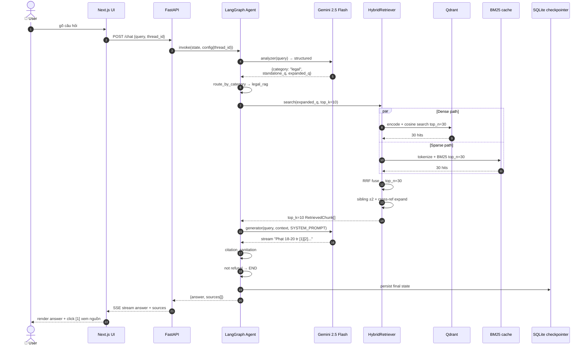

---

## 11. Evaluation flow

Quy trình đánh giá / regression:

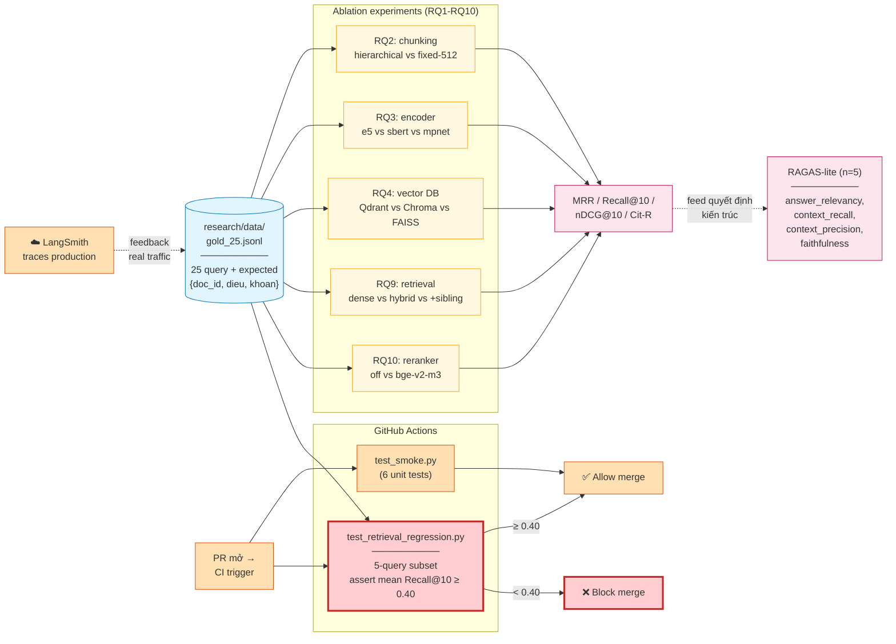

**Hai vòng feedback:**

- **Loop ngắn (CI):** mỗi PR chạy regression gate — nếu thay encoder/chunker mà MRR/Recall tụt dưới 0.40 → fail merge.
- **Loop dài (production):** trace trên LangSmith giúp khám phá query thực tế bị refusal/sai citation → bổ sung vào `gold_25.jsonl` → ablation lại.

---

## Tài liệu liên quan

- Báo cáo kỹ thuật đầy đủ (3 000 dòng): [bao_cao_he_thong.md](bao_cao_he_thong.md)
- Hướng dẫn chạy chi tiết: [implementation_plan.md](implementation_plan.md)
- Kịch bản thuyết trình: [Kich_ban_thuyet_trinh_v3.md](Kich_ban_thuyet_trinh_v3.md)
- README quickstart: [../README.md](../README.md)
